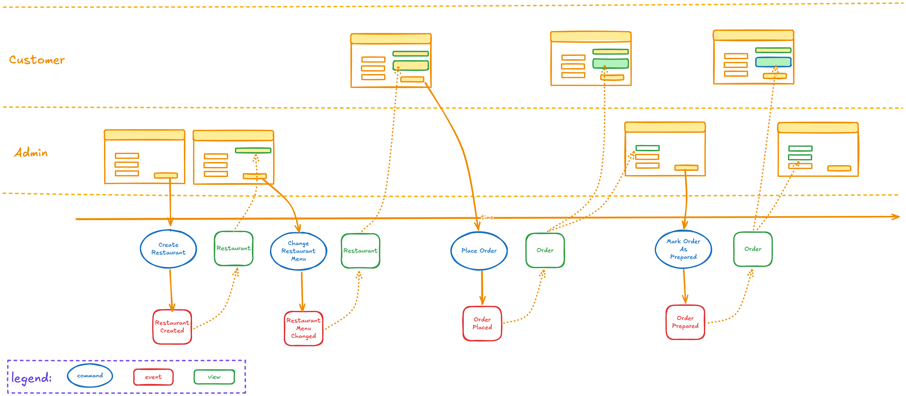
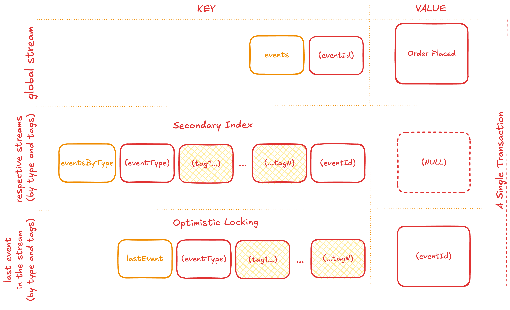
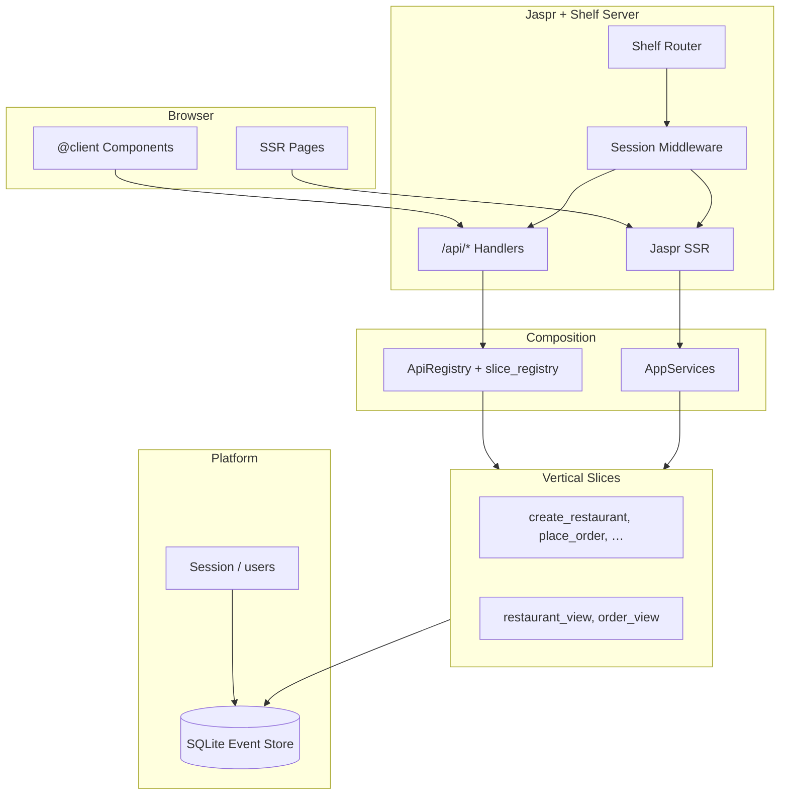

# Restaurant Order Management — Dart (Jaspr) Demo

A restaurant and order management demo built with
[Jaspr](https://docs.jaspr.site) (server mode), showcasing the **Dynamic
Consistency Boundary (DCB)** pattern using
[`fmodel`](https://github.com/dclimber/fmodel_dart) for Dart.
**SQLite** serves as the event store, with tag-based secondary indexing and
optimistic locking — a port of the Deno KV design from the
[TypeScript original](../order-management-demo).

## Disclaimer

This repository is a **Dart port** of
[fraktalio/order-management-demo](https://github.com/fraktalio/order-management-demo).
**Fraktalio** is credited as the original author of the domain design, event
modeling, and DCB use cases (see [`NOTICE`](NOTICE)).

The port was carried out by **Dclimber**, who relied primarily on **AI coding
agents** to produce the implementation — effectively **no code here was
hand-written** line-by-line. Treat this project as an experimental rewrite and
reference port, not a hand-crafted production codebase.

## Event Modeling

The domain is designed using [Event Modeling](https://eventmodeling.org) — a
blueprint that maps out commands, events, read models, and UI interactions in a
single visual artifact.



## Tech Stack

| Layer        | Technology                                                                 |
| ------------ | -------------------------------------------------------------------------- |
| Runtime      | [Dart](https://dart.dev) SDK `^3.10.0`                                     |
| Framework    | [Jaspr](https://docs.jaspr.site) server mode — SSR pages + `@client` islands |
| API          | [Shelf](https://pub.dev/packages/shelf) router (`/api/*`)                  |
| Database     | [SQLite](https://pub.dev/packages/sqlite3) event store + auth tables       |
| Domain       | [`fmodel`](https://github.com/dclimber/fmodel_dart) — `Decider`, `View`, `EventSourcingAggregate` |
| Auth         | Dev session stub (SQLite `users` / `sessions`; GitHub OAuth not ported)    |
| Validation   | Manual JSON parsing in per-slice `dto.dart` (ports Zod schemas from TS)    |
| Testing      | `package:test`, Given-When-Then DSL in `test/platform/support/`            |

## Dynamic Consistency Boundary (DCB)

Unlike the traditional aggregate pattern, DCB defines consistency boundaries
**per use case** rather than per entity. Each decider focuses on a single
command and declares exactly which events it needs to make its decision.

In the TypeScript demo, `DcbDecider<Command, State, InputEvent, OutputEvent>`
distinguishes input and output events at the type level. In this Dart port,
[`Decider<C, S, E>`](https://github.com/dclimber/fmodel_dart) handles one
command type per vertical slice, with exhaustive `switch` on sealed events in
`decide` and `evolve`. Each slice owns its command, errors, state, decider,
repository, handler, and UI — deletable as a unit.

### Use-Case Deciders

| Slice / decider              | Command                       | Reads                                                                                | Produces                     |
| ---------------------------- | ----------------------------- | ------------------------------------------------------------------------------------ | ---------------------------- |
| `create_restaurant`          | `CreateRestaurantCommand`     | `RestaurantCreatedEvent`                                                             | `RestaurantCreatedEvent`     |
| `change_restaurant_menu`     | `ChangeRestaurantMenuCommand` | `RestaurantCreatedEvent`                                                           | `RestaurantMenuChangedEvent` |
| `place_order`                | `PlaceOrderCommand`           | `RestaurantCreatedEvent`, `RestaurantMenuChangedEvent`, `RestaurantOrderPlacedEvent` | `RestaurantOrderPlacedEvent` |
| `mark_order_as_prepared`     | `MarkOrderAsPreparedCommand`  | `RestaurantOrderPlacedEvent`, `OrderPreparedEvent`                                   | `OrderPreparedEvent`         |

Notice how `place_order` spans both Restaurant and Order concepts — something
that's natural in DCB but would require a saga or process manager in the
aggregate pattern.

### Event Repository (SQLite)

A production-ready event-sourced repository using SQLite with optimistic
locking, flexible querying, and type-safe tag-based indexing — ported from the
Deno KV layout in the TypeScript demo.



The storage layout uses three patterns (SQLite tables instead of KV keys):

| Index              | Storage                                              | Value                       |
| ------------------ | ---------------------------------------------------- | --------------------------- |
| Primary storage    | `events` table (`id`, `payload`, `sequence`, …)      | Full event JSON             |
| Tag index          | `event_tags` (`event_type`, `tag_key`, `event_id`)   | `event_id` (pointer)        |
| Last event pointer | `last_events` (`pointer_key`, `event_id`, `version`) | `event_id` (optimistic lock)|

Event data is stored once; secondary indexes store only ULID pointers. The
repository generates all tag subset combinations (2^n − 1 indexes per event),
enabling flexible querying by any combination of tag fields. Last-event
pointers enable optimistic locking via version checks on append.

### Sliced / Vertical Repositories

Each decider has its own repository that declares exactly which event types it
needs, queried by the relevant entity IDs. This is the **sliced** (or vertical)
approach — instead of loading all events for an aggregate, each use case loads
only the minimal slice required for its decision:

```
createRestaurant       → [(restaurantId, RestaurantCreatedEvent)]
changeRestaurantMenu   → [(restaurantId, RestaurantCreatedEvent)]
placeOrder             → [(restaurantId, RestaurantCreatedEvent),
                          (restaurantId, RestaurantMenuChangedEvent),
                          (orderId,      RestaurantOrderPlacedEvent)]
markOrderAsPrepared    → [(orderId,      RestaurantOrderPlacedEvent),
                          (orderId,      OrderPreparedEvent)]
```

Notice how `place_order` spans two entity IDs (`restaurantId` and `orderId`) to
validate menu items against the restaurant while checking order uniqueness — a
cross-entity consistency boundary that would require coordination in the
aggregate pattern but is just a wider tuple query here.

Each tuple `(entityId, eventType)` maps to a tag index lookup, so the
repository fetches only matching events with no full-stream scanning. The
result: every use case pays only for the events it actually reads, and adding a
new use case never widens the query of an existing one.

```dart
final repository = CreateRestaurantEventRepository(eventStore);
final aggregate = buildCreateRestaurantAggregate(repository: repository);
final events = await aggregate.handle(command).toList();
```

## Specification by Example (Given/When/Then)

Deciders are tested using a **Given/When/Then** format powered by the fmodel
test DSL (`decider_test_dsl.dart`). This makes tests read like executable
specifications:


```dart
test('PlaceOrder - success', () async {
  await placeOrderDecider
      .givenEvents([
        RestaurantCreatedEvent(
          restaurantId: RestaurantId('restaurant-1'),
          name: RestaurantName('Italian Bistro'),
          menu: _initialMenu,
        ),
      ])
      .whenCommand(command)
      .thenEvents([
        RestaurantOrderPlacedEvent(
          restaurantId: RestaurantId('restaurant-1'),
          orderId: OrderId('order-1'),
          menuItems: _pizzaOrderItems,
        ),
      ]);
});
```

Error scenarios use `throwsA`:

```dart
await expectLater(
  () => placeOrderDecider.givenEvents([]).whenCommand(command).thenEvents([]),
  throwsA(isA<RestaurantNotFoundError>()),
);
```

## Views (Ad-hoc / Live Read Models)

Views are pure `View` projections that fold events into denormalized read-model
state. Two read-model slices exist — `order_view` and `restaurant_view` — each
handling only the events it cares about, with exhaustive pattern matching.

At runtime, an `EphemeralViewRepository` wires a view to the event store,
building the projection on demand from stored events (no separate read database
needed).

Views are tested with a **Given/Then** format using `view_test_dsl.dart`:

```dart
test('OrderView - order prepared', () {
  orderView
      .givenEvents([
        RestaurantOrderPlacedEvent(
          orderId: OrderId('order-1'),
          restaurantId: RestaurantId('restaurant-1'),
          menuItems: _pizzaOrderItems,
        ),
        OrderPreparedEvent(orderId: OrderId('order-1')),
      ])
      .thenState(
        OrderViewState(
          orderId: OrderId('order-1'),
          restaurantId: RestaurantId('restaurant-1'),
          menuItems: _pizzaOrderItems,
          status: OrderStatus.prepared,
        ),
      );
});
```

## Architecture



The codebase uses **vertical slices** — each use case is a self-contained folder
under `lib/vertical_slices/` with command, decider, repository, handler, and
UI. Shared value objects and events live in `lib/api.dart`; composition wires
slices at startup. See
[`doc/VERTICAL_SLICE_REFACTOR_PLAN.md`](doc/VERTICAL_SLICE_REFACTOR_PLAN.md).

## Project Structure

```
├── lib/
│   ├── api.dart                    # Shared VOs + events (cross-slice contract)
│   ├── composition/                # ApiRegistry, AppServices, slice_registry
│   ├── platform/                   # SQLite event store, database, auth, server helpers
│   ├── shell/                      # App router, theme, SSR pages, shared components
│   ├── vertical_slices/            # One folder per use case / read model
│   │   ├── create_restaurant/      # command, decider, aggregate, handler, ui/…
│   │   ├── change_restaurant_menu/
│   │   ├── place_order/
│   │   ├── mark_order_as_prepared/
│   │   ├── restaurant_view/        # view, ephemeral repository, GET queries
│   │   └── order_view/
│   ├── main.server.dart            # Server entry — platform boot + Shelf mount
│   └── main.client.dart            # Client entry — @client island hydration
├── test/
│   ├── api_test.dart               # Shared contract tests
│   ├── composition/
│   ├── platform/                   # Event store contract, serialization, test DSLs
│   └── vertical_slices/            # Mirrored per-slice tests
├── doc/                            # Port plan, refactor plan, requirements (GWT)
├── f1.png … f4.png                 # Event modeling & architecture diagrams
├── web/                            # Static assets
└── pubspec.yaml
```

## Pages & API

| Route | Description |
| ----- | ----------- |
| `/` | Home |
| `/dashboard` | Signed-in dashboard (protected) |
| `/restaurant` | Create restaurant, change menu |
| `/order` | Place order, track status |
| `/kitchen` | Kitchen dashboard (protected) |
| `/signin` | Dev sign-in |
| `/signout` | Sign out |
| `GET /api/me` | Current session user |
| `POST /api/restaurant` | Create restaurant |
| `PUT /api/restaurant/menu` | Change menu |
| `POST /api/order` | Place order |
| `POST /api/kitchen` | Mark order prepared |
| `GET /api/restaurant` | List / query restaurants |
| `GET /api/order` | Query order by ID |
| `GET /api/kitchen?status=` | Kitchen orders by status |

## Getting Started

### Prerequisites

- [Dart SDK](https://dart.dev/get-dart) `^3.10.0`
- [Jaspr CLI](https://docs.jaspr.site/get_started/installation):
  `dart pub global activate jaspr_cli`

### Setup

```bash
dart pub get
dart run build_runner build --delete-conflicting-outputs
```

### Common Commands

```bash
# Development server (http://localhost:8080)
jaspr serve

# Production build + output
jaspr build

# Static analysis
dart analyze

# Run all tests
dart test

# Run a specific test file
dart test test/vertical_slices/place_order/decider_test.dart
```

## Auth

GitHub OAuth from the TypeScript demo is **not** implemented. Use `/signin` for a
dev session backed by SQLite `users` and `sessions` tables. Protected routes
(`/dashboard`, `/kitchen`) redirect to sign-in when unauthenticated.

## Reference

- Original (Fraktalio): [fraktalio/order-management-demo](https://github.com/fraktalio/order-management-demo) · [`NOTICE`](NOTICE)
- TypeScript original example: [`order-management-demo`]([../order-management-demo](https://github.com/fraktalio/order-management-demo))
- fmodel Dart: [dclimber/fmodel_dart](https://github.com/dclimber/fmodel_dart)
