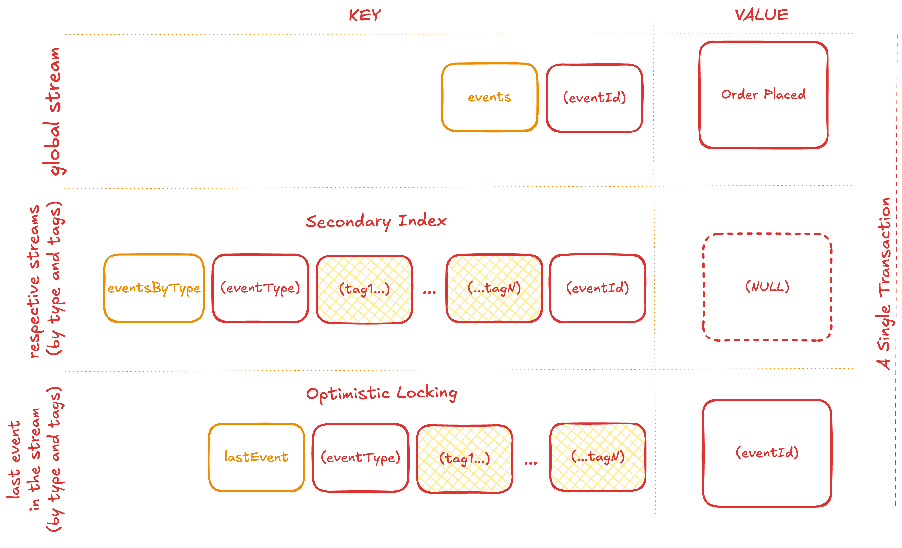
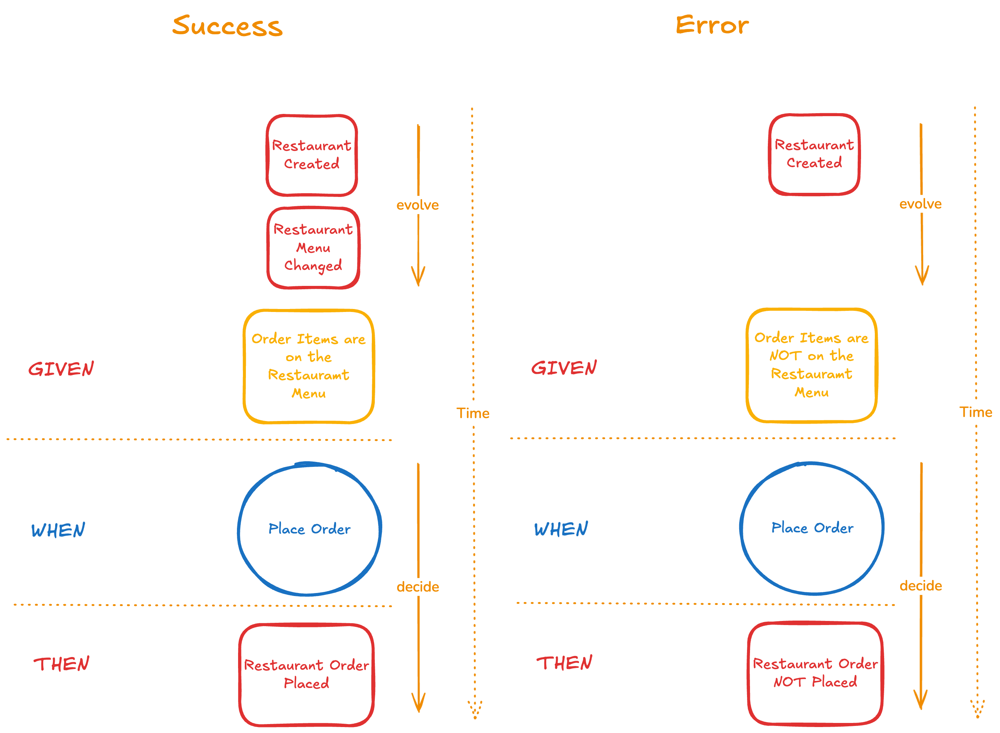
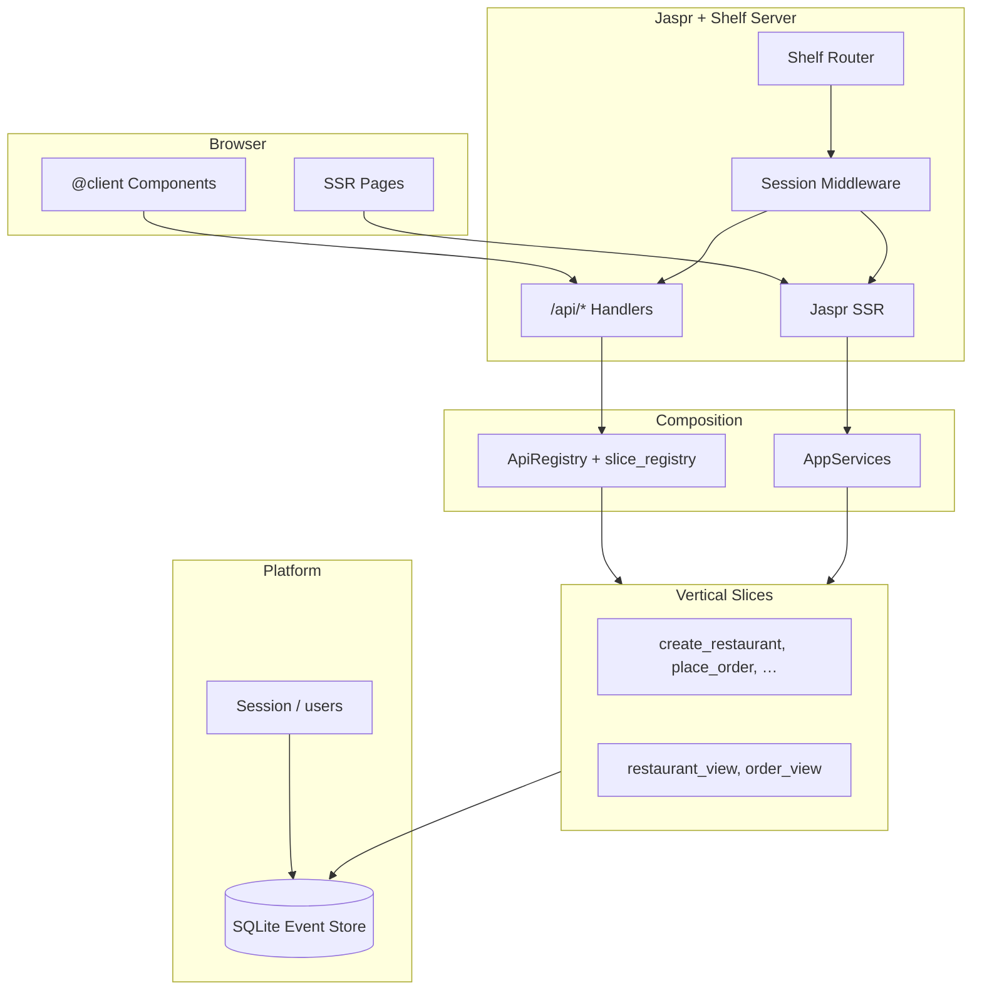

# Restaurant Order Management — Dart (Jaspr) Demo

A restaurant and order management demo built with
[Jaspr](https://docs.jaspr.site) (server mode), showcasing the **Dynamic
Consistency Boundary (DCB)** pattern using
[`fmodel`](https://github.com/dclimber/fmodel_dart) for Dart.
**SQLite** serves as the event store, with tag-based secondary indexing and
optimistic locking — a port of the Deno KV design from the
[TypeScript original](../order-management-demo).

## Disclaimer

This repository is a **Dart port** of
[fraktalio/order-management-demo](https://github.com/fraktalio/order-management-demo).
**Fraktalio** is credited as the original author of the domain design, event
modeling, and DCB use cases (see [`NOTICE`](NOTICE)).

The port was carried out by **Dclimber**, who relied primarily on **AI coding
agents** to produce the implementation — effectively **no code here was
hand-written** line-by-line. Treat this project as an experimental rewrite and
reference port, not a hand-crafted production codebase.

## Event Modeling

The domain is designed using [Event Modeling](https://eventmodeling.org) — a
blueprint that maps out commands, events, read models, and UI interactions in a
single visual artifact.

Event Model can be viewed [here](https://dclimber.github.io/order-management-demo-dart/).

<!doctype html>
<html lang="en">
<head>
<meta charset="utf-8">
<meta name="viewport" content="width=device-width, initial-scale=1">
<title>Event Model Canvas</title>
<style>
/* ============================================================
   Event Model Canvas — a static viewer for .em.hcl models.
   Identity: "engineered blueprint" — cool drafting neutrals,
   indigo chrome, mono spec-data, sticky notes in the domain's
   own conventional colors. Fully offline (system fonts only).
   ============================================================ */

/* ---- Tokens: light (bare :root = the un-stamped default) ---- */
:root {
  color-scheme: light;

  --bg:        #f3f0e8;
  --board:     #fbfaf5;
  --surface:   #f6f2e9;
  --panel:     #fffdf7;
  --ink:       #2e2a24;
  --ink-soft:  #6f685c;
  --ink-faint: #756e62;
  --rail:      #efe9db;
  --line:      #ddd5c4;
  --line-soft: #e7e1d3;
  --grid-line: rgba(120,108,84,0.10);
  --accent:    #b15b28;
  --accent-ink:#8f4a1f;
  --accent-soft:#f3e2d2;
  --shadow-sm: 0 1px 2px rgba(20,30,55,.10);
  --shadow:    0 1px 2px rgba(20,30,55,.09), 0 8px 22px rgba(20,30,55,.08);
  --shadow-lg: 0 12px 40px rgba(20,30,55,.20);

  /* Semantic sticky-note colors — domain conventions, held CONSTANT
     across themes (physical stickies stay bright on a dark board). */
  --event-fill:#f5a14a; --event-line:#d77c27; --event-ink:#402810;
  --external-event-fill:#ef9fbe; --external-event-line:#ce7395; --external-event-ink:#4d1831;
  --command-fill:#70d0e9; --command-line:#42a9c4; --command-ink:#153743;
  --read-fill:#c8e98e; --read-line:#93bc58; --read-ink:#263b16;
  --screen-fill:#f2eee4; --screen-line:#c8bdab; --screen-ink:#342f28;
  --proc-fill:#c18acb; --proc-line:#9e64aa; --proc-ink:#35203b;
  --table-fill:#f6eda0; --table-line:#d4c663; --table-ink:#423a12;
  --hot-fill:#F7C2C2;     --hot-line:#DC6A6A;     --hot-ink:#5b1a1a;
  --hot-sticky-fill:#E5484D; --hot-sticky-line:#B4232A; --hot-sticky-ink:#FFFFFF;
  --sticky-shadow:0 2px 2px rgba(48,38,22,.12),0 7px 12px rgba(48,38,22,.18);
  --sticky-shadow-hot:0 3px 4px rgba(48,38,22,.14),0 12px 20px rgba(48,38,22,.22);

  /* Status hues (semantic; independent of accent) */
  --st-created:#8792a6;
  --st-done:#2FA24E;
  --st-assigned:#3B82C4;
  --st-in_progress:#E08A26;
  --st-review:#7C6FD6;
  --st-blocked:#D4483B;
  --st-planned:#22a19b;
  --st-informational:#9aa4b4;

  /* Chrome that must react to theme */
  --wire:#8c8579;
  --wire-hot:#403b34;
}

/* Dark via OS, unless an explicit light choice is stamped */
@media (prefers-color-scheme: dark) {
  :root:not([data-theme="light"]) {
    color-scheme: dark;
    --bg:        #211d17;
    --board:     #241f18;
    --surface:   #2b261e;
    --panel:     #332d24;
    --ink:       #f0ece2;
    --ink-soft:  #c3bbaa;
    --ink-faint: #aaa18f;
    --rail:      #2b261e;
    --line:      #40392e;
    --line-soft: #332d2480;
    --grid-line: rgba(210,196,168,0.06);
    --accent:    #b15b28;
    --accent-ink:#e79a63;
    --accent-soft:#3a2c1e;
    --shadow-sm: 0 1px 2px rgba(0,0,0,.45);
    --shadow:    0 1px 2px rgba(0,0,0,.5), 0 10px 26px rgba(0,0,0,.4);
    --shadow-lg: 0 16px 46px rgba(0,0,0,.55);
    --wire:#6b6455;
    --wire-hot:#c9bfa8;
  }
}

/* Explicit dark choice wins in both directions */
:root[data-theme="dark"] {
  color-scheme: dark;
  --bg:        #211d17;
  --board:     #241f18;
  --surface:   #2b261e;
  --panel:     #332d24;
  --ink:       #f0ece2;
  --ink-soft:  #c3bbaa;
  --ink-faint: #aaa18f;
  --rail:      #2b261e;
  --line:      #40392e;
  --line-soft: #332d2480;
  --grid-line: rgba(210,196,168,0.06);
  --accent:    #b15b28;
  --accent-ink:#e79a63;
  --accent-soft:#3a2c1e;
  --shadow-sm: 0 1px 2px rgba(0,0,0,.45);
  --shadow:    0 1px 2px rgba(0,0,0,.5), 0 10px 26px rgba(0,0,0,.4);
  --shadow-lg: 0 16px 46px rgba(0,0,0,.55);
  --wire:#6b6455;
  --wire-hot:#c9bfa8;
}

/* ---------------------------- base ---------------------------- */
*{box-sizing:border-box}
#board[hidden], .board-es[hidden], .board-cm[hidden], .board-compact[hidden]{display:none}
html,body{height:100%}
body{
  margin:0;
  background:var(--bg);
  color:var(--ink);
  font-family: ui-sans-serif, system-ui, -apple-system, "Segoe UI", Roboto,
               "Helvetica Neue", Arial, sans-serif;
  font-size:14px; line-height:1.5;
  -webkit-font-smoothing:antialiased;
  display:flex; flex-direction:column;
}
:root{
  --font-cond: ui-sans-serif, system-ui, "Segoe UI Semibold", "Segoe UI", Roboto, sans-serif;
  --font-mono: ui-monospace, "SF Mono", "JetBrains Mono", "Cascadia Code",
               Menlo, Consolas, monospace;
}
.mono{font-family:var(--font-mono)}
button{font-family:inherit}
:focus-visible{outline:2px solid var(--accent); outline-offset:2px; border-radius:6px}

.label{
  font-family:var(--font-cond); font-weight:700;
  text-transform:uppercase; letter-spacing:.09em;
  font-stretch:condensed;
}

/* --------------------------- masthead ------------------------- */
.masthead{
  display:flex; align-items:center; gap:20px; flex-wrap:wrap;
  padding:14px 22px;
  background:var(--surface);
  border-bottom:1px solid var(--line);
  box-shadow:var(--shadow-sm);
  position:relative; z-index:30;
}
.brand{display:flex; align-items:baseline; gap:12px; min-width:0}
.brand h1{
  margin:0; font-family:var(--font-cond); font-weight:800;
  font-stretch:condensed; letter-spacing:0;
  font-size:20px; line-height:1.05; white-space:nowrap;
}
.brand .dot{color:var(--accent)}
.brand .sub{
  font-size:12px; color:var(--ink-soft); white-space:nowrap;
  border-left:1px solid var(--line); padding-left:12px;
}
.brand .sub b{color:var(--ink); font-weight:600}

.meta{display:flex; gap:18px; margin-left:2px}
.meta .stat{display:flex; flex-direction:column; line-height:1.1}
.meta .stat .n{font-family:var(--font-mono); font-weight:600; font-size:16px; font-variant-numeric:tabular-nums}
.meta .stat .k{font-size:10px; color:var(--ink-faint); letter-spacing:.06em; text-transform:uppercase}

.tools{display:flex; align-items:center; gap:8px; flex:1 1 100%; flex-wrap:wrap}
#t-theme{margin-left:auto}

/* control primitives */
.seg, .chips{display:flex; align-items:center; gap:4px;
  background:var(--panel); border:1px solid var(--line); border-radius:3px; padding:3px}
.seg .fkey, .chips .fkey{
  font-size:10px; color:var(--ink-faint); letter-spacing:.05em;
  text-transform:uppercase; padding:0 6px 0 4px; align-self:center}
.btn{
  appearance:none; border:1px solid transparent; background:transparent;
  color:var(--ink-soft); border-radius:2px; padding:5px 10px;
  font-size:12px; font-weight:600; cursor:pointer; white-space:nowrap;
  transition:background .12s, color .12s, border-color .12s;
}
.btn:hover{color:var(--ink); background:var(--accent-soft)}
.btn[aria-pressed="true"], .seg .btn.on{
  background:var(--accent); color:#fff; box-shadow:var(--shadow-sm)}
.zoom-level{min-width:48px; font-variant-numeric:tabular-nums; text-align:center}
.chip{
  display:inline-flex; align-items:center; gap:6px;
  border:1px solid var(--line); background:var(--panel);
  color:var(--ink-soft); border-radius:3px; padding:4px 10px 4px 8px;
  font-size:11px; font-weight:600; cursor:pointer; white-space:nowrap;
  transition:opacity .12s, border-color .12s, color .12s;
}
.chip .sw{width:9px; height:9px; border-radius:50%; background:var(--c)}
.chip[aria-pressed="false"]{opacity:.42}
.chip:hover{color:var(--ink)}
.toolbtn{
  appearance:none; display:inline-flex; align-items:center; gap:7px;
  border:1px solid var(--line); background:var(--panel); color:var(--ink-soft);
  border-radius:3px; padding:7px 11px; font-size:12px; font-weight:600; cursor:pointer;
  transition:background .12s,color .12s;
}
.toolbtn:hover{color:var(--ink); background:var(--accent-soft)}
.toolbtn .gl{font-size:14px; line-height:1}
.switch{display:inline-flex; align-items:center; gap:8px; font-size:12px; font-weight:600;
  color:var(--ink-soft); user-select:none; cursor:pointer; padding-right:2px}
.switch input{position:absolute; opacity:0; width:0; height:0}
.switch .track{width:34px; height:19px; border-radius:999px; background:var(--line);
  position:relative; transition:background .15s}
.switch .track::after{content:""; position:absolute; top:2px; left:2px; width:15px; height:15px;
  border-radius:50%; background:#fff; box-shadow:var(--shadow-sm); transition:transform .15s}
.switch input:checked + .track{background:var(--accent)}
.switch input:checked + .track::after{transform:translateX(15px)}
.switch input:focus-visible + .track{outline:2px solid var(--accent); outline-offset:2px}

/* --------------------------- workspace ------------------------ */
.workspace{flex:1; min-height:0; display:flex; position:relative}

.canvas-scroll{
  flex:1; min-width:0; overflow:auto; padding:22px 26px 64px;
  background: radial-gradient(var(--grid-line) .75px, transparent .75px) 0 0/22px 22px, var(--board);
  scroll-behavior:smooth;
}

.board{
  position:relative;
  display:grid;
  grid-template-columns:var(--rail-w);
  --rail-w:112px;
  --h-chapter:38px; --h-header:70px;
  width:max-content;
}

/* wire layer sits above band backgrounds, below cards */
.wires{position:absolute; inset:0; width:100%; height:100%; pointer-events:none; z-index:2; overflow:visible}
.wires path{fill:none; stroke:var(--wire); stroke-width:2; opacity:.9; transition:opacity .14s, stroke .14s}
.wires path.backward{stroke-dasharray:3 5}
.wires path.actor-screen-link{stroke:color-mix(in srgb, #0D3F39 58%, var(--wire)); stroke-width:1.8; opacity:.78}
.wires path.dim{opacity:.12}
.board.hovering .wires path{opacity:.08}
.board.hovering .wires path.hot{opacity:1; stroke:var(--wire-hot); stroke-width:2.6}
.board.hovering .wires path.backward.hot{stroke-dasharray:none}
.wires marker path{fill:var(--wire)}
.wires marker#ah-hot path, .wires marker#ah-es-hot path, .wires marker#ah-cm-hot path, .wires marker#ah-compact-hot path{fill:var(--wire-hot)}

/* corner + header + rail stacking */
.cell{position:relative}
.rail-corner{position:sticky; left:0; z-index:26; background:var(--surface)}
.rail-corner.r-chapter{top:0; height:var(--h-chapter); border-bottom:1px solid var(--line-soft)}
.rail-corner.r-header{top:var(--h-chapter); height:var(--h-header);
  border-bottom:1px solid var(--line); box-shadow:var(--shadow-sm)}

/* chapter band */
.chap-row-cell{position:sticky; top:0; z-index:20; height:var(--h-chapter);
  background:var(--surface); border-bottom:1px solid var(--line-soft);
  display:flex; align-items:center; padding:0 6px}
.chapter{
  display:flex; align-items:center; gap:8px; width:100%; height:24px;
  background:var(--accent-soft); color:var(--accent-ink);
  border:1px solid color-mix(in srgb, var(--accent) 30%, transparent);
  border-radius:7px; padding:0 12px;
}
.chapter .arw{color:var(--accent)}
.chapter .nm{font-family:var(--font-cond); font-weight:700; font-stretch:condensed;
  text-transform:uppercase; letter-spacing:.08em; font-size:11px}
.chapter .ct{margin-left:auto; font-family:var(--font-mono); font-size:10px; opacity:.7}

/* slice header */
.slice-head{position:sticky; top:var(--h-chapter); z-index:18; height:var(--h-header);
  background:var(--surface); border-bottom:1px solid var(--line);
  border-left:1px solid var(--line-soft); box-shadow:var(--shadow-sm);
  padding:9px 12px 8px; cursor:pointer; display:flex; flex-direction:column; gap:5px;
  transition:background .12s}
.slice-head:hover{background:var(--accent-soft)}
.slice-head .top{display:flex; align-items:center; gap:8px}
.slice-head .pat{width:26px; height:26px; flex:none; border-radius:7px;
  display:grid; place-items:center; background:var(--panel); border:1px solid var(--line); color:var(--ink-soft)}
.slice-head .pat svg{width:16px; height:16px}
.slice-head .ttl{font-weight:700; font-size:13.5px; line-height:1.15; color:var(--ink);
  overflow:hidden; text-overflow:ellipsis; display:-webkit-box; -webkit-line-clamp:1; -webkit-box-orient:vertical}
.slice-head .btm{display:flex; align-items:center; gap:8px; justify-content:space-between}
.slice-head .ptype{font-family:var(--font-mono); font-size:10px; color:var(--ink-faint); letter-spacing:.02em}
.status{display:inline-flex; align-items:center; gap:6px; font-family:var(--font-mono);
  font-size:10px; font-weight:600; text-transform:uppercase; letter-spacing:.04em; color:var(--ink-soft)}
.status .sd{width:8px; height:8px; border-radius:50%; background:var(--sc); box-shadow:0 0 0 3px color-mix(in srgb, var(--sc) 22%, transparent)}
.slice-idx{position:absolute; top:6px; right:9px; font-family:var(--font-mono); font-size:9px; color:var(--ink-faint)}

/* rail band labels */
.rail-lane{position:sticky; left:0; z-index:12; background:var(--rail);
  border-right:1px solid var(--line); display:flex; align-items:center; justify-content:center; padding:8px 0}
.rail-lane .txt{writing-mode:vertical-rl; transform:rotate(180deg);
  font-family:var(--font-cond); font-weight:700; font-stretch:condensed;
  text-transform:uppercase; letter-spacing:.14em; font-size:11px; color:var(--ink-soft)}
.rail-lane .txt small{display:block; font-size:9px; color:var(--ink-faint); letter-spacing:.1em; margin-top:4px}

/* band cells */
.band{border-left:1px solid var(--line-soft); border-bottom:1px dashed var(--line-soft);
  padding:16px 14px; display:grid; grid-template-columns:repeat(var(--stages),minmax(0,1fr));
  column-gap:20px; align-items:start; min-height:118px}
.band.screens{min-height:146px; background:color-mix(in srgb, var(--accent) 3.5%, transparent)}
.band.processors{min-height:96px; background:color-mix(in srgb, var(--proc-fill) 12%, transparent)}
.band.domain{min-height:118px}
.band.events{background:color-mix(in srgb, var(--event-fill) 7%, transparent)}
.stage-stack{display:flex; flex-direction:column; gap:14px; min-width:0}
.screen-pair{display:flex; align-items:center; gap:12px; min-width:0}
.screen-pair>.actor-card{flex:0 0 152px}
.screen-pair>.card{flex:1 1 176px; min-width:0}
.event-strip{grid-column:1/-1; display:flex; align-items:flex-start; gap:12px; min-width:0; flex-wrap:nowrap}
.event-strip .card{flex:0 0 176px}
.event-group{display:flex; align-items:flex-start; gap:12px; flex:none}
.event-group.outcome{margin-left:auto}

/* ---- context / aggregate event lanes ------------------------------ */
.ctx-head-rail{position:sticky; left:0; z-index:13; display:flex; align-items:center; padding:0 10px;
  background:var(--rail); border-right:1px solid var(--line); border-top:2px solid var(--accent)}
.ctx-rail-tag{font-family:var(--font-cond); font-weight:800; font-stretch:condensed;
  text-transform:uppercase; letter-spacing:.07em; font-size:9.5px; color:var(--accent-ink);
  overflow:hidden; text-overflow:ellipsis; white-space:nowrap}
.ctx-head{display:flex; align-items:stretch; background:var(--surface);
  border-left:1px solid var(--line-soft); border-top:2px solid var(--accent); padding:0}
.ctx-toggle{appearance:none; border:0; background:transparent; font:inherit; cursor:default;
  display:flex; align-items:center; gap:10px; width:100%; padding:8px 14px; color:var(--ink);
  position:sticky; left:0}
.ctx-toggle .ctx-caret{display:none}
.ctx-toggle .ctx-name{font-family:var(--font-cond); font-weight:800; font-stretch:condensed;
  text-transform:uppercase; letter-spacing:.1em; font-size:12px}
.ctx-toggle .ctx-name .ext{color:var(--accent)}
.ctx-toggle .ctx-count{font-family:var(--font-mono); font-size:10px; color:var(--ink-faint)}

.rail-lane.agg-lane{justify-content:flex-start; padding:10px 10px}
.agg-lane .agg-rail{display:flex; flex-direction:column; gap:4px; align-items:flex-start; width:100%}
.agg-lane .agg-name{font-family:var(--font-cond); font-weight:700; font-stretch:condensed;
  letter-spacing:.02em; font-size:11px; color:var(--ink-soft); line-height:1.2}

.band.events.agg-band{min-height:92px}
.band.events.agg-band.lane-empty{align-items:center; justify-items:center}
.lane-empty-mark{grid-column:1/-1; text-align:center; color:var(--ink-faint); opacity:.35;
  font-family:var(--font-mono); font-size:12px}
.board .cell.lane-dim{opacity:.26; transition:opacity .14s}

.actor-card{appearance:none; position:relative; z-index:4; width:100%; min-height:42px;
  display:flex; align-items:center; gap:9px; padding:8px 10px; border:0;
  border-radius:1px; background:#f5e84f; color:#3b3510; box-shadow:var(--sticky-shadow);
  font:inherit; text-align:left; cursor:default; transform:rotate(-.35deg);
  transition:transform .14s,box-shadow .14s,opacity .14s}
.actor-card:hover,.actor-card:focus-visible{transform:translateY(-4px) rotate(0); box-shadow:var(--sticky-shadow-hot)}
.actor-card .person{width:24px; height:24px; flex:none; display:grid; place-items:center;
  border-radius:50%; background:rgba(59,53,16,.14)}
.actor-card .person svg{width:15px; height:15px}
.actor-card .actor-copy{display:flex; min-width:0; flex-direction:column; gap:2px}
.actor-card .an{font-weight:700; font-size:12px; line-height:1.15}
.actor-card .am{font-family:var(--font-mono); font-size:9px; line-height:1; opacity:.7}
.actor-card .lock{margin-left:auto; width:14px; height:14px; opacity:.72}

/* ------------------------- sticky cards ----------------------- */
.card{position:relative; z-index:4; border-radius:1px; padding:9px 11px;
  border:0; background:var(--fl); color:var(--ik);
  box-shadow:var(--sticky-shadow); cursor:pointer;
  transition:transform .14s, box-shadow .14s, opacity .14s;
  transform:rotate(-.35deg);
  --fl:var(--panel); --cl:var(--line); --ik:var(--ink)}
.card:hover{transform:translateY(-4px) rotate(0); box-shadow:var(--sticky-shadow-hot)}
.card:nth-child(even){transform:rotate(.28deg)}
.card:nth-child(3n){transform:rotate(-.18deg) translateY(2px)}
.card:hover,.card.is-hot{transform:translateY(-4px) rotate(0)}
.card .kind{display:flex; align-items:center; gap:6px; margin-bottom:3px}
.card .kind .kdot{width:8px;height:8px;border-radius:2px;background:var(--cl)}
.card .kind .kn{font-family:var(--font-cond); font-weight:800; font-stretch:condensed;
  text-transform:uppercase; letter-spacing:.08em; font-size:9px; color:color-mix(in srgb,var(--ik) 68%,transparent)}
.card .kind .agg{margin-left:auto; font-family:var(--font-mono); font-size:9px; opacity:.6}
.card .ct{font-weight:750; font-size:14px; line-height:1.2; margin-top:2px}
.card .q{font-size:11px; line-height:1.35; margin-top:4px; opacity:.82; font-style:italic}
.card .api{font-family:var(--font-mono); font-size:10px; margin-top:5px; opacity:.72}
.card .id{font-family:var(--font-mono); font-size:9.5px; opacity:.55; margin-top:4px}

.card.event{--fl:var(--event-fill); --cl:var(--event-line); --ik:var(--event-ink)}
.card.event.external{--fl:var(--external-event-fill); --cl:var(--external-event-line); --ik:var(--external-event-ink)}
.card.command{--fl:var(--command-fill); --cl:var(--command-line); --ik:var(--command-ink)}
.card.readmodel{--fl:var(--read-fill); --cl:var(--read-line); --ik:var(--read-ink)}
.card.processor{--fl:var(--proc-fill); --cl:var(--proc-line); --ik:var(--proc-ink)}
.card.table{--fl:var(--table-fill); --cl:var(--table-line); --ik:var(--table-ink)}
.card.screen,.card.screen_image{--fl:var(--screen-fill); --cl:var(--screen-line); --ik:var(--screen-ink)}

.card .tags{display:flex; flex-wrap:wrap; gap:4px; margin-top:6px}
.card .tag{font-family:var(--font-mono); font-size:9px; padding:1px 6px; border-radius:2px;
  background:color-mix(in srgb, var(--ik) 12%, transparent); opacity:.8}

/* processor gear + screen wireframe */
.proc-head{display:flex; align-items:center; gap:8px}
.gear{width:22px; height:22px; flex:none}
@media (prefers-reduced-motion: reduce){ .card{transition:none} .canvas-scroll{scroll-behavior:auto} }

.wire-frame{height:28px; margin:6px -2px 2px; border:1px solid var(--screen-line);
  border-radius:2px; background:
    linear-gradient(var(--screen-line),var(--screen-line)) 8px 8px/34px 4px no-repeat,
    linear-gradient(var(--screen-line),var(--screen-line)) 8px 16px/58px 3px no-repeat,
    linear-gradient(var(--screen-line),var(--screen-line)) 8px 23px/44px 3px no-repeat,
    color-mix(in srgb, var(--screen-line) 14%, transparent);
  opacity:.9}
.image-preview{height:108px; margin-top:7px; border-radius:2px; border:1px dashed var(--screen-line);
  display:grid; place-items:center; overflow:hidden; background:var(--surface); position:relative}
.image-preview img{width:100%; height:100%; object-fit:contain; display:block}
.image-preview-fallback{display:none; padding:10px; text-align:center; font-family:var(--font-mono);
  font-size:10px; color:var(--screen-ink); opacity:.7}
.image-preview.failed img{display:none}
.image-preview.failed .image-preview-fallback{display:block}

/* fields */
.fields{margin-top:7px; padding-top:6px; border-top:1px solid color-mix(in srgb, var(--ik) 16%, transparent);
  display:none; flex-direction:column; gap:3px}
.board.show-fields .fields{display:flex}
.field{display:flex; align-items:baseline; gap:6px; font-family:var(--font-mono); font-size:10px; line-height:1.3}
.field .fn{font-weight:600}
.field .fty{opacity:.62}
.field .fb{margin-left:auto; display:flex; gap:3px}
.field .fb i{font-style:normal; font-size:8px; padding:0 4px; border-radius:4px;
  background:color-mix(in srgb, var(--ik) 15%, transparent); letter-spacing:.03em}
.field .fb i.id{background:#d9b23a; color:#3a2c00}
.field .fb i.pii{background:#e08aa0; color:#40101f}

/* hotspot: shared base (Storming's .es-hotspot relies on this positioning) */
.hotspot{position:absolute; z-index:6; cursor:help}
/* Model view: big red sticky, ~60% of the pinned card, hanging off its top-right corner */
.board .hotspot{top:0; right:0; z-index:7; width:60%; min-width:84px; max-width:140px; aspect-ratio:1;
  box-sizing:border-box; padding:8px 7px; border-radius:1px; border:0;
  background:var(--hot-sticky-fill); color:var(--hot-sticky-ink);
  display:flex; flex-direction:column; align-items:center; justify-content:center; gap:3px; text-align:center;
  box-shadow:var(--sticky-shadow); transform:translate(60%,-55%) rotate(4deg);
  transition:transform .14s, box-shadow .14s}
.board .hotspot:hover, .board .hotspot:focus-visible{z-index:9; transform:translate(60%,-55%) rotate(0); box-shadow:var(--sticky-shadow-hot)}
.board .hotspot .hs-mark{font-size:22px; font-weight:900; line-height:1}
.board .hotspot .hs-label{font-family:var(--font-cond); font-stretch:condensed; font-size:9px; font-weight:800; text-transform:uppercase; letter-spacing:.08em; opacity:.9}
.board .hotspot .hs-q{font-size:10px; font-weight:650; line-height:1.2; overflow:hidden; overflow-wrap:anywhere;
  display:-webkit-box; -webkit-line-clamp:3; -webkit-box-orient:vertical}
.board .hotspot::after{content:attr(data-q); position:absolute; bottom:104%; right:0; width:220px;
  background:var(--hot-sticky-fill); color:var(--hot-sticky-ink); border:1px solid var(--hot-sticky-line);
  border-radius:2px; padding:8px 10px; font-size:11px; font-weight:600; line-height:1.35; text-align:left;
  box-shadow:var(--shadow); opacity:0; pointer-events:none; transform:translateY(4px); transition:opacity .14s, transform .14s}
.board .hotspot:hover::after, .board .hotspot:focus-visible::after{opacity:1; transform:translateY(0)}
/* slice-level hotspots: in-flow row atop the Screens band, under the slice title */
.slice-hotspots{display:flex; flex-wrap:wrap; gap:12px; margin-bottom:14px; min-width:0}
.board .slice-hotspots .hotspot{position:relative; top:auto; right:auto; flex:0 0 auto; width:106px; min-width:0; max-width:none;
  transform:rotate(-2deg)}
.board .slice-hotspots .hotspot:hover, .board .slice-hotspots .hotspot:focus-visible{transform:rotate(0)}
.board .slice-hotspots .hotspot::after{bottom:auto; top:104%; right:auto; left:0}

/* filtering + hover dimming */
.card.filtered, .actor-card.filtered, .slice-head.filtered{opacity:.2; pointer-events:none; filter:saturate(.4)}
.board.hovering .card:not(.is-hot){opacity:.32}
.board.hovering .actor-card:not(.is-hot){opacity:.32}
.board.hovering .card.is-hot{box-shadow:var(--sticky-shadow-hot); transform:translateY(-4px) rotate(0)}

/* -------------------------- legend bar ------------------------ */
.legend{position:absolute; left:14px; bottom:14px; z-index:24; max-width:min(94vw, 720px)}
.legend>summary{list-style:none; cursor:pointer; display:inline-flex; align-items:center; gap:8px;
  background:var(--panel); border:1px solid var(--line); border-radius:10px; padding:8px 13px;
  font-family:var(--font-cond); font-weight:700; font-stretch:condensed; text-transform:uppercase;
  letter-spacing:.08em; font-size:11px; color:var(--ink-soft); box-shadow:var(--shadow)}
.legend>summary::-webkit-details-marker{display:none}
.legend>summary .cv{color:var(--accent)}
.legend[open]>summary{border-bottom-left-radius:0; border-bottom-right-radius:0}
.legend .panel{background:var(--panel); border:1px solid var(--line); border-top:0;
  border-radius:0 10px 10px 10px; padding:14px 16px; box-shadow:var(--shadow-lg);
  display:flex; gap:26px; flex-wrap:wrap}
.legend .grp{display:flex; flex-direction:column; gap:7px}
.legend .grp h4{margin:0 0 2px; font-family:var(--font-cond); font-weight:700; font-stretch:condensed;
  text-transform:uppercase; letter-spacing:.09em; font-size:10px; color:var(--ink-faint)}
.legend .row{display:flex; align-items:center; gap:8px; font-size:11.5px; color:var(--ink-soft)}
.legend .row .sw{width:14px; height:14px; border-radius:4px; border:1.5px solid var(--cl); background:var(--fl)}
.legend .row .sd{width:9px; height:9px; border-radius:50%}
.legend .row .pg{width:16px; height:16px; color:var(--ink-soft)}

/* ---------------------------- drawer -------------------------- */
.scrim{position:fixed; inset:0; background:rgba(40,34,22,.42); opacity:0; pointer-events:none;
  transition:opacity .2s; z-index:40}
.scrim.open{opacity:1; pointer-events:auto}
.drawer{position:fixed; top:0; right:0; height:100%; width:min(440px, 94vw);
  background:var(--surface); border-left:1px solid var(--line); box-shadow:var(--shadow-lg);
  transform:translateX(100%); transition:transform .24s cubic-bezier(.4,.0,.2,1); z-index:41;
  display:flex; flex-direction:column}
.drawer.open{transform:translateX(0)}
@media (prefers-reduced-motion: reduce){ .drawer{transition:none} .scrim{transition:none} }
.drawer header{padding:18px 20px 14px; border-bottom:1px solid var(--line); position:relative}
.drawer header .pt{font-family:var(--font-mono); font-size:10px; color:var(--ink-faint);
  text-transform:uppercase; letter-spacing:.08em}
.drawer header h2{margin:5px 0 8px; font-size:19px; line-height:1.15; font-family:var(--font-cond); font-weight:800; font-stretch:condensed}
.drawer header .desc{font-size:13.5px; color:var(--ink-soft); line-height:1.5}
.drawer header .row{display:flex; align-items:center; gap:10px; margin-top:10px; flex-wrap:wrap}
.drawer .x{position:absolute; top:14px; right:14px; width:30px; height:30px; border-radius:8px;
  border:1px solid var(--line); background:var(--panel); color:var(--ink-soft); cursor:pointer; font-size:16px}
.drawer .x:hover{color:var(--ink); background:var(--accent-soft)}
.drawer .body{padding:16px 20px 40px; overflow:auto}
.sec{margin-bottom:22px}
.sec>h3{margin:0 0 10px; font-family:var(--font-cond); font-weight:700; font-stretch:condensed;
  text-transform:uppercase; letter-spacing:.09em; font-size:11px; color:var(--ink-faint);
  display:flex; align-items:center; gap:8px}
.sec>h3::after{content:""; flex:1; height:1px; background:var(--line)}

.owner-pill{display:inline-flex; align-items:center; gap:6px; font-size:11px; color:var(--ink-soft);
  background:var(--panel); border:1px solid var(--line); border-radius:7px; padding:3px 9px; font-family:var(--font-mono)}

/* scenario GWT */
.scenario{border:1px solid var(--line); border-radius:11px; overflow:hidden; margin-bottom:14px; background:var(--panel)}
.scenario>.sh{padding:9px 12px; font-weight:700; font-size:12.5px; background:var(--surface); border-bottom:1px solid var(--line)}
.gwt{display:flex; gap:9px; padding:9px 12px; align-items:flex-start}
.gwt+.gwt{border-top:1px dashed var(--line-soft)}
.gwt .k{flex:none; width:52px; font-family:var(--font-cond); font-weight:800; font-stretch:condensed;
  text-transform:uppercase; letter-spacing:.06em; font-size:10px; padding:3px 0; text-align:center;
  border-radius:6px; color:#fff}
.gwt.given .k{background:var(--read-line)}
.gwt.when  .k{background:var(--command-line)}
.gwt.then  .k{background:var(--event-line)}
.gwt.then.err .k{background:var(--hot-line)}
.gwt .c{flex:1; min-width:0}
.gwt .c .cn{font-size:12.5px; font-weight:600; line-height:1.3}
.gwt .c .ref{display:inline-flex; align-items:center; gap:5px; margin-top:3px; font-family:var(--font-mono);
  font-size:10px; color:var(--ink-soft)}
.gwt .c .cn{font-size:13px; font-weight:600; line-height:1.4}
.gwt .c .ex{margin-top:5px; font-family:var(--font-mono); font-size:10px; color:var(--ink-soft);
  background:var(--surface); border:1px solid var(--line); border-radius:6px; padding:5px 8px; overflow-x:auto}
.gwt .c .flag{display:inline-block; margin-top:5px; font-family:var(--font-mono); font-size:9px;
  padding:1px 6px; border-radius:5px; background:var(--accent-soft); color:var(--accent-ink)}
.gwt .c .err-msg{color:var(--hot-line); font-weight:600}
.comment{font-size:11.5px; color:var(--ink-soft); font-style:italic; padding:8px 12px;
  border-left:3px solid var(--line); margin-top:2px}

/* element list in drawer */
.elrow{display:flex; align-items:center; gap:10px; padding:8px 0; border-bottom:1px solid var(--line-soft)}
.elrow:last-child{border-bottom:0}
.elrow .ek{width:10px; height:10px; border-radius:3px; flex:none; background:var(--cl); border:1px solid var(--cl2, var(--cl))}
.elrow .ei{flex:1; min-width:0}
.elrow .ei .en{font-weight:600; font-size:12.5px}
.elrow .ei .ei2{font-family:var(--font-mono); font-size:10px; color:var(--ink-faint)}
.elrow .ec{font-family:var(--font-mono); font-size:10px; color:var(--ink-soft)}
.empty{font-size:12px; color:var(--ink-faint); font-style:italic; padding:4px 0}

.foot{padding:10px 22px; border-top:1px solid var(--line); background:var(--surface);
  font-size:11px; color:var(--ink-faint); display:flex; gap:8px; align-items:center; flex-wrap:wrap; z-index:30}
.foot .mono{color:var(--ink-soft)}
.foot a{color:var(--accent-ink); text-decoration:none}
.foot a:hover{text-decoration:underline}

@media (max-width:640px){
  .brand{width:100%; flex-wrap:wrap; gap:8px}
  .brand .sub{white-space:normal; overflow-wrap:anywhere}
  .meta{order:3; width:100%; margin-left:0; display:grid; grid-template-columns:repeat(3,minmax(0,1fr));
    gap:12px; border-top:1px solid var(--line); padding-top:10px}
  .tools{width:100%}
}

/* Event Storming — sequential flows with independent workflows in parallel. */
:root {
  --es-command-fill:#70d0e9; --es-command-line:#42a9c4;
  --es-event-fill:#f5a14a; --es-event-line:#d77c27;
  --es-external-fill:#ef9fbe; --es-external-line:#ce7395;
  --es-policy-fill:#c18acb; --es-policy-line:#9e64aa; --es-policy-ink:#35203b;
  --es-read-fill:#c8e98e; --es-read-line:#93bc58;
  --es-screen-fill:#f2eee4; --es-screen-line:#c8bdab;
  --es-agg-fill:#f6eda0; --es-agg-line:#d4c663; --es-agg-ink:#423a12;
  --es-actor-fill:#f5e84f; --es-actor-line:#d3c52d;
}

.board-es{
  --es-board:#fbfaf5; --es-board-ink:#2e2a24; --es-board-muted:#756e62;
  position:relative; min-width:max-content; min-height:100%; padding:30px 38px 64px;
  background:var(--es-board); color:var(--es-board-ink);
}
.board-es::before{content:""; position:absolute; inset:0; pointer-events:none; opacity:.22; background-image:radial-gradient(#c9c0b1 .65px,transparent .65px); background-size:18px 18px}
.board-es > :not(.wires){position:relative; z-index:1}
.board-es .wires{position:absolute; inset:0; z-index:2; pointer-events:none; overflow:visible}
.board-es .wires path{fill:none; stroke:#8c8579; stroke-width:1.5; vector-effect:non-scaling-stroke; opacity:.68; transition:stroke .14s,opacity .14s}
.board-es .wires path.es-wire-cross{stroke-dasharray:5 7}
.board-es .wires path.hot{stroke:#403b34; stroke-width:2.2; opacity:1}

.es-disclaimer{
  position:relative; z-index:1; max-width:760px; margin:0 0 28px;
  padding:14px 18px; border:1px dashed #c9bfa8; border-radius:3px;
  background:color-mix(in srgb, var(--es-board) 55%, #fff6df);
  color:var(--es-board-ink); font-size:12px; line-height:1.55;
}
.es-disclaimer summary{cursor:pointer; font-weight:750}
.es-disclaimer[open] summary{margin-bottom:8px}
.es-disclaimer p{margin:0 0 8px}
.es-disclaimer p:last-child{margin-bottom:0}
.es-disclaimer ul{margin:0 0 8px; padding-left:18px}
.es-disclaimer li{margin-bottom:6px}
.es-disclaimer li:last-child{margin-bottom:0}
.es-disclaimer b{font-weight:750}

.es-chapter{position:relative; z-index:1; min-width:780px; margin:0 0 38px; border:0; border-radius:0; background:transparent; box-shadow:none; overflow:visible}
.es-chapter-label{padding:7px 5px 8px; border-bottom:2px dotted #d3ccbf; background:transparent; color:var(--es-board-muted); font-family:var(--font-cond); font-weight:800; font-size:12px; text-transform:uppercase; letter-spacing:.12em}
.es-rows{display:flex; flex-direction:column; gap:32px; padding:20px 5px 8px}
.es-flow-group{display:grid; grid-auto-flow:row; gap:34px 72px; align-items:start; width:max-content}
.es-row{display:grid; grid-template-columns:max-content; grid-template-rows:auto auto; align-items:start; width:max-content; min-height:170px; border:0; border-radius:0; position:relative}
.es-row:hover{background:transparent}
.es-row-head{position:relative; min-width:0; border:0; background:transparent; color:var(--es-board-ink); padding:0 8px 9px; text-align:left; cursor:pointer; display:flex; align-items:center; gap:7px}
.es-row-head:hover .es-row-title{text-decoration:underline}
.es-slice-idx{font-family:var(--font-mono); color:#a0998c; font-size:9px}
.es-pattern{width:16px; height:16px; color:#766f63}
.es-pattern svg{display:block; width:16px; height:16px}
.es-row-title{font-family:var(--font-cond); font-weight:760; font-size:12px; line-height:1.2; overflow-wrap:anywhere}
.es-row-head .status{margin-left:3px; font-size:9px; color:var(--es-board-muted)}
.es-flow{display:grid; column-gap:0; row-gap:8px; justify-content:start; align-items:start; padding:0 15px 30px 8px; min-width:max-content; position:relative}

.es-note{
  --es-fill:#fff; --es-line:transparent; --es-ink:#302b24;
  position:relative; z-index:3; flex:0 0 166px; width:166px; min-height:132px;
  padding:14px 14px 16px; border:0; border-radius:1px; background:var(--es-fill);
  color:var(--es-ink); box-shadow:0 2px 2px rgba(48,38,22,.12),0 7px 12px rgba(48,38,22,.18);
  transform:rotate(-.35deg); transition:opacity .14s,filter .14s,transform .14s,box-shadow .14s;
}
.es-note + .es-note{margin-left:0}
.es-note:nth-child(even){transform:rotate(.28deg)}
.es-note:nth-child(3n){transform:rotate(-.18deg) translateY(2px)}
.es-note:hover,.es-note.is-hot{z-index:6; transform:translateY(-4px) rotate(0); box-shadow:0 3px 4px rgba(48,38,22,.14),0 12px 20px rgba(48,38,22,.22)}
.board-es.hovering .es-note:not(.is-hot){opacity:.28; filter:saturate(.35)}
.es-command{--es-fill:var(--es-command-fill); --es-ink:#153743}
.es-event{--es-fill:var(--es-event-fill); --es-ink:#402810}
.es-event.external{--es-fill:var(--es-external-fill); --es-ink:#4d1831; flex-basis:190px; width:190px}
.es-processor{--es-fill:var(--es-policy-fill); --es-ink:var(--es-policy-ink); flex-basis:198px; width:198px}
.es-readmodel{--es-fill:var(--es-read-fill); --es-ink:#263b16}
.es-table{--es-fill:var(--es-agg-fill); --es-ink:var(--es-agg-ink)}
.es-screen,.es-screen_image{--es-fill:var(--es-screen-fill); --es-ink:#342f28}
.es-aggregate-note{--es-fill:var(--es-agg-fill); --es-ink:var(--es-agg-ink); flex-basis:214px; width:214px}
.es-note-kind{min-height:14px; color:color-mix(in srgb,var(--es-ink) 68%,transparent); font-family:var(--font-cond); font-size:9px; font-weight:800; text-transform:uppercase; letter-spacing:.08em}
.es-note-title{margin-top:8px; font-weight:750; font-size:14px; line-height:1.22; overflow-wrap:anywhere}
.es-actor-note{--es-fill:var(--es-actor-fill); --es-ink:#3b3510}
.es-actor-note .es-note-title{display:flex; align-items:center; gap:7px}
.es-actor-note .es-note-title svg{width:20px; height:20px; flex:none}
.es-note .q{margin-top:9px; font-size:11px; line-height:1.35; font-style:italic; opacity:.82}
.es-api{margin-top:8px; font-family:var(--font-mono); font-size:10px; opacity:.72}
.es-wire-frame{height:24px; margin-top:9px; border:1px solid color-mix(in srgb,var(--es-ink) 28%,transparent); border-radius:2px; background:rgba(255,255,255,.32)}
.es-note .image-preview{height:84px; border-color:color-mix(in srgb,var(--es-ink) 28%,transparent)}
.es-note .tags{gap:4px; flex-wrap:wrap; margin-top:9px}.es-note .tag{padding:2px 5px; border-radius:2px; background:color-mix(in srgb,var(--es-ink) 13%,transparent); font-family:var(--font-mono); font-size:9px; line-height:1.2}
.es-fields{margin-top:9px; padding-top:7px; border-top:1px solid color-mix(in srgb,var(--es-ink) 18%,transparent); flex-direction:column; gap:3px}
.es-note-detail{display:none!important}
.board-es.show-fields .es-note-detail{display:block!important}
.board-es.show-fields .es-note .tags,.board-es.show-fields .es-fields{display:flex!important}
.es-fields .field{color:var(--es-ink)}
.es-note.filtered,.es-row-head.filtered{opacity:.18; pointer-events:none; filter:saturate(.35)}
.hotspot.es-hotspot{
  width:78px; height:78px; top:-18px; right:-18px; border-radius:2px;
  display:flex; flex-direction:column; align-items:center; justify-content:center; gap:2px;
  padding:6px; text-align:center; background:var(--hot-fill); border:1.5px solid var(--hot-line);
  color:var(--hot-ink); box-shadow:0 2px 2px rgba(48,38,22,.12),0 7px 12px rgba(48,38,22,.2);
  transform:rotate(5deg); font-weight:800;
}
.hotspot.es-hotspot::after{content:none}
.hotspot.es-hotspot:hover,.hotspot.es-hotspot:focus-visible{z-index:9; transform:rotate(0)}
.es-hotspot-mark{font-size:15px; line-height:1}
.es-hotspot-label{font-size:8px; font-weight:800; text-transform:uppercase; letter-spacing:.06em; opacity:.85}
.es-hotspot-question{margin-top:2px; font-size:8.5px; font-weight:650; line-height:1.2; overflow-wrap:anywhere}

@media (max-width:850px){
  .board-es{padding:24px 28px 54px}
  .es-chapter{min-width:620px}
  .es-flow-group{gap:30px 58px}
  .es-note{flex-basis:150px; width:150px}
  .es-event.external{flex-basis:172px;width:172px}
  .es-processor{flex-basis:180px;width:180px}
  .es-aggregate-note{flex-basis:194px;width:194px}
}

/* --------------------------- Context Map view --------------------------- */
:root {
  --cm-node-fill: var(--panel);
  --cm-node-line: var(--accent);
  --cm-node-ink: var(--ink);
  --cm-tag-fill: var(--accent-soft);
  --cm-tag-line: var(--accent);
}

@media (prefers-color-scheme: dark) {
  :root:not([data-theme="light"]) {
    --cm-node-fill: var(--panel);
    --cm-node-line: var(--accent);
    --cm-node-ink: var(--ink);
    --cm-tag-fill: var(--accent-soft);
    --cm-tag-line: var(--accent);
  }
}

:root[data-theme="dark"] {
  --cm-node-fill: var(--panel);
  --cm-node-line: var(--accent);
  --cm-node-ink: var(--ink);
  --cm-tag-fill: var(--accent-soft);
  --cm-tag-line: var(--accent);
}

.board-cm {
  position: relative;
  min-width: 100%;
  min-height: 100%;
  overflow: hidden;
  background-color: var(--board);
}

.board-cm .wires { z-index: 2; }
.board-cm .wires .cm-edge { transition: opacity .14s, stroke .14s, stroke-width .14s; }
.board-cm .wires .cm-edge-badge {
  fill: var(--cm-node-ink);
  font-family: var(--font-mono);
  font-size: 10px;
  font-weight: 800;
  paint-order: stroke;
  stroke: var(--board);
  stroke-width: 4px;
  stroke-linejoin: round;
}
.board-cm .wires .cm-edge-tag rect { fill: var(--cm-tag-fill); stroke: var(--cm-tag-line); stroke-width: 1px; }
.board-cm .wires .cm-edge-tag text {
  fill: var(--cm-node-ink);
  font-family: var(--font-mono);
  font-size: 10px;
  font-weight: 800;
}

.cm-node {
  position: absolute;
  z-index: 3;
  display: flex;
  flex-direction: column;
  align-items: center;
  cursor: default;
  transition: opacity .14s, filter .14s, transform .14s;
}
.cm-disc {
  width: calc(var(--cm-r) * 2);
  height: calc(var(--cm-r) * 2);
  border: 2px solid var(--cm-node-line);
  border-radius: 50%;
  background: var(--cm-node-fill);
  box-shadow: var(--shadow);
  color: var(--cm-node-ink);
  display: grid;
  place-items: center;
  padding: 10px;
  text-align: center;
  transition: border-color .14s, box-shadow .14s, background .14s;
}
.cm-node.external .cm-disc { border-style: dashed; }
.cm-title {
  font-family: var(--font-cond);
  font-size: 12px;
  font-weight: 800;
  line-height: 1.15;
  overflow-wrap: anywhere;
}
.cm-team {
  display: inline-flex;
  align-items: center;
  justify-content: center;
  gap: 4px;
  max-width: 150px;
  margin-top: 7px;
  color: var(--ink-soft);
  font-size: 10px;
  font-weight: 700;
  line-height: 1.2;
  text-align: center;
}
.cm-team svg { width: 13px; height: 13px; flex: 0 0 auto; }
.cm-external {
  margin-top: 4px;
  color: var(--ink-soft);
  font-family: var(--font-mono);
  font-size: 9px;
  font-weight: 700;
  white-space: nowrap;
}

.board-cm.cm-hovering .cm-node { opacity: .22; filter: saturate(.45); }
.board-cm.cm-hovering .cm-node.is-hot { opacity: 1; filter: none; transform: translateY(-2px); }
.board-cm.cm-hovering .cm-node.is-hot .cm-disc { border-color: var(--wire-hot); box-shadow: var(--shadow-lg); }
.board-cm.cm-hovering .cm-edge,
.board-cm.cm-hovering .cm-edge-badge,
.board-cm.cm-hovering .cm-edge-tag { opacity: .1; }
.board-cm.cm-hovering .cm-edge.hot,
.board-cm.cm-hovering .cm-edge-badge.hot,
.board-cm.cm-hovering .cm-edge-tag.hot { opacity: 1; }
.board-cm.cm-hovering .cm-edge.hot { stroke: var(--wire-hot); stroke-width: 2.6; }

.cm-empty {
  position: absolute;
  inset: 0;
  display: grid;
  place-items: center;
  color: var(--ink-soft);
  font-family: var(--font-cond);
  font-size: 15px;
  font-weight: 700;
  letter-spacing: .02em;
}

/* ---- Compact view: one events row, bounded-context boxes ---------------- */
.board-compact[hidden]{display:none}

.board-compact .cell.band.events{display:flex; flex-direction:row; align-items:flex-start; gap:12px; padding:16px 14px}
.board-compact .cell.band.events.lane-empty{align-items:center; justify-content:center}

.ctx-box{border:1.5px dashed var(--ctx-line); background:var(--ctx-fill); border-radius:12px;
  padding:10px 12px 12px; display:flex; flex-direction:column; gap:10px; min-width:0;
  transition:opacity .14s}
.ctx-box.lane-dim{opacity:.26}
.ctx-box-title{font-size:11px; font-weight:750; letter-spacing:.04em; text-transform:uppercase; color:var(--ctx-line)}

.ctx-pair{display:flex; flex-direction:column; align-items:flex-start; min-width:0}
.ctx-pair + .ctx-pair{margin-top:12px}
.ctx-pair>.card.event{flex:0 0 auto; width:176px}
/* the aggregate / external-system sticky is stuck on top of its event, overlapping its top edge */
.ctx-pair>.card.aggregate, .ctx-pair>.ext-sticky{position:relative; z-index:5; margin:0 0 -5px 10px}

.card.aggregate{--fl:#f6eda0; --cl:#d4c663; --ik:#423a12; background:#f6eda0; color:#423a12; border:0;
  flex:0 0 auto; width:150px; min-height:0; padding:7px 10px 12px; transform:rotate(1deg)}
.card.aggregate .kind{display:flex; align-items:center; gap:5px}
.card.aggregate .ct{font-size:13px}

.ext-sticky{flex:0 0 auto; width:150px; min-height:0; padding:7px 10px 12px; background:#ef9fbe; color:#4d1831;
  border:0; border-radius:1px; cursor:pointer;
  box-shadow:0 1px 1px rgba(48,38,22,.12), 0 6px 10px rgba(48,38,22,.16);
  transform:rotate(-1.5deg); transition:transform .14s, box-shadow .14s, opacity .14s}
.ext-sticky:hover, .ext-sticky.is-hot{transform:translateY(-3px) rotate(0); box-shadow:var(--sticky-shadow-hot)}
.ext-sticky .k{display:flex; align-items:center; gap:5px; font-size:10px; text-transform:uppercase; letter-spacing:.08em; font-weight:800}
.ext-sticky .t{font-size:13px; font-weight:700; margin-top:3px; line-height:1.2}
.card.aggregate .ic, .ext-sticky .ic{width:13px; height:13px; flex:0 0 13px}

.ext-sticky.filtered, .card.aggregate.filtered{opacity:.2; pointer-events:none}
.board-compact.hovering .ext-sticky:not(.is-hot){opacity:.32}

.wires marker#ah-compact path{fill:var(--wire)}
.wires marker#ah-compact-hot path{fill:var(--wire-hot)}

.legend .row.ctx-note{max-width:260px; line-height:1.35; align-items:flex-start}
</style>
</head>
<body>

<header class="masthead">
  <div class="brand">
    <h1>Event Model<span class="dot">.</span>Canvas</h1>
    <span class="sub">model <b id="m-title">—</b> · HCL Spec <span class="mono" id="m-version">—</span></span>
  </div>
  <div class="meta" id="m-stats"></div>

    <button class="toolbtn" id="t-theme" title="Cycle theme"><span class="gl" id="theme-gl">◐</span><span id="theme-tx">Auto</span></button>
  <div class="tools">
    <div class="seg" id="f-view"><span class="fkey">View</span></div>
    <div class="seg" id="f-zoom"><span class="fkey">Zoom</span><button class="btn" id="z-out" title="Zoom out (-)" aria-label="Zoom out">−</button><button class="btn zoom-level" id="z-reset" title="Reset zoom to 100% (0)" aria-label="Reset zoom">100%</button><button class="btn" id="z-in" title="Zoom in (+)" aria-label="Zoom in">+</button><button class="btn" id="z-fit" title="Fit width (F)" aria-label="Fit to width">Fit</button></div>
    <div class="seg" id="f-chapter"><span class="fkey">Chapter</span></div>
    <div class="chips" id="f-status"><span class="fkey">Status</span></div>
    <div class="seg" id="f-context"><span class="fkey">Context</span></div>
    <label class="switch" id="f-fields-switch" title="Show field details on cards">
      <input type="checkbox" id="t-fields">
      <div class="track"></div>
    </label>
  </div>
</header>

<div class="workspace">
  <div class="canvas-scroll">
    <div class="board show-fields" id="board" aria-label="Event model canvas">
      <svg class="wires" id="wires" aria-hidden="true">
        <defs>
          <marker id="ah" markerWidth="9" markerHeight="9" refX="7" refY="4.5" orient="auto">
            <path d="M0 0 L9 4.5 L0 9 L2.4 4.5 Z" fill="var(--wire)"></path>
          </marker>
          <marker id="ah-hot" markerWidth="9" markerHeight="9" refX="7" refY="4.5" orient="auto">
            <path d="M0 0 L9 4.5 L0 9 L2.4 4.5 Z" fill="var(--wire-hot)"></path>
          </marker>
        </defs>
      </svg>
      <!-- grid content injected by script -->
    </div>
    <div class="board-es view show-fields" id="board-es" aria-label="Event storming canvas" hidden>
      <svg class="wires" id="wires-es" aria-hidden="true">
        <defs>
          <marker id="ah-es" markerWidth="9" markerHeight="9" refX="7" refY="4.5" orient="auto">
            <path d="M0 0 L9 4.5 L0 9 L2.4 4.5 Z" fill="var(--wire)"></path>
          </marker>
          <marker id="ah-es-hot" markerWidth="9" markerHeight="9" refX="7" refY="4.5" orient="auto">
            <path d="M0 0 L9 4.5 L0 9 L2.4 4.5 Z" fill="var(--wire-hot)"></path>
          </marker>
        </defs>
      </svg>
      <details class="es-disclaimer">
        <summary>Reading note — an Event Model drawn in a Storming style</summary>
        <p>This board is an <b>Event Model</b>, rendered in a visual style inspired by Event Storming. The methods share an event-first, timeline-based way of reasoning about systems, but serve different purposes:</p>
        <ul>
          <li><b>Event Storming</b> is a collaborative discovery and design technique: participants explore the domain by arranging events and progressively introducing commands, policies, actors, external systems, and boundaries.</li>
          <li><b>Event Modeling</b> turns that discovered behaviour into a more constrained system blueprint: workflows are decomposed into slices connecting screens, commands, events, read models, and automations, with concrete data and scenarios that can be used to validate and implement the system.</li>
        </ul>
        <p>This view is generated from Event Modeling data. Its sticky-note and timeline presentation borrows from Event Storming; the underlying semantics are Event Modeling.</p>
      </details>
      <!-- grid content injected by script -->
    </div>
    <div class="board-cm view" id="board-cm" aria-label="Context map canvas" hidden>
      <svg class="wires" id="wires-cm" aria-hidden="true">
        <defs>
          <marker id="ah-cm" markerWidth="9" markerHeight="9" refX="7" refY="4.5" orient="auto">
            <path d="M0 0 L9 4.5 L0 9 L2.4 4.5 Z" fill="var(--wire)"></path>
          </marker>
          <marker id="ah-cm-hot" markerWidth="9" markerHeight="9" refX="7" refY="4.5" orient="auto">
            <path d="M0 0 L9 4.5 L0 9 L2.4 4.5 Z" fill="var(--wire-hot)"></path>
          </marker>
        </defs>
      </svg>
      <!-- grid content injected by script -->
    </div>
    <div class="board board-compact view" id="board-compact" aria-label="Event Modeling compact view" hidden>
      <svg class="wires" id="wires-compact" aria-hidden="true"><defs>
        <marker id="ah-compact" markerWidth="9" markerHeight="9" refX="7" refY="4.5" orient="auto"><path d="M0 0 L9 4.5 L0 9 L2.4 4.5 Z" fill="var(--wire)"></path></marker>
        <marker id="ah-compact-hot" markerWidth="9" markerHeight="9" refX="7" refY="4.5" orient="auto"><path d="M0 0 L9 4.5 L0 9 L2.4 4.5 Z" fill="var(--wire-hot)"></path></marker>
      </defs></svg>
    </div>
  </div>

  <details class="legend" id="legend">
    <summary><span class="cv">◱</span> Legend &amp; conventions</summary>
    <div class="panel" id="legend-panel"></div>
  </details>
</div>

<div class="scrim" id="scrim"></div>
<aside class="drawer" id="drawer" aria-hidden="true" aria-label="Slice detail"></aside>

<footer class="foot">
  <span class="label" style="color:var(--ink-soft)">How to read</span>
  <span id="foot-hint"></span>
  <span style="margin-left:auto" class="mono">rendered by emhcl diagram</span>
</footer>

<script>
/* =====================================================================
   MODEL — adapted from the validated Event Modeling HCL Specification v0.3.0
   typed IR and injected here as
   JSON. The browser only handles layout and interaction.
   ===================================================================== */
const MODEL = {"title":"Order Management","version":"v0.3.0","actors":{"admin":{"title":"Admin","authRequired":true},"customer":{"title":"Customer","authRequired":true}},"contexts":{"restaurant_management":{"title":"Restaurant Management","external":false}},"contextMap":{"nodes":[{"id":"restaurant_management","title":"Restaurant Management","events":4,"aggregates":2}],"edges":[]},"chapters":[],"hotspots":[],"slices":[{"id":"create_restaurant","type":"state_change","title":"Create Restaurant","stageCount":3,"elements":[{"id":"create_restaurant__screen__create_restaurant_form","kind":"screen","title":"Create Restaurant Form","stage":0,"actor":"admin"},{"id":"create_restaurant__command__create_restaurant","kind":"command","title":"Create Restaurant","stage":1,"agg":"restaurant","api":"POST /api/restaurant","fields":[{"name":"restaurant_id","type":"String","id":true},{"name":"restaurant_name","type":"String"},{"name":"menu","type":"Custom"}]},{"id":"event__restaurant_management__restaurant_created","kind":"event","title":"Restaurant Created","stage":2,"agg":"restaurant","ctx":"restaurant_management","fields":[{"name":"restaurant_id","type":"String","id":true},{"name":"restaurant_name","type":"String"},{"name":"menu","type":"Custom"}]}],"scenarios":[{"title":"Restaurant Created","when":{"title":"Create Restaurant","refKind":"command","ref":"Create Restaurant"},"then":[{"title":"Restaurant Created","refKind":"event","ref":"Restaurant Created"}]},{"title":"Restaurant Already Exists","given":[{"title":"Restaurant Created","refKind":"event","ref":"Restaurant Created"}],"when":{"title":"Create Restaurant","refKind":"command","ref":"Create Restaurant"},"then":[{"title":"Restaurant {restaurant_id} already exists","refKind":"error","error":"Restaurant {restaurant_id} already exists"}]}]},{"id":"restaurant_view","type":"state_view","title":"Restaurant View","stageCount":2,"elements":[{"id":"restaurant_view__readmodel__restaurant","kind":"readmodel","title":"Restaurant","stage":0,"question":"What is the name and current menu of a restaurant (or of all restaurants)?","fields":[{"name":"restaurant_id","type":"String","id":true},{"name":"restaurant_name","type":"String"},{"name":"menu","type":"Custom"}]},{"id":"restaurant_view__screen__restaurant_menu","kind":"screen","title":"Restaurant Menu","stage":1,"actor":"admin"},{"id":"restaurant_view__screen__restaurant_list","kind":"screen","title":"Restaurant List","stage":1,"actor":"customer"}],"scenarios":[{"title":"Restaurant Created Shown","given":[{"title":"Restaurant Created","refKind":"event","ref":"Restaurant Created"}],"then":[{"title":"Restaurant","refKind":"readmodel","ref":"Restaurant"}]},{"title":"Menu Change Replaces Menu","given":[{"title":"Restaurant Created","refKind":"event","ref":"Restaurant Created"},{"title":"Restaurant Menu Changed","refKind":"event","ref":"Restaurant Menu Changed"}],"then":[{"title":"Restaurant","refKind":"readmodel","ref":"Restaurant"}],"comments":["Name is kept from Restaurant Created; menu is taken from the latest Restaurant Menu Changed."]}]},{"id":"change_restaurant_menu","type":"state_change","title":"Change Restaurant Menu","stageCount":3,"elements":[{"id":"change_restaurant_menu__screen__change_menu_form","kind":"screen","title":"Change Menu Form","stage":0,"actor":"admin"},{"id":"change_restaurant_menu__command__change_restaurant_menu","kind":"command","title":"Change Restaurant Menu","stage":1,"agg":"restaurant","api":"PUT /api/restaurant/menu","fields":[{"name":"restaurant_id","type":"String","id":true},{"name":"menu","type":"Custom"}]},{"id":"event__restaurant_management__restaurant_menu_changed","kind":"event","title":"Restaurant Menu Changed","stage":2,"agg":"restaurant","ctx":"restaurant_management","fields":[{"name":"restaurant_id","type":"String","id":true},{"name":"menu","type":"Custom"}]}],"scenarios":[{"title":"Menu Changed","given":[{"title":"Restaurant Created","refKind":"event","ref":"Restaurant Created"}],"when":{"title":"Change Restaurant Menu","refKind":"command","ref":"Change Restaurant Menu"},"then":[{"title":"Restaurant Menu Changed","refKind":"event","ref":"Restaurant Menu Changed"}]},{"title":"Restaurant Not Found","when":{"title":"Change Restaurant Menu","refKind":"command","ref":"Change Restaurant Menu"},"then":[{"title":"Restaurant {restaurant_id} does not exist","refKind":"error","error":"Restaurant {restaurant_id} does not exist"}]}]},{"id":"place_order","type":"state_change","title":"Place Order","stageCount":3,"elements":[{"id":"place_order__screen__place_order_form","kind":"screen","title":"Place Order Form","stage":0,"actor":"customer"},{"id":"place_order__command__place_order","kind":"command","title":"Place Order","stage":1,"agg":"order","api":"POST /api/order","fields":[{"name":"restaurant_id","type":"String","id":true},{"name":"order_id","type":"String","id":true},{"name":"menu_items","type":"Custom[]"}]},{"id":"event__restaurant_management__order_placed","kind":"event","title":"Order Placed","stage":2,"agg":"order","ctx":"restaurant_management","fields":[{"name":"restaurant_id","type":"String","id":true},{"name":"order_id","type":"String","id":true},{"name":"menu_items","type":"Custom[]"}]}],"scenarios":[{"title":"Order Placed","given":[{"title":"Restaurant Created","refKind":"event","ref":"Restaurant Created"}],"when":{"title":"Place Order","refKind":"command","ref":"Place Order"},"then":[{"title":"Order Placed","refKind":"event","ref":"Order Placed"}]},{"title":"Order Placed From Changed Menu","given":[{"title":"Restaurant Created","refKind":"event","ref":"Restaurant Created"},{"title":"Restaurant Menu Changed","refKind":"event","ref":"Restaurant Menu Changed"}],"when":{"title":"Place Order","refKind":"command","ref":"Place Order"},"then":[{"title":"Order Placed","refKind":"event","ref":"Order Placed"}],"comments":["Availability is checked against the latest menu."]},{"title":"Restaurant Not Found","when":{"title":"Place Order","refKind":"command","ref":"Place Order"},"then":[{"title":"Restaurant {restaurant_id} does not exist","refKind":"error","error":"Restaurant {restaurant_id} does not exist"}]},{"title":"Order Already Exists","given":[{"title":"Restaurant Created","refKind":"event","ref":"Restaurant Created"},{"title":"Order Placed","refKind":"event","ref":"Order Placed"}],"when":{"title":"Place Order","refKind":"command","ref":"Place Order"},"then":[{"title":"Order {order_id} already exists","refKind":"error","error":"Order {order_id} already exists"}]},{"title":"Menu Items Not Available","given":[{"title":"Restaurant Created","refKind":"event","ref":"Restaurant Created"}],"when":{"title":"Place Order","refKind":"command","ref":"Place Order"},"then":[{"title":"Menu items not available: {menu_item_ids}","refKind":"error","error":"Menu items not available: {menu_item_ids}"}],"comments":["Every ordered menu_item_id must be on the restaurant's current menu."]}]},{"id":"order_view","type":"state_view","title":"Order View","stageCount":2,"elements":[{"id":"order_view__readmodel__order","kind":"readmodel","title":"Order","stage":0,"question":"What was ordered and what is the status of an order (or of all orders with a given status)?","fields":[{"name":"order_id","type":"String","id":true},{"name":"restaurant_id","type":"String","id":true},{"name":"menu_items","type":"Custom[]"},{"name":"order_status","type":"String"}]},{"id":"order_view__screen__order_status_tracker","kind":"screen","title":"Order Status Tracker","stage":1,"actor":"customer"},{"id":"order_view__screen__kitchen_dashboard","kind":"screen","title":"Kitchen Dashboard","stage":1,"actor":"admin"}],"scenarios":[{"title":"Order Created","given":[{"title":"Order Placed","refKind":"event","ref":"Order Placed"}],"then":[{"title":"Order","refKind":"readmodel","ref":"Order"}],"comments":["status = created."]},{"title":"Order Prepared","given":[{"title":"Order Placed","refKind":"event","ref":"Order Placed"},{"title":"Order Prepared","refKind":"event","ref":"Order Prepared"}],"then":[{"title":"Order","refKind":"readmodel","ref":"Order"}],"comments":["status = prepared."]}]},{"id":"mark_order_as_prepared","type":"state_change","title":"Mark Order As Prepared","stageCount":3,"elements":[{"id":"mark_order_as_prepared__screen__kitchen_order","kind":"screen","title":"Kitchen Order","stage":0,"actor":"admin"},{"id":"mark_order_as_prepared__command__mark_order_as_prepared","kind":"command","title":"Mark Order As Prepared","stage":1,"agg":"order","api":"POST /api/kitchen","fields":[{"name":"order_id","type":"String","id":true}]},{"id":"event__restaurant_management__order_prepared","kind":"event","title":"Order Prepared","stage":2,"agg":"order","ctx":"restaurant_management","fields":[{"name":"order_id","type":"String","id":true}]}],"scenarios":[{"title":"Order Prepared","given":[{"title":"Order Placed","refKind":"event","ref":"Order Placed"}],"when":{"title":"Mark Order As Prepared","refKind":"command","ref":"Mark Order As Prepared"},"then":[{"title":"Order Prepared","refKind":"event","ref":"Order Prepared"}]},{"title":"Order Not Found","when":{"title":"Mark Order As Prepared","refKind":"command","ref":"Mark Order As Prepared"},"then":[{"title":"Order {order_id} does not exist","refKind":"error","error":"Order {order_id} does not exist"}]},{"title":"Order Already Prepared","given":[{"title":"Order Placed","refKind":"event","ref":"Order Placed"},{"title":"Order Prepared","refKind":"event","ref":"Order Prepared"}],"when":{"title":"Mark Order As Prepared","refKind":"command","ref":"Mark Order As Prepared"},"then":[{"title":"Order {order_id} is already prepared","refKind":"error","error":"Order {order_id} is already prepared"}]}]}],"edges":[{"from":"create_restaurant__screen__create_restaurant_form","to":"create_restaurant__command__create_restaurant"},{"from":"create_restaurant__command__create_restaurant","to":"event__restaurant_management__restaurant_created"},{"from":"restaurant_view__readmodel__restaurant","to":"restaurant_view__screen__restaurant_menu"},{"from":"restaurant_view__readmodel__restaurant","to":"restaurant_view__screen__restaurant_list"},{"from":"event__restaurant_management__restaurant_created","to":"restaurant_view__readmodel__restaurant"},{"from":"event__restaurant_management__restaurant_menu_changed","to":"restaurant_view__readmodel__restaurant"},{"from":"change_restaurant_menu__screen__change_menu_form","to":"change_restaurant_menu__command__change_restaurant_menu"},{"from":"change_restaurant_menu__command__change_restaurant_menu","to":"event__restaurant_management__restaurant_menu_changed"},{"from":"place_order__screen__place_order_form","to":"place_order__command__place_order"},{"from":"place_order__command__place_order","to":"event__restaurant_management__order_placed"},{"from":"order_view__readmodel__order","to":"order_view__screen__order_status_tracker"},{"from":"order_view__readmodel__order","to":"order_view__screen__kitchen_dashboard"},{"from":"event__restaurant_management__order_placed","to":"order_view__readmodel__order"},{"from":"event__restaurant_management__order_prepared","to":"order_view__readmodel__order"},{"from":"mark_order_as_prepared__screen__kitchen_order","to":"mark_order_as_prepared__command__mark_order_as_prepared"},{"from":"mark_order_as_prepared__command__mark_order_as_prepared","to":"event__restaurant_management__order_prepared"}]};

/* --------------------------- constants --------------------------- */
const BAND = {screen:"screens", screen_image:"screens", command:"domain", readmodel:"domain", processor:"processors", table:"domain", event:"events"};
const KIND_LABEL = {screen:"Screen", command:"Command", readmodel:"Read Model",
  processor:"Processor", screen_image:"Screen Image", table:"Table", event:"Event"};
const PATTERN_LABEL = {state_change:"state_change", state_view:"state_view",
  automation:"automation", translation:"translation"};
const STATUS_LABEL = {created:"Created", done:"Done", assigned:"Assigned", in_progress:"In progress",
  review:"Review", blocked:"Blocked", planned:"Planned", informational:"Informational"};

const PAT_SVG = {
  state_change:'<svg viewBox="0 0 24 24" fill="none" stroke="currentColor" stroke-width="1.8"><rect x="5" y="2.5" width="14" height="6.5" rx="1.6"/><path d="M12 9.2V15"/><path d="M9 12.5l3 3 3-3"/><rect x="5" y="15.5" width="14" height="6" rx="1.6"/></svg>',
  state_view:'<svg viewBox="0 0 24 24" fill="none" stroke="currentColor" stroke-width="1.8"><path d="M2 12s3.6-6 10-6 10 6 10 6-3.6 6-10 6-10-6-10-6Z"/><circle cx="12" cy="12" r="2.6"/></svg>',
  automation:'<svg viewBox="0 0 24 24" fill="none" stroke="currentColor" stroke-width="1.7"><circle cx="12" cy="12" r="3"/><path d="M12 2.5v3M12 18.5v3M2.5 12h3M18.5 12h3M5 5l2.1 2.1M16.9 16.9 19 19M19 5l-2.1 2.1M7.1 16.9 5 19"/></svg>',
  translation:'<svg viewBox="0 0 24 24" fill="none" stroke="currentColor" stroke-width="1.7"><path d="M3 7h11M9.5 3.5 13 7l-3.5 3.5"/><path d="M21 17H10M14.5 13.5 11 17l3.5 3.5"/></svg>',
};
const GEAR_SVG = '<svg class="gear" viewBox="0 0 24 24" fill="none" stroke="var(--proc-ink)" stroke-width="1.6"><circle cx="12" cy="12" r="3.1"/><path d="M12 2.2v3.2M12 18.6v3.2M2.2 12h3.2M18.6 12h3.2M4.9 4.9l2.3 2.3M16.8 16.8l2.3 2.3M19.1 4.9l-2.3 2.3M7.2 16.8l-2.3 2.3"/></svg>';
const ACTOR_SVG = '<svg viewBox="0 0 24 24" fill="none" stroke="currentColor" stroke-width="1.8" stroke-linecap="round" stroke-linejoin="round" aria-hidden="true"><path d="M20 21a8 8 0 0 0-16 0"/><circle cx="12" cy="7" r="4"/></svg>';
const LOCK_SVG = '<svg class="lock" viewBox="0 0 24 24" fill="none" stroke="currentColor" stroke-width="1.8" stroke-linecap="round" stroke-linejoin="round" aria-hidden="true"><rect width="18" height="11" x="3" y="11" rx="2"/><path d="M7 11V7a5 5 0 0 1 10 0v4"/></svg>';

/* --------------------------- helpers --------------------------- */
const $ = (s, r=document) => r.querySelector(s);
const el = (tag, cls, html) => { const n=document.createElement(tag); if(cls)n.className=cls; if(html!=null)n.innerHTML=html; return n; };
const esc = s => String(s).replace(/[&<>"]/g, c => ({'&':'&amp;','<':'&lt;','>':'&gt;','"':'&quot;'}[c]));
const fmtEx = v => typeof v === "string" ? '"'+v+'"' : (typeof v === "object" ? JSON.stringify(v).replace(/"/g,'') : String(v));
function statusVar(st){ return "var(--st-"+st+")"; }

// flat index of every element across slices, + which slice it lives in
const ELEMENTS = {};
const SLICE_OF = {};
MODEL.slices.forEach((s, si) => s.elements.forEach(e => { ELEMENTS[e.id]=e; SLICE_OF[e.id]=si; }));

/* ---- bounded-context / aggregate index for the event lanes ---- */
const titleize = s => String(s).replace(/[_-]+/g, " ").replace(/\b\w/g, c => c.toUpperCase());
const CTX_AGGS = {};                       // context id -> [aggregate id], first-seen order
(function(){
  const seen = new Set();
  MODEL.slices.forEach(s => s.elements.forEach(e => {
    if (e.kind !== "event") return;
    const ctx = (e.ctx && MODEL.contexts[e.ctx]) ? e.ctx : "__unmapped";
    const agg = e.agg || "__none";
    const key = ctx + " " + agg;
    if (seen.has(key)) return;
    seen.add(key);
    (CTX_AGGS[ctx] = CTX_AGGS[ctx] || []).push(agg);
  }));
})();
const CTX_ORDER = [
  ...Object.keys(MODEL.contexts).filter(c => CTX_AGGS[c]),
  ...(CTX_AGGS["__unmapped"] ? ["__unmapped"] : []),
];
const ctxTitle = c => c === "__unmapped" ? "Unmapped" : ((MODEL.contexts[c] && MODEL.contexts[c].title) || titleize(c));
const ctxExternal = c => !!(MODEL.contexts[c] && MODEL.contexts[c].external);
const aggTitle = a => a === "__none" ? "No aggregate" : titleize(a);
const eventCtx = e => (e.ctx && MODEL.contexts[e.ctx]) ? e.ctx : "__unmapped";

// directed edges from the canonical typed IR, de-duplicated defensively
const EDGES = [];
(function(){
  const seen = new Set();
  const add = (a,b) => { if(a&&b&&ELEMENTS[a]&&ELEMENTS[b]){ const k=a+">"+b; if(!seen.has(k)){seen.add(k); EDGES.push([a,b]);} } };
  (MODEL.edges||[]).forEach(edge => add(edge.from, edge.to));
})();
const NEIGHBORS = {};
EDGES.forEach(([a,b]) => { (NEIGHBORS[a]=NEIGHBORS[a]||new Set()).add(b); (NEIGHBORS[b]=NEIGHBORS[b]||new Set()).add(a); });

/* --------------------------- shared drawer (used by every view) --------------------------- */
const drawer = $("#drawer"), scrim = $("#scrim");
function refChip(rk, name){
  const cl = rk==="event"?"var(--event-line)":rk==="command"?"var(--command-line)":rk==="readmodel"?"var(--read-line)":"var(--ink-faint)";
  return `<span class="ref"><span class="kd" style="--rc:${cl}"></span>${esc(name)}</span>`;
}
function openSlice(i){
  const s = MODEL.slices[i];
  const secs = [];

  // scenarios
  if(s.scenarios && s.scenarios.length){
    const sc = s.scenarios.map(scn=>{
      const rows = [];
      (scn.given||[]).forEach(g=>{
        rows.push(`<div class="gwt given"><span class="k">Given</span><div class="c">`+
          `<div class="cn">${esc(g.title)}</div>`+ (g.ref?refChip(g.refKind,g.ref):"")+
          (g.examples?`<div class="ex">${esc(JSON.stringify(g.examples))}</div>`:"")+`</div></div>`);
      });
      if(scn.when){
        const w=scn.when;
        rows.push(`<div class="gwt when"><span class="k">When</span><div class="c">`+
          `<div class="cn">${esc(w.title)}</div>`+(w.ref?refChip(w.refKind,w.ref):"")+
          (w.fields && w.fields.length?`<div class="ex">${w.fields.map(esc).join(", ")}</div>`:"")+`</div></div>`);
      }
      (scn.then||[]).forEach(t=>{
        rows.push(`<div class="gwt then${t.error?" err":""}"><span class="k">Then</span><div class="c">`+
          `<div class="cn">${esc(t.title)}</div>`+
          (t.ref?refChip(t.refKind,t.ref):"")+
          (t.error?`<div class="ex err-msg">${esc(t.error)}</div>`:"")+
          (t.emptyList?`<span class="flag">expect_empty_list</span>`:"")+`</div></div>`);
      });
      return `<div class="scenario"><div class="sh">${esc(scn.title)}</div>${rows.join("")}`+
        (scn.comments||[]).map(comment=>`<div class="comment">💬 ${esc(comment)}</div>`).join("")+`</div>`;
    }).join("");
    secs.push(`<div class="sec"><h3>Scenarios · Given / When / Then</h3>${sc}</div>`);
  } else {
    secs.push(`<div class="sec"><h3>Scenarios</h3><div class="empty">No scenarios documented for this slice.</div></div>`);
  }

  // elements
  const elrows = s.elements.map(e=>{
    const cl = `var(--${e.kind==="readmodel"?"read":e.kind==="processor"?"proc":e.kind==="screen"?"screen":e.kind}-line, var(--line))`;
    const nf = e.fields? e.fields.length+" field"+(e.fields.length>1?"s":"") : "—";
    const meta = [KIND_LABEL[e.kind], e.agg?("◈ "+e.agg):null, e.ctx?((e.external?"↗ ":"")+e.ctx):null].filter(Boolean).join(" · ");
    return `<div class="elrow"><span class="ek" style="--cl:${cl}"></span>`+
      `<div class="ei"><div class="en">${esc(e.title)}</div><div class="ei2">${esc(meta)}</div></div>`+
      `<div class="ec">${nf}</div></div>`;
  }).join("");
  secs.push(`<div class="sec"><h3>Elements</h3>${elrows}</div>`);

  const ownerTxt = s.owner ? s.owner.replace(/^bounded_context\./,"") : null;
  drawer.innerHTML =
    `<header><button class="x" aria-label="Close">✕</button>`+
    `<div class="pt">${PATTERN_LABEL[s.type]} · slice ${String(i+1).padStart(2,"0")}</div>`+
    `<h2>${esc(s.title)}</h2>`+
    (s.description?`<div class="desc">${esc(s.description)}</div>`:"")+
    `<div class="row"><span class="status" style="--sc:${statusVar(s.status||"created")}"><span class="sd"></span>${STATUS_LABEL[s.status||"created"]}</span>`+
    (ownerTxt?`<span class="owner-pill">◈ ${esc(ownerTxt)}</span>`:"")+`</div></header>`+
    `<div class="body">${secs.join("")}</div>`;
  drawer.querySelector(".x").onclick = closeDrawer;
  drawer.classList.add("open"); scrim.classList.add("open");
  drawer.setAttribute("aria-hidden","false");
}
function closeDrawer(){ drawer.classList.remove("open"); scrim.classList.remove("open"); drawer.setAttribute("aria-hidden","true"); }
scrim.onclick = closeDrawer;
document.addEventListener("keydown", e=>{ if(e.key==="Escape") closeDrawer(); });

/* --------------------------- shared namespace for the other views --------------------------- */
const EMC = {
  MODEL, ELEMENTS, SLICE_OF, EDGES, NEIGHBORS,
  el, esc, titleize, statusVar, openSlice,
  KIND_LABEL, PAT_SVG, PATTERN_LABEL, STATUS_LABEL, ACTOR_SVG, GEAR_SVG,
  ctxTitle, ctxExternal, aggTitle, eventCtx,
};
// generalized nodeCenterEdges: rect of `node` relative to `container`
EMC.rectIn = (container, node) => {
  const cr = container.getBoundingClientRect(), r = node.getBoundingClientRect();
  const s = cr.width && container.offsetWidth ? cr.width / container.offsetWidth : 1;
  return { x:(r.left-cr.left)/s, y:(r.top-cr.top)/s, w:r.width/s, h:r.height/s,
           cx:(r.left-cr.left+r.width/2)/s, cy:(r.top-cr.top+r.height/2)/s };
};

/* --------------------------- legend content per active view --------------------------- */
const LEGENDS = {};
const LP = $("#legend-panel");

/* --------------------------- build board (Event Model view) --------------------------- */
let builtEventModel = false;
function renderEventModel(){
  if(builtEventModel) return;
  builtEventModel = true;

  const board = $("#board");
  const wires = $("#wires");
  const cols = MODEL.slices.length;
  board.style.setProperty("--cols", cols);

  const CARD_WIDTH = 176;
  const ACTOR_WIDTH = 152;
  const STAGE_GAP = 20;
  const CELL_PADDING = 28;
  function screenActors(slice){
    const firstScreenByActor = new Map();
    slice.elements.filter(e=>e.kind==="screen"&&e.actor).forEach(screen=>{
      const current = firstScreenByActor.get(screen.actor);
      if(!current || screen.stage<current.stage) firstScreenByActor.set(screen.actor,screen);
    });
    return firstScreenByActor;
  }
  function stageTemplate(slice){
    const stages = Math.max(2, slice.stageCount||1);
    const widths = Array(stages).fill(CARD_WIDTH);
    screenActors(slice).forEach(screen=>{
      const stage = Math.min(screen.stage||0,stages-1);
      widths[stage] = Math.max(widths[stage],ACTOR_WIDTH+12+CARD_WIDTH);
    });
    return widths.map(width=>width+"px").join(" ");
  }
  function sliceWidth(slice){
    const widths = stageTemplate(slice).split(" ").map(width=>Number.parseInt(width,10));
    const stageDemand = CELL_PADDING + widths.reduce((total,width)=>total+width,0) + (widths.length-1)*STAGE_GAP;
    const events = slice.elements.filter(e=>e.kind==="event").length;
    const eventDemand = events ? CELL_PADDING + events*CARD_WIDTH + Math.max(0,events-1)*12 : 0;
    return Math.max(480, stageDemand, eventDemand);
  }
  const sliceWidths = MODEL.slices.map(sliceWidth);
  board.style.gridTemplateColumns = `var(--rail-w) ${sliceWidths.map(w=>w+"px").join(" ")}`;

  function fieldRow(f){
    const badges = [];
    if(f.id) badges.push('<i class="id">id</i>');
    if(f.pii) badges.push('<i class="pii">pii</i>');
    return `<div class="field"><span class="fn">${esc(f.name)}</span><span class="fty">${esc(f.type)}</span><span class="fb">${badges.join("")}</span></div>`;
  }

  function cardHTML(e){
    const parts = [];
    parts.push(`<div class="kind"><span class="kdot"></span><span class="kn">${KIND_LABEL[e.kind]}</span>` +
      (e.agg ? `<span class="agg">◈ ${esc(e.agg)}</span>` : (e.ctx ? `<span class="agg">${e.external?"↗ ":""}${esc(e.ctx)}</span>` : ``)) +
      `</div>`);

    if(e.kind==="processor"){
      parts.push(`<div class="proc-head">${GEAR_SVG}<span class="ct">${esc(e.title)}</span></div>`);
    } else {
      parts.push(`<div class="ct">${esc(e.title)}</div>`);
    }
    if(e.question) parts.push(`<div class="q">“${esc(e.question)}”</div>`);
    if(e.api) parts.push(`<div class="api">${esc(e.api)}</div>`);
    if(e.kind==="screen"){
      parts.push(`<div class="wire-frame"></div>`);
    }
    if(e.kind==="screen_image"){
      parts.push(`<div class="image-preview${e.imageUrl?"":" failed"}">`+
        ``+
        `<span class="image-preview-fallback">Preview unavailable</span></div>`);
    }
    if(e.given) parts.push(`<div class="tags"><span class="tag">given / upstream</span></div>`);
    else if(e.tags) parts.push(`<div class="tags">${e.tags.map(t=>`<span class="tag">${esc(t)}</span>`).join("")}</div>`);
    if(e.fields) parts.push(`<div class="fields">${e.fields.map(fieldRow).join("")}</div>`);

    const c = el("div", "card "+e.kind+(e.external?" external":""), parts.join(""));
    c.dataset.id = e.id;
    c.dataset.slice = SLICE_OF[e.id];
    if(e.actor) c.dataset.actor = e.actor;
    if(e.ctx) c.dataset.ctx = e.ctx;
    const image = c.querySelector(".image-preview img");
    if(image) image.addEventListener("error", ()=>image.parentElement.classList.add("failed"));
    return c;
  }

  function actorCard(actorID, actor, sliceIndex){
    const button = el("button", "actor-card",
      `<span class="person">${ACTOR_SVG}</span><span class="actor-copy"><span class="an">${esc(actor.title)}</span>`+
      `<span class="am">Actor</span></span>${actor.authRequired?LOCK_SVG:""}`);
    button.type = "button";
    button.dataset.actor = actorID;
    button.dataset.slice = sliceIndex;
    button.setAttribute("aria-label", actor.title+(actor.authRequired?", authentication required":""));
    return button;
  }

  // --- header rows + band rows, cell by cell in grid order ---
  const frag = document.createDocumentFragment();

  // Row 1: chapter band. Rail corner + one cell per slice, chapters span their ranges.
  const corner1 = el("div","cell rail-corner r-chapter"); frag.appendChild(corner1);
  const sliceIndexById = {}; MODEL.slices.forEach((s,i)=>sliceIndexById[s.id]=i);
  const chapterCells = MODEL.slices.map(()=>null);
  MODEL.chapters.forEach(ch => {
    const idxs = ch.slices.map(id=>sliceIndexById[id]).filter(i=>i!=null).sort((a,b)=>a-b);
    if(!idxs.length) return;
    const start=idxs[0], span=idxs[idxs.length-1]-idxs[0]+1;
    const cell = el("div","cell chap-row-cell");
    cell.style.gridColumn = (start+2)+" / span "+span;
    cell.appendChild(el("div","chapter",
      `<span class="arw">▸</span><span class="nm">${esc(ch.title)}</span><span class="ct">${span} slice${span>1?"s":""}</span>`));
    chapterCells[start] = cell;
  });
  MODEL.slices.forEach((s,i)=>{ if(chapterCells[i]) frag.appendChild(chapterCells[i]); else {
    const gap = el("div","cell chap-row-cell"); gap.style.gridColumn=(i+2)+" / span 1"; frag.appendChild(gap);
  }});

  // Row 2: slice headers
  const corner2 = el("div","cell rail-corner r-header"); frag.appendChild(corner2);
  MODEL.slices.forEach((s,i)=>{
    const h = el("div","cell slice-head");
    h.dataset.slice = i;
    h.dataset.nodeId = "slice__"+s.id;
    h.innerHTML =
      `<span class="slice-idx">${String(i+1).padStart(2,"0")}</span>`+
      `<div class="top"><span class="pat" title="${PATTERN_LABEL[s.type]}">${PAT_SVG[s.type]||""}</span>`+
      `<span class="ttl">${esc(s.title)}</span></div>`+
      `<div class="btm"><span class="ptype">${PATTERN_LABEL[s.type]}</span>`+
      `<span class="status" style="--sc:${statusVar(s.status||"created")}"><span class="sd"></span>${STATUS_LABEL[s.status||"created"]}</span></div>`;
    frag.appendChild(h);
  });

  // Rows 3-6: element swimlanes
  const BANDS = [
    {key:"screens",    name:"Screens",    sub:"interfaces"},
    {key:"processors", name:"Processors", sub:"automation"},
    {key:"domain",     name:"Model",      sub:"commands & views"},
  ];
  const sliceHotspots = new Map();
  const placedSliceHotspots = new Set();
  MODEL.hotspots.forEach(h => {
    const i = MODEL.slices.findIndex(s => h.onId === "slice__"+s.id);
    if(i < 0) return;
    if(!sliceHotspots.has(i)) sliceHotspots.set(i, []);
    sliceHotspots.get(i).push(h);
  });
  BANDS.forEach(b => {
    const rail = el("div","cell rail-lane");
    rail.appendChild(el("div","txt", `${b.name}<small>${b.sub}</small>`));
    frag.appendChild(rail);

    MODEL.slices.forEach((s,i)=>{
      const cell = el("div","cell band "+b.key);
      const stages = Math.max(2,s.stageCount||1);
      cell.style.gridTemplateColumns = stageTemplate(s);
      if(b.key==="events"){
        const items = s.elements.filter(e=>BAND[e.kind]===b.key);
        if(items.length){
          const strip = el("div","event-strip");
          const upstream = el("div","event-group upstream");
          const outcome = el("div","event-group outcome");
          items.forEach(e=>(e.given?upstream:outcome).appendChild(cardHTML(e)));
          if(upstream.childElementCount) strip.appendChild(upstream);
          if(outcome.childElementCount) strip.appendChild(outcome);
          cell.appendChild(strip);
        }
      } else {
        const byStage = new Map();
        const firstScreenByActor = b.key==="screens" ? screenActors(s) : new Map();
        s.elements.filter(e=>BAND[e.kind]===b.key).forEach(e=>{
          const stage = Math.min(e.stage||0,stages-1);
          if(!byStage.has(stage)) byStage.set(stage,[]);
          byStage.get(stage).push(e);
        });
        const hasSliceHs = b.key==="screens" && sliceHotspots.has(i);
        if(hasSliceHs){
          const row = el("div","slice-hotspots");
          row.style.gridColumn = "1 / -1";
          row.style.gridRow = "1";
          sliceHotspots.get(i).forEach(h=>{ row.appendChild(hotspotNote(h)); placedSliceHotspots.add(h); });
          cell.appendChild(row);
        }
        [...byStage.entries()].sort((a,b)=>a[0]-b[0]).forEach(([stage,items])=>{
          const stack = el("div","stage-stack");
          stack.style.gridColumn = (stage+1);
          items.forEach(e=>{
            const card = cardHTML(e);
            if(b.key!=="screens" || !e.actor || firstScreenByActor.get(e.actor)!==e){
              stack.appendChild(card);
              return;
            }
            const pair = el("div","screen-pair");
            const actor = MODEL.actors[e.actor];
            if(actor) pair.appendChild(actorCard(e.actor,actor,i));
            pair.appendChild(card);
            stack.appendChild(pair);
          });
          if(hasSliceHs) stack.style.gridRow = "2";
          cell.appendChild(stack);
        });
      }
      frag.appendChild(cell);
    });
  });

  // Event lanes: one grid row per aggregate, grouped under a bounded-context header.
  function eventLaneCell(slice, sliceIx, ctx, agg, cix, aix){
    const cell = el("div","cell band events agg-band");
    cell.dataset.ctx = ctx; cell.dataset.agg = agg; cell.dataset.cix = cix; cell.dataset.aix = aix;
    if(sliceIx === 0) cell.classList.add("lane-start");
    if(sliceIx === MODEL.slices.length - 1) cell.classList.add("lane-end");
    cell.style.gridTemplateColumns = stageTemplate(slice);
    const items = slice.elements.filter(e => e.kind==="event" && eventCtx(e)===ctx && (e.agg||"__none")===agg);
    if(items.length){
      const strip = el("div","event-strip");
      const upstream = el("div","event-group upstream");
      const outcome = el("div","event-group outcome");
      items.forEach(e => (e.given?upstream:outcome).appendChild(cardHTML(e)));
      if(upstream.childElementCount) strip.appendChild(upstream);
      if(outcome.childElementCount) strip.appendChild(outcome);
      cell.appendChild(strip);
    } else {
      cell.classList.add("lane-empty");
      cell.appendChild(el("div","lane-empty-mark","—"));
    }
    return cell;
  }

  let aggIx = -1;
  CTX_ORDER.forEach((ctx, cix) => {
    const aggs = CTX_AGGS[ctx];

    const headRail = el("div","cell ctx-head-rail");
    headRail.dataset.ctx = ctx; headRail.dataset.cix = cix;
    headRail.innerHTML = `<span class="ctx-rail-tag">${esc(ctxTitle(ctx))}</span>`;
    frag.appendChild(headRail);

    const head = el("div","cell ctx-head");
    head.dataset.ctx = ctx; head.dataset.cix = cix;
    head.style.gridColumn = "2 / -1";
    head.innerHTML =
      `<button class="ctx-toggle" type="button" aria-expanded="true" data-ctx="${esc(ctx)}">`+
        `<span class="ctx-caret" aria-hidden="true">▾</span>`+
        `<span class="ctx-name">${esc(ctxTitle(ctx))}${ctxExternal(ctx)?' <span class="ext">↗</span>':''}</span>`+
        `<span class="ctx-count">${aggs.length} aggregate${aggs.length>1?"s":""}</span>`+
      `</button>`;
    frag.appendChild(head);

    aggs.forEach((agg, ai) => {
      aggIx++;
      const rail = el("div","cell rail-lane agg-lane"+(ai===0?" ctx-start":"")+(ai===aggs.length-1?" ctx-end":""));
      rail.dataset.ctx = ctx; rail.dataset.agg = agg; rail.dataset.cix = cix; rail.dataset.aix = aggIx;
      rail.innerHTML =
        `<div class="agg-rail">`+
          `<span class="agg-name">◈ ${esc(aggTitle(agg))}</span>`+
        `</div>`;
      frag.appendChild(rail);
      MODEL.slices.forEach((s, si) => frag.appendChild(eventLaneCell(s, si, ctx, agg, cix, aggIx)));
    });
  });

  board.appendChild(frag);

  // --- hotspots: pin onto visible targets; keep the rest in the legend ---
  const UNPINNED_HOTSPOTS = [];
  function hotspotNote(h){
    const dot = el("div","hotspot");
    dot.innerHTML = '<span class="hs-mark">?!</span><span class="hs-label">Hotspot</span><span class="hs-q">'+esc(h.question)+'</span>';
    dot.setAttribute("tabindex","0");
    dot.setAttribute("data-q", h.question + "  ·  ["+h.status+"]");
    return dot;
  }
  MODEL.hotspots.forEach(h => {
    if(placedSliceHotspots.has(h)) return;
    const target = board.querySelector('.card[data-id="'+h.onId+'"]');
    if(!target){ UNPINNED_HOTSPOTS.push(h); return; }
    target.appendChild(hotspotNote(h));
  });

  /* --------------------------- wires --------------------------- */
  function nodeCenterEdges(c){
    const br = board.getBoundingClientRect(), r = c.getBoundingClientRect();
    const s = br.width && board.offsetWidth ? br.width / board.offsetWidth : 1;
    return { x:(r.left-br.left)/s, y:(r.top-br.top)/s, w:r.width/s, h:r.height/s,
             cx:(r.left-br.left+r.width/2)/s, cy:(r.top-br.top+r.height/2)/s, node:c };
  }
  function cardCenterEdges(id){
    const c = board.querySelector('.card[data-id="'+id+'"]');
    return c ? nodeCenterEdges(c) : null;
  }
  let pathEls = [];
  let actorLinkEls = [];
  function drawActorLinks(){
    actorLinkEls.forEach(p=>p.remove()); actorLinkEls=[];
    board.querySelectorAll(".actor-card").forEach(actor=>{
      const A = nodeCenterEdges(actor);
      const screens = [...board.querySelectorAll(".card.screen")].filter(screen=>
        screen.dataset.slice===actor.dataset.slice && screen.dataset.actor===actor.dataset.actor);
      screens.forEach(screen=>{
        const B = cardCenterEdges(screen.dataset.id);
        if(!B) return;
        const leftToRight = B.cx>=A.cx;
        const sx = leftToRight ? A.x+A.w : A.x;
        const ex = leftToRight ? B.x : B.x+B.w;
        const dx = Math.max(28,Math.abs(ex-sx)*.42);
        const p = document.createElementNS("http://www.w3.org/2000/svg","path");
        p.classList.add("actor-screen-link");
        p.setAttribute("d",`M ${sx} ${A.cy} C ${sx+(leftToRight?dx:-dx)} ${A.cy} ${ex-(leftToRight?dx:-dx)} ${B.cy} ${ex} ${B.cy}`);
        p.dataset.actor = actor.dataset.actor;
        p.dataset.slice = actor.dataset.slice;
        wires.appendChild(p); actorLinkEls.push(p);
      });
    });
  }
  function drawWires(){
    pathEls.forEach(p=>p.remove()); pathEls=[];
    actorLinkEls.forEach(p=>p.remove()); actorLinkEls=[];
    const bw = board.scrollWidth, bh = board.scrollHeight;
    wires.setAttribute("viewBox", `0 0 ${bw} ${bh}`);
    wires.setAttribute("width", bw); wires.setAttribute("height", bh);
    EDGES.forEach(([a,b])=>{
      const A = cardCenterEdges(a), B = cardCenterEdges(b);
      if(!A||!B) return;
      let sx,sy,ex,ey,c1x,c1y,c2x,c2y;
      const horiz = Math.abs(B.cx-A.cx) > 16;
      if(horiz){
        const ltr = B.cx >= A.cx;
        sx = ltr ? A.x+A.w : A.x;  sy = A.cy;
        ex = ltr ? B.x : B.x+B.w;  ey = B.cy;
        const dx = Math.max(40, Math.abs(ex-sx)*0.45);
        c1x = sx + (ltr?dx:-dx); c1y = sy; c2x = ex - (ltr?dx:-dx); c2y = ey;
      } else {
        const down = B.cy >= A.cy;
        sx = A.cx; sy = down ? A.y+A.h : A.y;
        ex = B.cx; ey = down ? B.y : B.y+B.h;
        const dy = Math.max(28, Math.abs(ey-sy)*0.5);
        c1x = sx; c1y = sy + (down?dy:-dy); c2x = ex; c2y = ey - (down?dy:-dy);
      }
      const p = document.createElementNS("http://www.w3.org/2000/svg","path");
      p.setAttribute("d", `M ${sx} ${sy} C ${c1x} ${c1y} ${c2x} ${c2y} ${ex} ${ey}`);
      p.setAttribute("marker-end","url(#ah)");
      p.dataset.a=a; p.dataset.b=b;
      if(B.cx<A.cx) p.classList.add("backward");
      const dimmed = A.node.classList.contains("filtered") || B.node.classList.contains("filtered");
      if(dimmed) p.classList.add("dim");
      wires.appendChild(p); pathEls.push(p);
    });
    drawActorLinks();
  }
  window.relayoutEventModel = drawWires;

  /* --------------------------- hover highlight --------------------------- */
  board.addEventListener("mouseover", e=>{
    const card = e.target.closest(".card"); if(!card) return;
    const id = card.dataset.id;
    const hot = new Set([id, ...(NEIGHBORS[id]||[])]);
    board.classList.add("hovering");
    board.querySelectorAll(".card").forEach(c=>c.classList.toggle("is-hot", hot.has(c.dataset.id)));
    const actor = card.dataset.actor;
    const slice = card.dataset.slice;
    board.querySelectorAll(".actor-card").forEach(button=>button.classList.toggle("is-hot", !!actor && button.dataset.actor===actor && button.dataset.slice===slice));
    pathEls.forEach(p=>p.classList.toggle("hot", p.dataset.a===id||p.dataset.b===id));
    actorLinkEls.forEach(p=>p.classList.toggle("hot", !!actor && p.dataset.actor===actor && p.dataset.slice===slice));
    pathEls.forEach(p=>{ if(p.classList.contains("hot")) p.setAttribute("marker-end","url(#ah-hot)"); });
  });
  board.addEventListener("mouseout", e=>{
    if(e.relatedTarget && e.target.closest(".card") && e.target.closest(".card").contains(e.relatedTarget)) return;
    if(e.relatedTarget && e.relatedTarget.closest && e.relatedTarget.closest(".actor-card")) return;
    board.classList.remove("hovering");
    board.querySelectorAll(".card.is-hot").forEach(c=>c.classList.remove("is-hot"));
    board.querySelectorAll(".actor-card.is-hot").forEach(actor=>actor.classList.remove("is-hot"));
    pathEls.forEach(p=>{ p.classList.remove("hot"); p.setAttribute("marker-end","url(#ah)"); });
    actorLinkEls.forEach(p=>p.classList.remove("hot"));
  });

  function highlightActor(button, active){
    const screenIds = new Set([...board.querySelectorAll(".card.screen")]
      .filter(screen=>screen.dataset.slice===button.dataset.slice && screen.dataset.actor===button.dataset.actor)
      .map(screen=>screen.dataset.id));
    board.classList.toggle("hovering", active);
    board.querySelectorAll(".actor-card").forEach(actor=>actor.classList.toggle("is-hot", active && actor===button));
    board.querySelectorAll(".card").forEach(card=>card.classList.toggle("is-hot", active && screenIds.has(card.dataset.id)));
    pathEls.forEach(path=>{
      const hot = active && (screenIds.has(path.dataset.a)||screenIds.has(path.dataset.b));
      path.classList.toggle("hot", hot);
      path.setAttribute("marker-end", hot?"url(#ah-hot)":"url(#ah)");
    });
    actorLinkEls.forEach(path=>path.classList.toggle("hot", active && path.dataset.actor===button.dataset.actor && path.dataset.slice===button.dataset.slice));
  }
  board.querySelectorAll(".actor-card").forEach(actor=>{
    actor.addEventListener("mouseenter",()=>highlightActor(actor,true));
    actor.addEventListener("mouseleave",()=>highlightActor(actor,false));
    actor.addEventListener("focus",()=>highlightActor(actor,true));
    actor.addEventListener("blur",()=>highlightActor(actor,false));
  });

  /* --------------------------- filters --------------------------- */
  const state = EMC.filterState = {chapter:"__all", statuses:new Set(), context:"__all"};

  function applyFilters(){
    MODEL.slices.forEach((s,i)=>{
      const inChapter = state.chapter==="__all" ||
        (MODEL.chapters.find(c=>c.id===state.chapter)?.slices.includes(s.id));
      const st = s.status||"created";
      const okStatus = state.statuses.size===0 || state.statuses.has(st);
      const sliceVisible = inChapter && okStatus;
      board.querySelector('.slice-head[data-slice="'+i+'"]').classList.toggle("filtered", !sliceVisible);
      board.querySelectorAll('.actor-card[data-slice="'+i+'"]').forEach(actor=>actor.classList.toggle("filtered", !sliceVisible));
      s.elements.forEach(e=>{
        const c = board.querySelector('.card[data-id="'+e.id+'"]'); if(!c) return;
        const okCtx = state.context==="__all" || !e.ctx || e.ctx===state.context;
        c.classList.toggle("filtered", !(sliceVisible && okCtx));
      });
    });
    board.querySelectorAll(".cell[data-ctx]").forEach(n => {
      n.classList.toggle("lane-dim", state.context !== "__all" && n.dataset.ctx !== state.context);
    });
    requestAnimationFrame(drawWires);
    window.applyStormingFilters && window.applyStormingFilters(state);
    window.applyCompactFilters && window.applyCompactFilters(state);
  }

  // chapter segmented
  const fChapter = $("#f-chapter");
  [["__all","All"], ...MODEL.chapters.map(c=>[c.id,c.title])].forEach(([v,lab],i)=>{
    const b = el("button","btn"+(v==="__all"?" on":""), esc(lab)); b.dataset.v=v;
    b.onclick=()=>{ state.chapter=v; fChapter.querySelectorAll(".btn").forEach(x=>x.classList.toggle("on",x.dataset.v===v)); applyFilters(); };
    fChapter.appendChild(b);
  });

  // status chips (only statuses present)
  const fStatus = $("#f-status");
  const present = [...new Set(MODEL.slices.map(s=>s.status||"created"))];
  present.forEach(st=>{
    const chip = el("button","chip", `<span class="sw" style="--c:${statusVar(st)}"></span>${STATUS_LABEL[st]}`);
    chip.setAttribute("aria-pressed","true"); chip.dataset.st=st;
    chip.onclick=()=>{
      const on = chip.getAttribute("aria-pressed")==="true";
      // treat as an active-set: click toggles membership; empty set = show all
      if(state.statuses.size===0){ present.forEach(s=>state.statuses.add(s)); }
      if(on){ state.statuses.delete(st); } else { state.statuses.add(st); }
      if(state.statuses.size===present.length) state.statuses.clear();
      fStatus.querySelectorAll(".chip").forEach(c=>{
        const active = state.statuses.size===0 || state.statuses.has(c.dataset.st);
        c.setAttribute("aria-pressed", active?"true":"false");
      });
      applyFilters();
    };
    fStatus.appendChild(chip);
  });

  // context segmented
  const fContext = $("#f-context");
  const ctxs = [["__all","All"], ...Object.entries(MODEL.contexts).map(([id,c])=>[id, c.title+(c.external?" ↗":"")])];
  ctxs.forEach(([v,lab])=>{
    const b = el("button","btn"+(v==="__all"?" on":""), esc(lab)); b.dataset.v=v;
    b.onclick=()=>{ state.context=v; fContext.querySelectorAll(".btn").forEach(x=>x.classList.toggle("on",x.dataset.v===v)); applyFilters(); };
    fContext.appendChild(b);
  });

  /* --------------------------- click to open drawer --------------------------- */
  board.addEventListener("click", e=>{
    if(e.target.closest(".hotspot")) return;
    const sh = e.target.closest(".slice-head");
    if(sh){ openSlice(+sh.dataset.slice); return; }
    const card = e.target.closest(".card");
    if(card){ openSlice(+card.dataset.slice); }
  });

  /* --------------------------- legend --------------------------- */
  const elLeg = [
    ["event","Domain event","var(--event-fill)","var(--event-line)"],
    ["external-event","External event","var(--external-event-fill)","var(--external-event-line)"],
    ["command","Command","var(--command-fill)","var(--command-line)"],
    ["readmodel","Read model","var(--read-fill)","var(--read-line)"],
    ["screen","Screen","var(--screen-fill)","var(--screen-line)"],
    ["processor","Processor","var(--proc-fill)","var(--proc-line)"],
    ["hotspot","Hotspot","var(--hot-sticky-fill)","var(--hot-sticky-line)"],
  ].map(([k,l,f,c])=>`<div class="row"><span class="sw" style="--fl:${f};--cl:${c}"></span>${l}</div>`).join("");
  const patLeg = Object.entries(PATTERN_LABEL).map(([k,l])=>`<div class="row"><span class="pg">${PAT_SVG[k]}</span>${l}</div>`).join("");
  const stLeg = Object.entries(STATUS_LABEL).map(([k,l])=>`<div class="row"><span class="sd" style="background:${statusVar(k)}"></span>${l}</div>`).join("");
  const hotspotLeg = UNPINNED_HOTSPOTS.map(h=>`<div class="row"><span class="sw" style="--fl:var(--hot-sticky-fill);--cl:var(--hot-sticky-line)"></span>`+
    `<span>${esc(h.question)}${h.target?` · <span class="mono">${esc(h.target)}</span>`:""}</span></div>`).join("");
  const placedActors = new Set(MODEL.slices.flatMap(slice=>slice.elements.map(element=>element.actor).filter(Boolean)));
  const actorLeg = Object.entries(MODEL.actors).map(([id,actor])=>`<div class="row"><span class="sw" style="--fl:#8FE3D8;--cl:#5DBFB3"></span>`+
    `<span>${esc(actor.title)}${placedActors.has(id)?"":` · <span class="mono">unassigned</span>`}</span></div>`).join("");
  LEGENDS.model =
    `<div class="grp"><h4>Elements</h4>${elLeg}</div>`+
    (actorLeg?`<div class="grp"><h4>Actors</h4>${actorLeg}</div>`:"")+
    `<div class="grp"><h4>Patterns (slice types)</h4>${patLeg}</div>`+
    `<div class="grp"><h4>Slice status</h4>${stLeg}</div>`+
    (hotspotLeg?`<div class="grp"><h4>Other hotspots</h4>${hotspotLeg}</div>`:"");

  applyFilters();      // paints filters + first wire pass
}

/* --------------------------- meta (view-independent chrome) --------------------------- */
$("#m-title").textContent = MODEL.title;
$("#m-version").textContent = MODEL.version;
const counts = {slices:MODEL.slices.length, actors:Object.keys(MODEL.actors).length};
["command","event","readmodel","processor","screen"].forEach(k=>counts[k]=0);
Object.values(ELEMENTS).forEach(e=>{ if(counts[e.kind]!=null) counts[e.kind]++; });
const statBits = [["slices","Slice","Slices"],["actors","Actor","Actors"],["event","Event","Events"],["command","Command","Commands"],["readmodel","Read model","Read models"],["processor","Processor","Processors"]];
$("#m-stats").innerHTML = statBits.map(([k,one,many])=>`<div class="stat"><span class="n">${counts[k]}</span><span class="k">${counts[k]===1?one:many}</span></div>`).join("");

/* --------------------------- theme --------------------------- */
const THEMES = [["auto","◐","Auto"],["light","☀","Light"],["dark","☾","Dark"]];
let themeIx = 0;
try{ const saved=localStorage.getItem("emc-theme"); if(saved){ themeIx=THEMES.findIndex(t=>t[0]===saved); if(themeIx<0)themeIx=0; } }catch(_){}
function relayoutAll(){
  requestAnimationFrame(()=>{
    window.relayoutEventModel && window.relayoutEventModel();
    window.relayoutEventStorming && window.relayoutEventStorming();
    window.relayoutContextMap && window.relayoutContextMap();
    window.relayoutCompact && window.relayoutCompact();
  });
}
function applyTheme(){
  const [v,gl,tx]=THEMES[themeIx];
  if(v==="auto") document.documentElement.removeAttribute("data-theme");
  else document.documentElement.setAttribute("data-theme", v);
  $("#theme-gl").textContent=gl; $("#theme-tx").textContent=tx;
  try{ localStorage.setItem("emc-theme", v); }catch(_){}
  relayoutAll();
}
$("#t-theme").onclick=()=>{ themeIx=(themeIx+1)%THEMES.length; applyTheme(); };
applyTheme();

/* --------------------------- zoom --------------------------- */
const ZOOM_MIN = 0.25, ZOOM_MAX = 2, ZOOM_STEPS = [0.25,0.33,0.5,0.67,0.8,0.9,1,1.1,1.25,1.5,1.75,2];
const zoomByView = {model:1, storming:1, compact:1};
const fZoomEl = $("#f-zoom");
function zoomBoard(){
  const v = document.body.dataset.view;
  return v === "model" ? boardModel : v === "storming" ? boardES : v === "compact" ? boardCompact : null;
}
function updateZoomLabel(){
  const v = document.body.dataset.view;
  $("#z-reset").textContent = Math.round((zoomByView[v] || 1) * 100) + "%";
}
function scrollNoSmooth(sc, fn){
  const prev = sc.style.scrollBehavior;
  sc.style.scrollBehavior = "auto";
  fn();
  sc.style.scrollBehavior = prev;
}
function setZoom(z, anchor){
  const board = zoomBoard();
  if(!board) return;
  const v = document.body.dataset.view;
  z = Math.min(ZOOM_MAX, Math.max(ZOOM_MIN, z));
  const old = zoomByView[v];
  if(z === old){ updateZoomLabel(); return; }
  const sc = document.querySelector(".canvas-scroll");
  const sr = sc.getBoundingClientRect(), br = board.getBoundingClientRect();
  if(!anchor) anchor = {x:sr.left + sr.width/2, y:sr.top + sr.height/2};
  const px = (anchor.x - br.left) / old, py = (anchor.y - br.top) / old;
  board.style.zoom = z === 1 ? "" : String(z);
  zoomByView[v] = z;
  const br2 = board.getBoundingClientRect();
  scrollNoSmooth(sc, ()=>{
    sc.scrollLeft += (br2.left + px*z) - anchor.x;
    sc.scrollTop += (br2.top + py*z) - anchor.y;
  });
  updateZoomLabel();
  relayoutAll();
}
function zoomIn(){
  const cur = zoomByView[document.body.dataset.view];
  const next = ZOOM_STEPS.find(s => s > cur + 0.001);
  if(next !== undefined) setZoom(next);
}
function zoomOut(){
  const cur = zoomByView[document.body.dataset.view];
  const prev = [...ZOOM_STEPS].reverse().find(s => s < cur - 0.001);
  if(prev !== undefined) setZoom(prev);
}
function zoomFit(){
  const board = zoomBoard();
  if(!board) return;
  const sc = document.querySelector(".canvas-scroll");
  const cs = getComputedStyle(sc);
  const avail = sc.clientWidth - parseFloat(cs.paddingLeft) - parseFloat(cs.paddingRight);
  setZoom(Math.min(1, Math.max(ZOOM_MIN, avail / board.scrollWidth)));
  scrollNoSmooth(sc, ()=>{ sc.scrollLeft = 0; });
}
$("#z-out").onclick = zoomOut;
$("#z-in").onclick = zoomIn;
$("#z-reset").onclick = () => setZoom(1);
$("#z-fit").onclick = zoomFit;
document.querySelector(".canvas-scroll").addEventListener("wheel", e=>{
  if(!(e.ctrlKey || e.metaKey)) return;
  if(!zoomBoard()) return;
  e.preventDefault();
  const f = Math.exp(-e.deltaY * (e.deltaMode === 1 ? 0.05 : 0.0015));
  setZoom(zoomByView[document.body.dataset.view] * f, {x:e.clientX, y:e.clientY});
}, {passive:false});
document.addEventListener("keydown", e=>{
  if(e.ctrlKey || e.metaKey || e.altKey) return;
  const t = e.target;
  if(t && (/^(INPUT|TEXTAREA|SELECT)$/.test(t.tagName) || t.isContentEditable)) return;
  if($("#drawer").getAttribute("aria-hidden") !== "true") return;
  if(!zoomBoard()) return;
  if(e.key === "+" || e.key === "=") zoomIn();
  else if(e.key === "-" || e.key === "_") zoomOut();
  else if(e.key === "0") setZoom(1);
  else if(e.key === "f" || e.key === "F") zoomFit();
  else return;
  e.preventDefault();
});

/* --------------------------- view switcher --------------------------- */
const boardModel = $("#board"), boardES = $("#board-es"), boardCM = $("#board-cm"), boardCompact = $("#board-compact");
const fChapterEl = $("#f-chapter"), fStatusEl = $("#f-status"), fContextEl = $("#f-context"), fFieldsEl = $("#f-fields-switch");
const fieldPrefs = {model:true, storming:false, compact:true};

$("#t-fields").addEventListener("change", e=>{
  const view = document.body.dataset.view;
  if(view !== "model" && view !== "storming" && view !== "compact") return;
  fieldPrefs[view] = e.target.checked;
  const board = view === "model" ? boardModel : (view === "storming" ? boardES : boardCompact);
  board.classList.toggle("show-fields", e.target.checked);
  relayoutAll();
});

function setFiltersVisible(visible){
  [fChapterEl, fStatusEl, fContextEl, fFieldsEl].forEach(node=>{ if(node) node.style.display = visible?"":"none"; });
}

const VIEW_HINTS = {
  model: "Time flows left → right; columns are slices; events are grouped by bounded context, then aggregate.",
  compact: "Same slices with one events row. Each bounded context is a dashed box; the aggregate or external system is the sticky on top of its event.",
  storming: "Adjacent notes show local flow; dashed arrows connect sequential workflows; independent flows run in parallel.",
  contextmap: "Bounded contexts and the upstream → downstream relationships derived from cross-context event consumption.",
};

function setView(name){
  document.body.dataset.view = name;
  boardModel.hidden = name !== "model";
  boardES.hidden = name !== "storming";
  boardCM.hidden = name !== "contextmap";
  boardCompact.hidden = name !== "compact";
  setFiltersVisible(name !== "contextmap");
  fZoomEl.style.display = (name === "model" || name === "storming" || name === "compact") ? "" : "none";
  updateZoomLabel();
  if(name === "model" || name === "storming" || name === "compact"){
    const showFields = fieldPrefs[name];
    $("#t-fields").checked = showFields;
    const board = name === "model" ? boardModel : (name === "storming" ? boardES : boardCompact);
    board.classList.toggle("show-fields", showFields);
  }
  if(name === "model") renderEventModel();
  else if(name === "storming") window.renderEventStorming && window.renderEventStorming();
  else if(name === "contextmap") window.renderContextMap && window.renderContextMap();
  else if(name === "compact") window.renderCompact && window.renderCompact();
  LP.innerHTML = LEGENDS[name] || `<div class="empty">No legend available for this view.</div>`;
  $("#foot-hint").textContent = (VIEW_HINTS[name] || "") + (name === "contextmap" ? "" : " Hover to trace a flow · click for scenarios · Ctrl/⌘ + scroll to zoom, +/−/0 keys.");
  relayoutAll();
}

const fView = $("#f-view");
[["model","Model"],["compact","Compact"],["storming","Storming"],["contextmap","Context Map"]].forEach(([v,lab])=>{
  const b = el("button","btn"+(v==="model"?" on":""), esc(lab)); b.dataset.v=v;
  b.onclick=()=>{ fView.querySelectorAll(".btn").forEach(x=>x.classList.toggle("on",x.dataset.v===v)); setView(v); };
  fView.appendChild(b);
});

/* --------------------------- go --------------------------- */
window.addEventListener("resize", relayoutAll);
setView("model");
setTimeout(relayoutAll, 60);   // after fonts/layout settle
</script>
<script>
/* Event Storming / Big-Picture view. Depends only on the shared EMC namespace. */
(function(){
  let built = false;

  const priority = {screen:0, screen_image:0, command:1, event:2, processor:3, readmodel:4, table:4};
  const fieldRow = f => {
    const badges = [];
    if(f.id) badges.push('<i class="id">id</i>');
    if(f.pii) badges.push('<i class="pii">pii</i>');
    return `<div class="field"><span class="fn">${EMC.esc(f.name)}</span><span class="fty">${EMC.esc(f.type)}</span><span class="fb">${badges.join("")}</span></div>`;
  };

  function processorLabel(sliceType){
    if(sliceType === "automation") return "Automation";
    if(sliceType === "translation") return "Translation";
    return EMC.KIND_LABEL.processor;
  }

  function noteFor(element, sliceIndex){
    const slice = EMC.MODEL.slices[sliceIndex];
    const parts = [];
    const kind = element.kind === "processor" ? processorLabel(slice.type) :
      (EMC.KIND_LABEL[element.kind] || EMC.titleize(element.kind));
    parts.push(`<div class="es-note-kind">${EMC.esc(kind)}</div>`);
    parts.push(`<div class="es-note-title">${EMC.esc(element.title)}</div>`);
    if(element.question) parts.push(`<div class="q es-note-detail">“${EMC.esc(element.question)}”</div>`);
    if(element.api) parts.push(`<div class="es-api es-note-detail">${EMC.esc(element.api)}</div>`);
    if(element.kind === "screen") parts.push('<div class="es-wire-frame es-note-detail"></div>');
    if(element.kind === "screen_image"){
      parts.push(`<div class="image-preview es-note-detail${element.imageUrl?"":" failed"}"><span class="image-preview-fallback">Preview unavailable</span></div>`);
    }
    if(element.given) parts.push('<div class="tags es-note-detail"><span class="tag">given / upstream</span></div>');
    else if(element.tags && element.tags.length) parts.push(`<div class="tags es-note-detail">${element.tags.map(tag=>`<span class="tag">${EMC.esc(tag)}</span>`).join("")}</div>`);
    if(element.fields && element.fields.length) parts.push(`<div class="es-fields es-note-detail">${element.fields.map(fieldRow).join("")}</div>`);

    const note = EMC.el("div", `es-note es-${element.kind}${element.external?" external":""}`, parts.join(""));
    note.dataset.id = element.id;
    note.dataset.slice = sliceIndex;
    if(element.actor) note.dataset.actor = element.actor;
    if(element.ctx) note.dataset.ctx = element.ctx;
    const image = note.querySelector(".image-preview img");
    if(image) image.addEventListener("error", ()=>image.parentElement.classList.add("failed"));
    return note;
  }

  function aggregateFor(element, sliceIndex){
    const note = EMC.el("div", "es-note es-aggregate-note",
      `<div class="es-note-kind">Constraint / aggregate</div>`+
      `<div class="es-note-title">${EMC.esc(EMC.aggTitle(element.agg))}</div>`);
    note.dataset.slice = sliceIndex;
    note.dataset.relatedId = element.id;
    note.dataset.for = element.id;
    if(element.ctx) note.dataset.ctx = element.ctx;
    return note;
  }

  function actorNoteFor(actorID, element, sliceIndex){
    const actor = EMC.MODEL.actors[actorID];
    const title = actor ? actor.title : EMC.titleize(actorID);
    const note = EMC.el("div", "es-note es-actor-note",
      `<div class="es-note-kind">Actor</div>`+
      `<div class="es-note-title">${EMC.ACTOR_SVG}<span>${EMC.esc(title)}</span></div>`);
    note.dataset.slice = sliceIndex;
    note.dataset.relatedId = element.id;
    note.dataset.for = element.id;
    if(element.ctx) note.dataset.ctx = element.ctx;
    return note;
  }

  // Lays out one slice's notes on a small per-slice grid: columns follow the
  // element's local causal stage. Two kinds of sidecar notes decorate a real
  // node without affecting its own placement: a command's aggregate note
  // (half a column after the command) and a screen's actor note (half a
  // column before the screen when the screen precedes a command, or half a
  // column after it when the screen follows a read model). Rows ("lanes")
  // keep a chain aligned with its source and give every additional branch
  // (e.g. a command triggering more than one event) its own lane stacked
  // below the first; a sidecar always inherits its anchor's lane when free.
  function layoutSliceNotes(slice, sliceIndex, flow){
    const elements = slice.elements;
    const byId = new Map(elements.map(element=>[element.id, element]));
    const incoming = new Map(elements.map(element=>[element.id, []]));
    const outgoing = new Map(elements.map(element=>[element.id, []]));
    EMC.EDGES.forEach(([fromId, toId]) => {
      if(byId.has(fromId) && byId.has(toId)){
        incoming.get(toId).push(fromId);
        outgoing.get(fromId).push(toId);
      }
    });

    const realNodes = elements.map(element => ({id:element.id, element, column:element.stage||0}));
    realNodes.sort((a,b)=> a.column-b.column || (priority[a.element.kind]??9)-(priority[b.element.kind]??9));

    const laneOf = new Map();
    const occupied = new Map();
    let nextLane = 0;
    const isFree = (column, lane) => !(occupied.get(column) || new Set()).has(lane);
    const occupy = (column, lane) => {
      if(!occupied.has(column)) occupied.set(column, new Set());
      occupied.get(column).add(lane);
    };
    const assignLane = (column, preferredLanes) => {
      let lane = preferredLanes.find(candidate => candidate != null && isFree(column, candidate));
      if(lane == null) lane = nextLane++;
      occupy(column, lane);
      return lane;
    };

    realNodes.forEach(node => {
      const predecessorLanes = [...new Set((incoming.get(node.id) || []).map(id=>laneOf.get(id)).filter(l=>l != null))].sort((a,b)=>a-b);
      laneOf.set(node.id, assignLane(node.column, predecessorLanes));
    });

    const sidecars = [];
    elements.forEach(element => {
      if(element.kind === "command" && element.agg){
        sidecars.push({kind:"aggregate", anchor:element, column:(element.stage||0)+0.5});
      }
      if((element.kind === "screen" || element.kind === "screen_image") && element.actor){
        const followsCommand = (outgoing.get(element.id) || []).some(id=>byId.get(id)?.kind === "command");
        const followsReadmodel = (incoming.get(element.id) || []).some(id => {
          const kind = byId.get(id)?.kind;
          return kind === "readmodel" || kind === "table";
        });
        const side = followsCommand ? "left" : followsReadmodel ? "right" : (slice.type === "state_view" ? "right" : "left");
        sidecars.push({kind:"actor", anchor:element, actorID:element.actor, column:(element.stage||0)+(side === "left" ? -0.5 : 0.5)});
      }
    });
    sidecars.forEach(sidecar => {
      const anchorLane = laneOf.get(sidecar.anchor.id);
      sidecar.lane = assignLane(sidecar.column, anchorLane != null ? [anchorLane] : []);
    });

    const columns = [...new Set([...realNodes.map(node=>node.column), ...sidecars.map(sidecar=>sidecar.column)])].sort((a,b)=>a-b);
    const trackOf = new Map(columns.map((column,index)=>[column, index+1]));

    const place = (note, column, lane) => {
      const track = trackOf.get(column);
      note.style.gridColumn = String(track);
      note.style.gridRow = String(lane+1);
      if(track > 1) note.style.marginLeft = "-3px";
      flow.appendChild(note);
    };

    realNodes.forEach(node => place(noteFor(node.element, sliceIndex), node.column, laneOf.get(node.id)));
    sidecars.forEach(sidecar => {
      const note = sidecar.kind === "aggregate" ? aggregateFor(sidecar.anchor, sliceIndex) : actorNoteFor(sidecar.actorID, sidecar.anchor, sliceIndex);
      place(note, sidecar.column, sidecar.lane);
    });
  }


  function buildStormingGraph(){
    const count = EMC.MODEL.slices.length;
    const outgoing = Array.from({length:count}, ()=>new Set());
    const undirected = Array.from({length:count}, ()=>new Set());
    EMC.EDGES.forEach(([fromID, toID]) => {
      const from = EMC.SLICE_OF[fromID], to = EMC.SLICE_OF[toID];
      if(!Number.isInteger(from) || !Number.isInteger(to) || from === to) return;
      outgoing[from].add(to);
      undirected[from].add(to);
      undirected[to].add(from);
    });

    const flowBySlice = Array(count).fill(-1);
    let flow = 0;
    for(let start=0; start<count; start++){
      if(flowBySlice[start] >= 0) continue;
      const pending = [start];
      flowBySlice[start] = flow;
      while(pending.length){
        const current = pending.pop();
        [...undirected[current]].sort((a,b)=>b-a).forEach(next => {
          if(flowBySlice[next] >= 0) return;
          flowBySlice[next] = flow;
          pending.push(next);
        });
      }
      flow++;
    }

    let nextIndex = 0;
    const indices = Array(count).fill(-1), low = Array(count).fill(0);
    const stack = [], onStack = Array(count).fill(false);
    const sccOf = Array(count).fill(-1), sccMembers = [];
    function connect(node){
      indices[node] = low[node] = nextIndex++;
      stack.push(node);
      onStack[node] = true;
      [...outgoing[node]].sort((a,b)=>a-b).forEach(next => {
        if(indices[next] < 0){
          connect(next);
          low[node] = Math.min(low[node], low[next]);
        } else if(onStack[next]){
          low[node] = Math.min(low[node], indices[next]);
        }
      });
      if(low[node] !== indices[node]) return;
      const members = [];
      while(stack.length){
        const member = stack.pop();
        onStack[member] = false;
        sccOf[member] = sccMembers.length;
        members.push(member);
        if(member === node) break;
      }
      members.sort((a,b)=>a-b);
      sccMembers.push(members);
    }
    for(let node=0; node<count; node++) if(indices[node] < 0) connect(node);

    const sccOutgoing = sccMembers.map(()=>new Set());
    const indegree = sccMembers.map(()=>0);
    outgoing.forEach((targets, from) => targets.forEach(to => {
      const sourceSCC = sccOf[from], targetSCC = sccOf[to];
      if(sourceSCC === targetSCC || sccOutgoing[sourceSCC].has(targetSCC)) return;
      sccOutgoing[sourceSCC].add(targetSCC);
      indegree[targetSCC]++;
    }));
    const ready = indegree.map((degree, scc)=>degree === 0 ? scc : -1).filter(scc=>scc >= 0).sort((a,b)=>a-b);
    const order = [];
    while(ready.length){
      const scc = ready.shift();
      order.push(scc);
      [...sccOutgoing[scc]].sort((a,b)=>a-b).forEach(next => {
        indegree[next]--;
        if(indegree[next] !== 0) return;
        const at = ready.findIndex(candidate=>candidate > next);
        if(at < 0) ready.push(next); else ready.splice(at, 0, next);
      });
    }
    const columnBySCC = sccMembers.map(()=>0);
    order.forEach(scc => {
      sccOutgoing[scc].forEach(next => {
        columnBySCC[next] = Math.max(columnBySCC[next], columnBySCC[scc] + 1);
      });
    });
    return {flowBySlice, columnBySlice:sccOf.map(scc=>columnBySCC[scc])};
  }

  function chapterFor(title, indices, graph){
    const chapter = EMC.el("section", "es-chapter");
    chapter.appendChild(EMC.el("div", "es-chapter-label", EMC.esc(title)));
    const rows = EMC.el("div", "es-rows");
    const groups = new Map();
    indices.forEach(i => {
      const slice = EMC.MODEL.slices[i];
      const flowID = graph.flowBySlice[i];
      if(!groups.has(flowID)){
        const group = EMC.el("div", "es-flow-group");
        group.dataset.flow = flowID;
        rows.appendChild(group);
        groups.set(flowID, group);
      }
      const row = EMC.el("article", "es-row");
      row.dataset.slice = i;
      row.dataset.column = graph.columnBySlice[i];
      row.style.gridColumn = `${graph.columnBySlice[i] + 1}`;
      const status = slice.status || "created";
      const head = EMC.el("button", "es-row-head",
        `<span class="es-slice-idx">${String(i+1).padStart(2,"0")}</span>`+
        `<span class="es-pattern" title="${EMC.esc(EMC.PATTERN_LABEL[slice.type]||slice.type)}">${EMC.PAT_SVG[slice.type]||""}</span>`+
        `<span class="es-row-title">${EMC.esc(slice.title)}</span>`+
        `<span class="status" style="--sc:${EMC.statusVar(status)}"><span class="sd"></span>${EMC.esc(EMC.STATUS_LABEL[status]||EMC.titleize(status))}</span>`);
      head.type = "button";
      head.dataset.slice = i;
      head.dataset.nodeId = "slice__"+slice.id;
      head.addEventListener("click", ()=>EMC.openSlice(i));
      row.appendChild(head);
      const flow = EMC.el("div", "es-flow");
      layoutSliceNotes(slice, i, flow);
      row.appendChild(flow);
      groups.get(flowID).appendChild(row);
    });
    chapter.appendChild(rows);
    return chapter;
  }

  window.renderEventStorming = function(){
    if(built) return;
    built = true;
    const board = document.querySelector("#board-es");
    const wires = document.querySelector("#wires-es");
    if(!board || !wires) return;
    const graph = buildStormingGraph();
    const used = new Set();
    const fragment = document.createDocumentFragment();
    (EMC.MODEL.chapters || []).forEach(chapter => {
      const indices = (chapter.slices || []).map(id=>EMC.MODEL.slices.findIndex(slice=>slice.id===id)).filter(i=>i>=0 && !used.has(i));
      indices.forEach(i=>used.add(i));
      if(indices.length) fragment.appendChild(chapterFor(chapter.title, indices, graph));
    });
    const ungrouped = EMC.MODEL.slices.map((_,i)=>i).filter(i=>!used.has(i));
    if(ungrouped.length) fragment.appendChild(chapterFor("Ungrouped", ungrouped, graph));
    board.appendChild(fragment);

    const unpinned = [];
    (EMC.MODEL.hotspots || []).forEach(hotspot => {
      const target = [...board.querySelectorAll(".es-note")].find(note=>note.dataset.id===hotspot.onId) ||
        [...board.querySelectorAll(".es-row-head")].find(head=>head.dataset.nodeId===hotspot.onId);
      if(!target){ unpinned.push(hotspot); return; }
      const pin = EMC.el("div", "hotspot es-hotspot",
        `<span class="es-hotspot-mark">?!</span><span class="es-hotspot-label">hotspot</span>`+
        `<span class="es-hotspot-question es-note-detail">${EMC.esc(hotspot.question)}</span>`);
      pin.setAttribute("tabindex", "0");
      pin.setAttribute("data-q", `${hotspot.question}  ·  [${hotspot.status}]`);
      target.appendChild(pin);
    });


    function layoutRows(){
      const groups = [...board.querySelectorAll(".es-flow-group")];
      groups.forEach(group=>group.style.gridTemplateColumns = "");
      const columnCount = Math.max(0, ...graph.columnBySlice) + 1;
      const widths = Array(columnCount).fill(0);
      board.querySelectorAll(".es-row").forEach(row => {
        const column = +row.dataset.column;
        widths[column] = Math.max(widths[column], Math.ceil(row.scrollWidth));
      });
      const template = widths.map(width=>`${width}px`).join(" ");
      groups.forEach(group=>group.style.gridTemplateColumns = template);
    }

    let paths = [];
    function drawWires(){
      if(!built) return;
      paths.forEach(path=>path.remove());
      paths = [];
      const width = board.scrollWidth, height = board.scrollHeight;
      wires.setAttribute("viewBox", `0 0 ${width} ${height}`);
      wires.setAttribute("width", width);
      wires.setAttribute("height", height);
      EMC.EDGES.forEach(([fromId,toId]) => {
        const from = [...board.querySelectorAll(".es-note")].find(note=>note.dataset.id===fromId);
        const to = [...board.querySelectorAll(".es-note")].find(note=>note.dataset.id===toId);
        if(!from || !to || from.dataset.slice === to.dataset.slice) return;
        const a = EMC.rectIn(board, from), b = EMC.rectIn(board, to);
        const leftToRight = b.cx >= a.cx;
        const sx = leftToRight ? a.x+a.w : a.x, ex = leftToRight ? b.x : b.x+b.w;
        const sy = a.cy, ey = b.cy, dx = Math.max(34, Math.abs(ex-sx)*.42);
        const path = document.createElementNS("http://www.w3.org/2000/svg", "path");
        path.setAttribute("d", `M ${sx} ${sy} C ${sx+(leftToRight?dx:-dx)} ${sy} ${ex-(leftToRight?dx:-dx)} ${ey} ${ex} ${ey}`);
        path.setAttribute("marker-end", "url(#ah-es)");
        path.dataset.a = fromId;
        path.dataset.b = toId;
        path.classList.add("es-wire-cross");
        if(from.classList.contains("filtered") || to.classList.contains("filtered")) path.classList.add("dim");
        wires.appendChild(path);
        paths.push(path);
      });
    }
    window.relayoutEventStorming = function(){
      layoutRows();
      drawWires();
    };

    function applyStormingFilters(state){
      if(!state) return;
      EMC.MODEL.slices.forEach((slice, i) => {
        const inChapter = state.chapter === "__all" ||
          (EMC.MODEL.chapters.find(c => c.id === state.chapter)?.slices.includes(slice.id));
        const status = slice.status || "created";
        const okStatus = state.statuses.size === 0 || state.statuses.has(status);
        const rowVisible = inChapter && okStatus;
        board.querySelectorAll('.es-row-head[data-slice="'+i+'"]').forEach(head => head.classList.toggle("filtered", !rowVisible));
        slice.elements.forEach(element => {
          const note = board.querySelector('.es-note[data-id="'+element.id+'"]');
          if(!note) return;
          const okCtx = state.context === "__all" || !element.ctx || element.ctx === state.context;
          const filtered = !(rowVisible && okCtx);
          note.classList.toggle("filtered", filtered);
          board.querySelectorAll('.es-aggregate-note[data-for="'+element.id+'"]').forEach(aggregate => aggregate.classList.toggle("filtered", filtered));
        });
      });
      window.relayoutEventStorming && window.relayoutEventStorming();
    }
    window.applyStormingFilters = applyStormingFilters;

    function setHover(note, active){
      const id = note.dataset.id || note.dataset.relatedId;
      if(!id) return;
      const near = new Set([id, ...(EMC.NEIGHBORS[id] || [])]);
      board.classList.toggle("hovering", active);
      board.querySelectorAll(".es-note").forEach(n=>{
        const noteID = n.dataset.id || n.dataset.relatedId;
        n.classList.toggle("is-hot", active && near.has(noteID));
      });
      paths.forEach(path => {
        const hot = active && (path.dataset.a===id || path.dataset.b===id);
        path.classList.toggle("hot", hot);
        path.setAttribute("marker-end", hot ? "url(#ah-es-hot)" : "url(#ah-es)");
      });
    }
    board.addEventListener("mouseover", event => {
      const note = event.target.closest(".es-note");
      if(note && !note.contains(event.relatedTarget)) setHover(note, true);
    });
    board.addEventListener("mouseout", event => {
      const note = event.target.closest(".es-note");
      if(note && !note.contains(event.relatedTarget)) setHover(note, false);
    });
    board.addEventListener("click", event => {
      if(event.target.closest(".hotspot")) return;
      const note = event.target.closest(".es-note");
      if(note) EMC.openSlice(+note.dataset.slice);
    });

    const swatch = (label, fill, line) => `<div class="row"><span class="sw" style="--fl:${fill};--cl:${line}"></span>${label}</div>`;
    const elements = [
      swatch("Domain event", "var(--es-event-fill)", "var(--es-event-line)"),
      swatch("External event", "var(--es-external-fill)", "var(--es-external-line)"),
      swatch("Command", "var(--es-command-fill)", "var(--es-command-line)"),
      swatch("Constraint / aggregate", "var(--es-agg-fill)", "var(--es-agg-line)"),
      swatch("Automation / Translation", "var(--es-policy-fill)", "var(--es-policy-line)"),
      swatch("Read model", "var(--es-read-fill)", "var(--es-read-line)"),
      swatch("Screen", "var(--es-screen-fill)", "var(--es-screen-line)"),
      swatch("Hotspot", "var(--hot-fill)", "var(--hot-line)"),
    ].join("");
    const placedActors = new Set(EMC.MODEL.slices.flatMap(slice=>slice.elements.map(element=>element.actor).filter(Boolean)));
    const actors = Object.entries(EMC.MODEL.actors).map(([id, actor]) =>
      `<div class="row"><span class="sw" style="--fl:var(--es-actor-fill);--cl:var(--es-actor-line)"></span><span>${EMC.esc(actor.title)}${placedActors.has(id)?"":' · <span class="mono">unassigned</span>'}</span></div>`).join("");
    const patterns = Object.entries(EMC.PATTERN_LABEL).map(([key,label])=>`<div class="row"><span class="pg">${EMC.PAT_SVG[key]}</span>${label}</div>`).join("");
    const statuses = Object.entries(EMC.STATUS_LABEL).map(([key,label])=>`<div class="row"><span class="sd" style="background:${EMC.statusVar(key)}"></span>${label}</div>`).join("");
    const other = unpinned.map(h=>`<div class="row"><span class="sw" style="--fl:var(--hot-fill);--cl:var(--hot-line)"></span><span>${EMC.esc(h.question)}${h.target?` · <span class="mono">${EMC.esc(h.target)}</span>`:""}</span></div>`).join("");
    LEGENDS.storming = `<div class="grp"><h4>Elements</h4>${elements}</div>`+
      (actors?`<div class="grp"><h4>Actors</h4>${actors}</div>`:"")+
      `<div class="grp"><h4>Patterns (slice types)</h4>${patterns}</div><div class="grp"><h4>Slice status</h4>${statuses}</div>`+
      (other?`<div class="grp"><h4>Other hotspots</h4>${other}</div>`:"");
    applyStormingFilters(EMC.filterState);
    layoutRows();
    requestAnimationFrame(drawWires);
  };

  window.relayoutEventStorming = function(){};
})();
</script>
<script>
/* --------------------------- Context Map view --------------------------- */
(function(){
  const svgNS = "http://www.w3.org/2000/svg";
  const MIN_RADIUS = 32;
  const MAX_RADIUS = 58;
  const COLUMN_GAP = 300;
  const ROW_GAP = 176;
  const PADDING_X = 110;
  const PADDING_Y = 104;
  let built = false;
  let board;
  let wires;
  let nodesByID = {};
  let edges = [];
  let radii = {};

  const svg = (name, attrs, text) => {
    const node = document.createElementNS(svgNS, name);
    Object.entries(attrs || {}).forEach(([key, value]) => node.setAttribute(key, String(value)));
    if (text != null) node.textContent = text;
    return node;
  };

  function legendHTML(empty){
    const rows = empty
      ? '<div class="row">No bounded contexts were declared in this model.</div>'
      : '<div class="row"><span class="sw" style="--fl:var(--cm-node-fill);--cl:var(--cm-node-line)"></span>Bounded context · circle size approximates event count</div>'+
        '<div class="row"><span class="pg">♙</span>Team label · owning team</div>'+
        '<div class="row"><span class="pg">↗</span>Dashed circle · external context</div>';
    return '<div class="grp"><h4>Contexts</h4>'+rows+'</div>'+ 
      '<div class="grp"><h4>Derived relationships</h4>'+
        '<div class="row"><span class="pg">U → D</span>Upstream → downstream ends</div>'+
        '<div class="row"><span class="sw" style="--fl:var(--cm-tag-fill);--cl:var(--cm-tag-line)"></span>CS · customer/supplier — cross-context event consumption</div>'+
        '<div class="row"><span class="sw" style="--fl:var(--cm-tag-fill);--cl:var(--cm-tag-line)"></span>ACL · anti-corruption layer — consumer is a translation</div>'+
        '<div class="row">OHS/CF/SK/Partnership are not derived: the source model declares no such relationships.</div>'+
      '</div>';
  }

  function clearWires(){
    wires.querySelectorAll('.cm-edge, .cm-edge-badge, .cm-edge-tag').forEach(node => node.remove());
  }

  function drawWires(){
    if (!built || !board || !wires) return;
    clearWires();
    edges.forEach(edge => {
      const upstream = nodesByID[edge.upstream];
      const downstream = nodesByID[edge.downstream];
      if (!upstream || !downstream) return;
      const from = EMC.rectIn(board, upstream.querySelector('.cm-disc'));
      const to = EMC.rectIn(board, downstream.querySelector('.cm-disc'));
      const dx = to.cx - from.cx;
      const dy = to.cy - from.cy;
      const distance = Math.hypot(dx, dy);
      if (!distance) return;
      const ux = dx / distance;
      const uy = dy / distance;
      const fromRadius = radii[edge.upstream];
      const toRadius = radii[edge.downstream];
      const startX = from.cx + ux * fromRadius;
      const startY = from.cy + uy * fromRadius;
      const endX = to.cx - ux * toRadius;
      const endY = to.cy - uy * toRadius;
      const path = svg('path', {
        class: 'cm-edge',
        d: `M ${startX} ${startY} L ${endX} ${endY}`,
        'marker-end': 'url(#ah-cm)',
        'data-upstream': edge.upstream,
        'data-downstream': edge.downstream,
      });
      wires.appendChild(path);

      const badge = (label, x, y) => {
        wires.appendChild(svg('text', {
          class: 'cm-edge-badge', x, y,
          'text-anchor': 'middle',
          'dominant-baseline': 'middle',
          'data-upstream': edge.upstream,
          'data-downstream': edge.downstream,
        }, label));
      };
      badge('U', startX + ux * 15 - uy * 15, startY + uy * 15 + ux * 15);
      badge('D', endX - ux * 15 - uy * 15, endY - uy * 15 + ux * 15);

      const tag = edge.pattern === 'anticorruption' ? 'ACL' : 'CS';
      const tagX = (startX + endX) / 2 - uy * 15;
      const tagY = (startY + endY) / 2 + ux * 15;
      const width = tag === 'ACL' ? 31 : 25;
      const group = svg('g', {class: 'cm-edge-tag', 'data-upstream': edge.upstream, 'data-downstream': edge.downstream});
      group.appendChild(svg('rect', {x: tagX - width / 2, y: tagY - 10, width, height: 20, rx: 4, ry: 4}));
      group.appendChild(svg('text', {x: tagX, y: tagY, 'text-anchor': 'middle', 'dominant-baseline': 'middle'}, tag));
      wires.appendChild(group);
    });
  }

  function setHighlight(id, active){
    if (!built) return;
    const related = new Set([id]);
    edges.forEach(edge => {
      if (edge.upstream === id) related.add(edge.downstream);
      if (edge.downstream === id) related.add(edge.upstream);
    });
    board.classList.toggle('cm-hovering', active);
    Object.entries(nodesByID).forEach(([nodeID, node]) => node.classList.toggle('is-hot', active && related.has(nodeID)));
    wires.querySelectorAll('.cm-edge, .cm-edge-tag, .cm-edge-badge').forEach(node => {
      const upstream = node.dataset.upstream;
      const downstream = node.dataset.downstream;
      node.classList.toggle('hot', active && (upstream === id || downstream === id));
    });
    wires.querySelectorAll('.cm-edge').forEach(path => path.setAttribute('marker-end', path.classList.contains('hot') ? 'url(#ah-cm-hot)' : 'url(#ah-cm)'));
  }

  window.relayoutContextMap = drawWires;
  window.renderContextMap = function(){
    if (built) return;
    built = true;
    board = document.querySelector('#board-cm');
    wires = document.querySelector('#wires-cm');
    window.relayoutContextMap = drawWires;
    const map = (EMC.MODEL && EMC.MODEL.contextMap) || {};
    const nodes = Array.isArray(map.nodes) ? map.nodes : [];
    edges = Array.isArray(map.edges) ? map.edges.filter(edge => edge && edge.upstream && edge.downstream) : [];
    LEGENDS.contextmap = legendHTML(nodes.length === 0);

    if (!nodes.length) {
      board.appendChild(EMC.el('div', 'cm-empty', 'No bounded contexts declared.'));
      return;
    }

    const predecessors = {};
    nodes.forEach(node => { predecessors[node.id] = []; });
    edges.forEach(edge => {
      if (edge.upstream in predecessors && edge.downstream in predecessors) {
        predecessors[edge.downstream].push(edge.upstream);
      }
    });
    const depth = {};
    const state = {};
    function computeDepth(id) {
      if (depth[id] !== undefined) return depth[id];
      state[id] = "visiting";
      let best = 0;
      predecessors[id].forEach(predecessor => {
        if (state[predecessor] === "visiting") return; // back-edge closing the active recursion: ignored entirely, edge still drawn
        best = Math.max(best, computeDepth(predecessor) + 1);
      });
      state[id] = "done";
      depth[id] = best;
      return best;
    }
    nodes.forEach(node => computeDepth(node.id));
    const columns = [];
    nodes.forEach(node => (columns[depth[node.id]] = columns[depth[node.id]] || []).push(node));
    const columnCount = columns.length;
    const tallestColumn = Math.max(...columns.map(column => column ? column.length : 0));
    const maxEvents = Math.max(...nodes.map(node => Number(node.events) || 0));
    const height = PADDING_Y * 2 + Math.max(0, tallestColumn - 1) * ROW_GAP + MAX_RADIUS * 2 + 70;
    const width = PADDING_X * 2 + Math.max(0, columnCount - 1) * COLUMN_GAP + MAX_RADIUS * 2;
    board.style.width = `${width}px`;
    board.style.minHeight = `${height}px`;

    columns.forEach((column, columnIndex) => {
      if (!column) return;
      const columnHeight = Math.max(0, column.length - 1) * ROW_GAP;
      const topOffset = (height - columnHeight) / 2;
      column.forEach((node, rowIndex) => {
        const events = Number(node.events) || 0;
        const radius = maxEvents > 0
          ? MIN_RADIUS + (MAX_RADIUS - MIN_RADIUS) * Math.sqrt(events / maxEvents)
          : (MIN_RADIUS + MAX_RADIUS) / 2;
        radii[node.id] = radius;
        const centerX = PADDING_X + MAX_RADIUS + columnIndex * COLUMN_GAP;
        const centerY = topOffset + rowIndex * ROW_GAP;
        const team = node.team ? `<div class="cm-team">${EMC.ACTOR_SVG}<span>${EMC.esc(node.team)}</span></div>` : '';
        const external = node.external ? '<span class="cm-external">↗ external</span>' : '';
        const element = EMC.el('div', `cm-node${node.external ? ' external' : ''}`,
          `<div class="cm-disc" style="--cm-r:${radius}px"><span class="cm-title">${EMC.esc(node.title)}</span></div>${team}${external}`);
        element.dataset.id = node.id;
        element.style.left = `${centerX - radius}px`;
        element.style.top = `${centerY - radius}px`;
        element.style.width = `${radius * 2}px`;
        element.style.setProperty('--cm-r', `${radius}px`);
        element.tabIndex = 0;
        element.setAttribute('aria-label', `${node.title}${node.external ? ', external context' : ''}`);
        element.addEventListener('mouseenter', () => setHighlight(node.id, true));
        element.addEventListener('mouseleave', () => setHighlight(node.id, false));
        element.addEventListener('focus', () => setHighlight(node.id, true));
        element.addEventListener('blur', () => setHighlight(node.id, false));
        nodesByID[node.id] = element;
        board.appendChild(element);
      });
    });
    requestAnimationFrame(drawWires);
  };
})();
</script>
<script>
/* Compact view: Model-view rows with ONE events row whose cells stack bounded-context boxes.
   Depends on the shared EMC namespace from viewer.js. */
(function(){
  let built = false;
  let board = null, wires = null;
  let pathEls = [];
  const nodeById = new Map();      // data-id -> card / sticky node
  const creatorOf = {};            // event id -> creator node id (ext__… / agg__…)
  const visualEdges = [];          // [from, to]: the model's own edges (command → event → read model)

  const CARD_WIDTH = 176;
  const ACTOR_WIDTH = 152;
  const STAGE_GAP = 20;
  const CELL_PADDING = 28;

  const BAND = {screen:"screens", screen_image:"screens", command:"domain", readmodel:"domain", processor:"processors", table:"domain", event:"events"};
  const BANDS = [
    {key:"screens",    name:"Screens",    sub:"interfaces"},
    {key:"processors", name:"Processors", sub:"automation"},
    {key:"domain",     name:"Model",      sub:"commands & views"},
  ];

  const CONTEXT_COLORS = [
    {fill:"rgba(112,176,214,0.20)", line:"#3d87b0"},
    {fill:"rgba(126,184,106,0.20)", line:"#5a8f45"},
    {fill:"rgba(214,168,74,0.22)", line:"#b1842e"},
    {fill:"rgba(150,140,210,0.20)", line:"#6d62a8"},
    {fill:"rgba(90,176,168,0.20)", line:"#2f8f88"},
    {fill:"rgba(214,122,74,0.20)", line:"#b85a2e"},
    {fill:"rgba(120,150,200,0.20)", line:"#4d6f9e"},
    {fill:"rgba(168,186,92,0.22)", line:"#7a8c38"},
  ];
  const EXTERNAL_COLOR = {fill:"rgba(239,159,190,0.24)", line:"#ce7395"};
  function contextColor(i){
    if(i < CONTEXT_COLORS.length) return CONTEXT_COLORS[i];
    const hue = (i * 47) % 300;
    return {fill:`hsla(${hue},55%,62%,0.22)`, line:`hsl(${hue},45%,36%)`};
  }

  const LOCK_SVG = '<svg class="lock" viewBox="0 0 24 24" fill="none" stroke="currentColor" stroke-width="1.8" stroke-linecap="round" stroke-linejoin="round" aria-hidden="true"><rect width="18" height="11" x="3" y="11" rx="2"/><path d="M7 11V7a5 5 0 0 1 10 0v4"/></svg>';
  const SVG_NS = "http://www.w3.org/2000/svg";

  const fieldRow = f => {
    const badges = [];
    if(f.id) badges.push('<i class="id">id</i>');
    if(f.pii) badges.push('<i class="pii">pii</i>');
    return `<div class="field"><span class="fn">${EMC.esc(f.name)}</span><span class="fty">${EMC.esc(f.type)}</span><span class="fb">${badges.join("")}</span></div>`;
  };

  function screenActors(slice){
    const firstScreenByActor = new Map();
    slice.elements.filter(e=>e.kind==="screen"&&e.actor).forEach(screen=>{
      const current = firstScreenByActor.get(screen.actor);
      if(!current || screen.stage<current.stage) firstScreenByActor.set(screen.actor,screen);
    });
    return firstScreenByActor;
  }
  function stageWidths(slice){
    const stages = Math.max(2, slice.stageCount||1);
    const widths = Array(stages).fill(CARD_WIDTH);
    screenActors(slice).forEach(screen=>{
      const stage = Math.min(screen.stage||0,stages-1);
      widths[stage] = Math.max(widths[stage],ACTOR_WIDTH+12+CARD_WIDTH);
    });
    return widths;
  }
  function stageTemplate(slice){
    return stageWidths(slice).map(width=>width+"px").join(" ");
  }

  const BOX_GAP = 12, BOX_CHROME = 28, EDGE_MARGIN = 20;
  const ctxRank = ctx => {
    if(ctx === "__unmapped") return Infinity;
    const ix = Object.keys(EMC.MODEL.contexts).indexOf(ctx);
    return ix < 0 ? Infinity : ix;
  };
  const planCache = new Map();
  // Horizontal placement of a slice's context boxes. Rules: a box sits to the right of the
  // command that emits its events, and to the left of the read model its events feed.
  // Band cells are shifted by `lead` so a read model can sit right of the given event's box.
  function slicePlan(slice){
    if(planCache.has(slice)) return planCache.get(slice);
    const widths = stageWidths(slice);
    const stages = widths.length;
    const x0 = k => widths.slice(0,k).reduce((t,w)=>t+w,0) + k*STAGE_GAP;
    const stageOf = e => Math.min(e.stage||0, stages-1);
    const byId = new Map(slice.elements.map(e=>[e.id,e]));
    const events = slice.elements.map((e,ix)=>({e,ix})).filter(x=>x.e.kind==="event");
    const boxes = new Map();
    events.forEach(({e})=>{
      const ctx = EMC.eventCtx(e);
      if(!boxes.has(ctx)) boxes.set(ctx, {ctx, events:[], width:0, given:false, minStage:Infinity, cmds:[], rms:[]});
      const box = boxes.get(ctx);
      box.width = Math.max(box.width, CARD_WIDTH + BOX_CHROME);
      box.events.push(e);
      box.given = box.given || !!e.given;
      box.minStage = Math.min(box.minStage, e.stage||0);
      EMC.EDGES.forEach(([a,b])=>{
        if(b===e.id && byId.get(a) && byId.get(a).kind==="command") box.cmds.push(byId.get(a));
        if(a===e.id && byId.get(b) && byId.get(b).kind==="readmodel") box.rms.push(byId.get(b));
      });
    });
    const order = [...boxes.values()].sort((a,b)=>
      ((a.given?0:1)-(b.given?0:1)) || (a.minStage-b.minStage) || (ctxRank(a.ctx)-ctxRank(b.ctx)));
    let lead = CELL_PADDING/2;
    for(let pass=0; pass<2; pass++){
      let cursor = CELL_PADDING/2;
      order.forEach(box=>{
        let minLeft = CELL_PADDING/2;
        box.cmds.forEach(cmd=>{
          const k = stageOf(cmd);
          minLeft = Math.max(minLeft, lead + x0(k) + widths[k] + EDGE_MARGIN);
        });
        box.left = Math.max(cursor, minLeft);
        box.margin = box.left - cursor;
        cursor = box.left + box.width + BOX_GAP;
        box.rms.forEach(rm=>{
          lead = Math.max(lead, box.left + box.width + EDGE_MARGIN - x0(stageOf(rm)));
        });
      });
    }
    const stageDemand = lead + x0(stages) - STAGE_GAP + CELL_PADDING/2;
    const eventDemand = order.length ? order[order.length-1].left + order[order.length-1].width + CELL_PADDING/2 : 0;
    const plan = {widths, lead, order, boxes, total: Math.max(480, stageDemand, eventDemand)};
    planCache.set(slice, plan);
    return plan;
  }
  function sliceWidth(slice){ return slicePlan(slice).total; }

  const SVG_ATTRS = 'class="ic" viewBox="0 0 24 24" fill="none" stroke="currentColor" stroke-width="1.8" stroke-linecap="round" stroke-linejoin="round" aria-hidden="true"';
  // globe: an outside system
  const EXT_ICON = `<svg ${SVG_ATTRS}><circle cx="12" cy="12" r="9"/><path d="M3 12h18"/><path d="M12 3c2.6 2.6 4 5.6 4 9s-1.4 6.4-4 9c-2.6-2.6-4-5.6-4-9s1.4-6.4 4-9z"/></svg>`;
  // cube: a consistency boundary
  const AGG_ICON = `<svg ${SVG_ATTRS}><path d="M12 2.5 20.5 7v10L12 21.5 3.5 17V7z"/><path d="M3.5 7 12 11.5 20.5 7"/><path d="M12 11.5v10"/></svg>`;

  function cardNode(e){
    const isEvent = e.kind === "event";
    const parts = [];
    parts.push(`<div class="kind"><span class="kdot"></span><span class="kn">${EMC.KIND_LABEL[e.kind]}</span>` +
      (isEvent ? `` : (e.agg ? `<span class="agg">◈ ${EMC.esc(e.agg)}</span>` : (e.ctx ? `<span class="agg">${e.external?"↗ ":""}${EMC.esc(e.ctx)}</span>` : ``))) +
      `</div>`);

    if(e.kind==="processor"){
      parts.push(`<div class="proc-head">${EMC.GEAR_SVG}<span class="ct">${EMC.esc(e.title)}</span></div>`);
    } else {
      parts.push(`<div class="ct">${EMC.esc(e.title)}</div>`);
    }
    if(e.question) parts.push(`<div class="q">“${EMC.esc(e.question)}”</div>`);
    if(e.api) parts.push(`<div class="api">${EMC.esc(e.api)}</div>`);
    if(e.kind==="screen"){
      parts.push(`<div class="wire-frame"></div>`);
    }
    if(e.kind==="screen_image"){
      parts.push(`<div class="image-preview${e.imageUrl?"":" failed"}">`+
        ``+
        `<span class="image-preview-fallback">Preview unavailable</span></div>`);
    }
    if(e.given) parts.push(`<div class="tags"><span class="tag">given / upstream</span></div>`);
    else if(e.tags) parts.push(`<div class="tags">${e.tags.map(t=>`<span class="tag">${EMC.esc(t)}</span>`).join("")}</div>`);
    if(e.fields) parts.push(`<div class="fields">${e.fields.map(fieldRow).join("")}</div>`);

    const c = EMC.el("div", "card "+e.kind+(e.external?" external":""), parts.join(""));
    c.dataset.id = e.id;
    c.dataset.slice = EMC.SLICE_OF[e.id];
    if(e.actor) c.dataset.actor = e.actor;
    if(isEvent) c.dataset.ctx = EMC.eventCtx(e);
    else if(e.ctx) c.dataset.ctx = e.ctx;
    const image = c.querySelector(".image-preview img");
    if(image) image.addEventListener("error", ()=>image.parentElement.classList.add("failed"));
    return c;
  }

  function actorCard(actorID, actor, sliceIndex){
    const button = EMC.el("button", "actor-card",
      `<span class="person">${EMC.ACTOR_SVG}</span><span class="actor-copy"><span class="an">${EMC.esc(actor.title)}</span>`+
      `<span class="am">Actor</span></span>${actor.authRequired?LOCK_SVG:""}`);
    button.type = "button";
    button.dataset.actor = actorID;
    button.dataset.slice = sliceIndex;
    button.setAttribute("aria-label", actor.title+(actor.authRequired?", authentication required":""));
    return button;
  }

  function hotspotNote(h){
    const dot = EMC.el("div","hotspot");
    dot.innerHTML = '<span class="hs-mark">?!</span><span class="hs-label">Hotspot</span><span class="hs-q">'+EMC.esc(h.question)+'</span>';
    dot.setAttribute("tabindex","0");
    dot.setAttribute("data-q", h.question + "  ·  ["+h.status+"]");
    return dot;
  }

  /* creator (external-system sticky or aggregate card) for an event, or null */
  function creatorNode(e, ctx){
    const slice = EMC.SLICE_OF[e.id];
    if(e.external || EMC.ctxExternal(ctx)){
      const s = EMC.el("div","ext-sticky",
        `<div class="k">${EXT_ICON}<span>External system</span></div><div class="t">${EMC.esc(EMC.ctxTitle(ctx))}</div>`);
      s.dataset.id = "ext__"+e.id;
      s.dataset.slice = slice;
      s.dataset.ctx = ctx;
      return s;
    }
    if(e.agg){
      const a = EMC.el("div","card aggregate",
        `<div class="kind">${AGG_ICON}<span class="kn">Aggregate</span></div>`+
        `<div class="ct">${EMC.esc(EMC.aggTitle(e.agg))}</div>`);
      a.dataset.id = "agg__"+e.id;
      a.dataset.slice = slice;
      a.dataset.ctx = ctx;
      return a;
    }
    return null;
  }

  function eventsCell(slice, sliceIx, ctxOrder, colors){
    const cell = EMC.el("div","cell band events");
    const events = slice.elements.map((e,ix)=>({e,ix})).filter(x=>x.e.kind==="event");
    let any = false;
    const plan = slicePlan(slice);
    plan.order.forEach(({ctx, width, margin})=>{
      const items = events.filter(x=>EMC.eventCtx(x.e)===ctx)
        .sort((a,b)=>((a.e.stage||0)-(b.e.stage||0)) || (a.ix-b.ix));
      if(!items.length) return;
      any = true;
      const external = EMC.ctxExternal(ctx);
      const color = colors[ctx];
      const box = EMC.el("div","ctx-box"+(external?" external":""));
      box.style.width = width+"px";
      box.style.flex = "0 0 auto";
      if(margin) box.style.marginLeft = margin+"px";
      box.dataset.ctx = ctx;
      box.style.setProperty("--ctx-fill", color.fill);
      box.style.setProperty("--ctx-line", color.line);
      box.appendChild(EMC.el("div","ctx-box-title", EMC.esc(EMC.ctxTitle(ctx)) + (external ? '<span class="ext"> ↗</span>' : "")));
      items.forEach(({e})=>{
        const pair = EMC.el("div","ctx-pair");
        const creator = creatorNode(e, ctx);
        if(creator){
          pair.appendChild(creator);
          creatorOf[e.id] = creator.dataset.id;
        }
        pair.appendChild(cardNode(e));
        box.appendChild(pair);
      });
      cell.appendChild(box);
    });
    if(!any){
      cell.classList.add("lane-empty");
      cell.appendChild(EMC.el("div","lane-empty-mark","—"));
    }
    return cell;
  }

  function buildEdges(){
    const seen = new Set();
    EMC.EDGES.forEach(([a,b])=>{
      const k = a+">"+b;
      if(!seen.has(k)){ seen.add(k); visualEdges.push([a,b]); }
    });
  }

  function render(){
    if(built) return;
    board = document.getElementById("board-compact");
    if(!board) return;
    wires = document.getElementById("wires-compact");
    built = true;

    // clear any previously injected nodes, keep the wire svg
    [...board.children].forEach(n=>{ if(n !== wires) n.remove(); });

    const MODEL = EMC.MODEL;
    board.style.setProperty("--cols", MODEL.slices.length);
    const sliceWidths = MODEL.slices.map(sliceWidth);
    board.style.gridTemplateColumns = `var(--rail-w) ${sliceWidths.map(w=>w+"px").join(" ")}`;

    // context order: contexts owning an event, then "__unmapped"
    const owning = new Set();
    MODEL.slices.forEach(s=>s.elements.forEach(e=>{ if(e.kind==="event") owning.add(EMC.eventCtx(e)); }));
    const ctxOrder = [
      ...Object.keys(MODEL.contexts).filter(c=>owning.has(c)),
      ...(owning.has("__unmapped") ? ["__unmapped"] : []),
    ];
    const colors = {};
    let colorIx = 0;
    ctxOrder.forEach(ctx=>{ colors[ctx] = EMC.ctxExternal(ctx) ? EXTERNAL_COLOR : contextColor(colorIx++); });

    const frag = document.createDocumentFragment();

    // Row 1: chapters
    frag.appendChild(EMC.el("div","cell rail-corner r-chapter"));
    const sliceIndexById = {}; MODEL.slices.forEach((s,i)=>sliceIndexById[s.id]=i);
    const chapterCells = MODEL.slices.map(()=>null);
    MODEL.chapters.forEach(ch=>{
      const idxs = ch.slices.map(id=>sliceIndexById[id]).filter(i=>i!=null).sort((a,b)=>a-b);
      if(!idxs.length) return;
      const start = idxs[0], span = idxs[idxs.length-1]-idxs[0]+1;
      const cell = EMC.el("div","cell chap-row-cell");
      cell.style.gridColumn = (start+2)+" / span "+span;
      cell.appendChild(EMC.el("div","chapter",
        `<span class="arw">▸</span><span class="nm">${EMC.esc(ch.title)}</span><span class="ct">${span} slice${span>1?"s":""}</span>`));
      chapterCells[start] = cell;
    });
    MODEL.slices.forEach((s,i)=>{ if(chapterCells[i]) frag.appendChild(chapterCells[i]); else {
      const gap = EMC.el("div","cell chap-row-cell"); gap.style.gridColumn=(i+2)+" / span 1"; frag.appendChild(gap);
    }});

    // Row 2: slice headers
    frag.appendChild(EMC.el("div","cell rail-corner r-header"));
    MODEL.slices.forEach((s,i)=>{
      const h = EMC.el("div","cell slice-head");
      h.dataset.slice = i;
      h.dataset.nodeId = "slice__"+s.id;
      h.innerHTML =
        `<span class="slice-idx">${String(i+1).padStart(2,"0")}</span>`+
        `<div class="top"><span class="pat" title="${EMC.PATTERN_LABEL[s.type]}">${EMC.PAT_SVG[s.type]||""}</span>`+
        `<span class="ttl">${EMC.esc(s.title)}</span></div>`+
        `<div class="btm"><span class="ptype">${EMC.PATTERN_LABEL[s.type]}</span>`+
        `<span class="status" style="--sc:${EMC.statusVar(s.status||"created")}"><span class="sd"></span>${EMC.STATUS_LABEL[s.status||"created"]}</span></div>`;
      frag.appendChild(h);
    });

    // Rows 3-5: screens / processors / domain
    const sliceHotspots = new Map();
    const placedSliceHotspots = new Set();
    MODEL.hotspots.forEach(h=>{
      const i = MODEL.slices.findIndex(s=>h.onId === "slice__"+s.id);
      if(i < 0) return;
      if(!sliceHotspots.has(i)) sliceHotspots.set(i, []);
      sliceHotspots.get(i).push(h);
    });
    BANDS.forEach(b=>{
      const rail = EMC.el("div","cell rail-lane");
      rail.appendChild(EMC.el("div","txt", `${b.name}<small>${b.sub}</small>`));
      frag.appendChild(rail);

      MODEL.slices.forEach((s,i)=>{
        const cell = EMC.el("div","cell band "+b.key);
        const stages = Math.max(2,s.stageCount||1);
        cell.style.gridTemplateColumns = stageTemplate(s);
        cell.style.paddingLeft = slicePlan(s).lead + "px";
        const byStage = new Map();
        const firstScreenByActor = b.key==="screens" ? screenActors(s) : new Map();
        s.elements.filter(e=>BAND[e.kind]===b.key).forEach(e=>{
          const stage = Math.min(e.stage||0,stages-1);
          if(!byStage.has(stage)) byStage.set(stage,[]);
          byStage.get(stage).push(e);
        });
        const hasSliceHs = b.key==="screens" && sliceHotspots.has(i);
        if(hasSliceHs){
          const row = EMC.el("div","slice-hotspots");
          row.style.gridColumn = "1 / -1";
          row.style.gridRow = "1";
          sliceHotspots.get(i).forEach(h=>{ row.appendChild(hotspotNote(h)); placedSliceHotspots.add(h); });
          cell.appendChild(row);
        }
        [...byStage.entries()].sort((a,c)=>a[0]-c[0]).forEach(([stage,items])=>{
          const stack = EMC.el("div","stage-stack");
          stack.style.gridColumn = (stage+1);
          items.forEach(e=>{
            const card = cardNode(e);
            if(b.key!=="screens" || !e.actor || firstScreenByActor.get(e.actor)!==e){
              stack.appendChild(card);
              return;
            }
            const pair = EMC.el("div","screen-pair");
            const actor = MODEL.actors[e.actor];
            if(actor) pair.appendChild(actorCard(e.actor,actor,i));
            pair.appendChild(card);
            stack.appendChild(pair);
          });
          if(hasSliceHs) stack.style.gridRow = "2";
          cell.appendChild(stack);
        });
        frag.appendChild(cell);
      });
    });

    // Row 6: the single events row
    const evRail = EMC.el("div","cell rail-lane");
    evRail.appendChild(EMC.el("div","txt","Events"));
    frag.appendChild(evRail);
    MODEL.slices.forEach((s,i)=>frag.appendChild(eventsCell(s, i, ctxOrder, colors)));

    board.appendChild(frag);

    // hotspots: pin onto visible cards
    MODEL.hotspots.forEach(h=>{
      if(placedSliceHotspots.has(h)) return;
      const target = board.querySelector('.card[data-id="'+h.onId+'"]');
      if(target) target.appendChild(hotspotNote(h));
    });

    board.querySelectorAll(".card[data-id], .ext-sticky[data-id]").forEach(n=>nodeById.set(n.dataset.id, n));
    buildEdges();

    wireInteractions();

    LEGENDS.compact = legendHTML();

    window.applyCompactFilters(EMC.filterState || {chapter:"__all", statuses:new Set(), context:"__all"});
  }

  /* --------------------------- wires --------------------------- */
  function drawWires(){
    if(!built) return;
    pathEls.forEach(p=>p.remove()); pathEls = [];
    const bw = board.scrollWidth, bh = board.scrollHeight;
    wires.setAttribute("viewBox", `0 0 ${bw} ${bh}`);
    wires.setAttribute("width", bw); wires.setAttribute("height", bh);
    visualEdges.forEach(([a,b])=>{
      const nodeA = nodeById.get(a), nodeB = nodeById.get(b);
      if(!nodeA || !nodeB) return;
      const A = EMC.rectIn(board, nodeA), B = EMC.rectIn(board, nodeB);
      let sx,sy,ex,ey,c1x,c1y,c2x,c2y;
      // command → event leaves the command's bottom and enters the event's left edge;
      // the aggregate / external sticky stacked on top of the event never covers it
      const commandToEvent = nodeA.classList.contains("command") && nodeB.classList.contains("event");
      const horiz = !commandToEvent && Math.abs(B.cx-A.cx) > 16;
      if(commandToEvent){
        sx = A.cx; sy = A.y+A.h;
        ex = B.x;  ey = B.cy;
        const dy = Math.max(28, Math.abs(ey-sy)*0.5), dx = Math.max(24, Math.abs(ex-sx)*0.35);
        c1x = sx; c1y = sy + dy; c2x = ex - dx; c2y = ey;
      } else if(horiz){
        const ltr = B.cx >= A.cx;
        sx = ltr ? A.x+A.w : A.x;  sy = A.cy;
        ex = ltr ? B.x : B.x+B.w;  ey = B.cy;
        const dx = Math.max(40, Math.abs(ex-sx)*0.45);
        c1x = sx + (ltr?dx:-dx); c1y = sy; c2x = ex - (ltr?dx:-dx); c2y = ey;
      } else {
        const down = B.cy >= A.cy;
        sx = A.cx; sy = down ? A.y+A.h : A.y;
        ex = B.cx; ey = down ? B.y : B.y+B.h;
        const dy = Math.max(28, Math.abs(ey-sy)*0.5);
        c1x = sx; c1y = sy + (down?dy:-dy); c2x = ex; c2y = ey - (down?dy:-dy);
      }
      const p = document.createElementNS(SVG_NS,"path");
      p.setAttribute("d", `M ${sx} ${sy} C ${c1x} ${c1y} ${c2x} ${c2y} ${ex} ${ey}`);
      p.setAttribute("marker-end","url(#ah-compact)");
      p.dataset.a = a; p.dataset.b = b;
      if(B.cx < A.cx && !commandToEvent) p.classList.add("backward");
      if(nodeA.classList.contains("filtered") || nodeB.classList.contains("filtered")) p.classList.add("dim");
      wires.appendChild(p); pathEls.push(p);
    });
  }
  window.relayoutCompact = drawWires;

  /* --------------------------- hover + click --------------------------- */
  function wireInteractions(){
    const NODE = ".card, .ext-sticky";
    board.addEventListener("mouseover", e=>{
      const node = e.target.closest(NODE); if(!node) return;
      const id = node.dataset.id;
      const hot = new Set([id]);
      pathEls.forEach(p=>{
        if(p.dataset.a===id) hot.add(p.dataset.b);
        else if(p.dataset.b===id) hot.add(p.dataset.a);
      });
      // the aggregate / external-system sticky beside a hot event lights up with it
      [...hot].forEach(h=>{ if(creatorOf[h]) hot.add(creatorOf[h]); });
      Object.entries(creatorOf).forEach(([ev,cr])=>{ if(cr===id) hot.add(ev); });
      board.classList.add("hovering");
      board.querySelectorAll(NODE).forEach(n=>n.classList.toggle("is-hot", hot.has(n.dataset.id)));
      const actor = node.dataset.actor, slice = node.dataset.slice;
      board.querySelectorAll(".actor-card").forEach(button=>
        button.classList.toggle("is-hot", !!actor && button.dataset.actor===actor && button.dataset.slice===slice));
      pathEls.forEach(p=>{
        const isHot = p.dataset.a===id || p.dataset.b===id;
        p.classList.toggle("hot", isHot);
        p.setAttribute("marker-end", isHot ? "url(#ah-compact-hot)" : "url(#ah-compact)");
      });
    });
    board.addEventListener("mouseout", e=>{
      const node = e.target.closest(NODE);
      if(node && e.relatedTarget && node.contains(e.relatedTarget)) return;
      if(e.relatedTarget && e.relatedTarget.closest && e.relatedTarget.closest(".actor-card")) return;
      board.classList.remove("hovering");
      board.querySelectorAll(".card.is-hot, .ext-sticky.is-hot, .actor-card.is-hot").forEach(n=>n.classList.remove("is-hot"));
      pathEls.forEach(p=>{ p.classList.remove("hot"); p.setAttribute("marker-end","url(#ah-compact)"); });
    });
    board.addEventListener("click", e=>{
      if(e.target.closest(".hotspot")) return;
      const node = e.target.closest(".slice-head, .card, .ext-sticky");
      if(node) EMC.openSlice(+node.dataset.slice);
    });
  }

  /* --------------------------- filters --------------------------- */
  window.applyCompactFilters = function(state){
    if(!built) return;
    const MODEL = EMC.MODEL;
    MODEL.slices.forEach((s,i)=>{
      const chapter = MODEL.chapters.find(c=>c.id===state.chapter);
      const inChapter = state.chapter==="__all" || !!(chapter && chapter.slices.includes(s.id));
      const st = s.status||"created";
      const okStatus = state.statuses.size===0 || state.statuses.has(st);
      const sliceVisible = inChapter && okStatus;
      const head = board.querySelector('.slice-head[data-slice="'+i+'"]');
      if(head) head.classList.toggle("filtered", !sliceVisible);
      board.querySelectorAll('.actor-card[data-slice="'+i+'"]').forEach(actor=>actor.classList.toggle("filtered", !sliceVisible));
      s.elements.forEach(e=>{
        const okCtx = state.context==="__all" || !e.ctx || e.ctx===state.context;
        const filtered = !(sliceVisible && okCtx);
        const c = nodeById.get(e.id);
        if(c) c.classList.toggle("filtered", filtered);
        const creator = creatorOf[e.id] && nodeById.get(creatorOf[e.id]);
        if(creator) creator.classList.toggle("filtered", filtered);
      });
    });
    board.querySelectorAll(".ctx-box").forEach(box=>{
      box.classList.toggle("lane-dim", state.context !== "__all" && box.dataset.ctx !== state.context);
    });
    requestAnimationFrame(drawWires);
  };

  /* --------------------------- legend --------------------------- */
  function legendHTML(){
    const rows = [
      ["Domain event","var(--event-fill)","var(--event-line)"],
      ["External event","var(--external-event-fill)","var(--external-event-line)"],
      ["Command","var(--command-fill)","var(--command-line)"],
      ["Read model","var(--read-fill)","var(--read-line)"],
      ["Screen","var(--screen-fill)","var(--screen-line)"],
      ["Processor","var(--proc-fill)","var(--proc-line)"],
      ["Aggregate","#f6eda0","#d4c663"],
      ["External system",EXTERNAL_COLOR.fill,EXTERNAL_COLOR.line],
    ].map(([l,f,c])=>`<div class="row"><span class="sw" style="--fl:${f};--cl:${c}"></span>${l}</div>`).join("");
    return `<div class="grp"><h4>Elements</h4>${rows}</div>`+
      `<div class="grp"><h4>Bounded contexts</h4><div class="row ctx-note">`+
      `Each bounded context is a dashed rounded box. color1 is the first non-external context; external systems are always pink.`+
      `</div></div>`;
  }

  window.renderCompact = function(){
    if(!built){ render(); }
    if(built) requestAnimationFrame(drawWires);
  };
})();
</script>
</body>
</html>


## Tech Stack

| Layer        | Technology                                                                 |
| ------------ | -------------------------------------------------------------------------- |
| Runtime      | [Dart](https://dart.dev) SDK `^3.10.0`                                     |
| Framework    | [Jaspr](https://docs.jaspr.site) server mode — SSR pages + `@client` islands |
| API          | [Shelf](https://pub.dev/packages/shelf) router (`/api/*`)                  |
| Database     | [SQLite](https://pub.dev/packages/sqlite3) event store + auth tables       |
| Domain       | [`fmodel`](https://github.com/dclimber/fmodel_dart) — `Decider`, `View`, `EventSourcingAggregate` |
| Auth         | Dev session stub (SQLite `users` / `sessions`; GitHub OAuth not ported)    |
| Validation   | Manual JSON parsing in per-slice `dto.dart` (ports Zod schemas from TS)    |
| Testing      | `package:test`, Given-When-Then DSL in `test/platform/support/`            |

## Dynamic Consistency Boundary (DCB)

Unlike the traditional aggregate pattern, DCB defines consistency boundaries
**per use case** rather than per entity. Each decider focuses on a single
command and declares exactly which events it needs to make its decision.

In the TypeScript demo, `DcbDecider<Command, State, InputEvent, OutputEvent>`
distinguishes input and output events at the type level. In this Dart port,
[`Decider<C, S, E>`](https://github.com/dclimber/fmodel_dart) handles one
command type per vertical slice, with exhaustive `switch` on sealed events in
`decide` and `evolve`. Each slice owns its command, errors, state, decider,
repository, handler, and UI — deletable as a unit.

### Use-Case Deciders

| Slice / decider              | Command                       | Reads                                                                                | Produces                     |
| ---------------------------- | ----------------------------- | ------------------------------------------------------------------------------------ | ---------------------------- |
| `create_restaurant`          | `CreateRestaurantCommand`     | `RestaurantCreatedEvent`                                                             | `RestaurantCreatedEvent`     |
| `change_restaurant_menu`     | `ChangeRestaurantMenuCommand` | `RestaurantCreatedEvent`                                                           | `RestaurantMenuChangedEvent` |
| `place_order`                | `PlaceOrderCommand`           | `RestaurantCreatedEvent`, `RestaurantMenuChangedEvent`, `RestaurantOrderPlacedEvent` | `RestaurantOrderPlacedEvent` |
| `mark_order_as_prepared`     | `MarkOrderAsPreparedCommand`  | `RestaurantOrderPlacedEvent`, `OrderPreparedEvent`                                   | `OrderPreparedEvent`         |

Notice how `place_order` spans both Restaurant and Order concepts — something
that's natural in DCB but would require a saga or process manager in the
aggregate pattern.

### Event Repository (SQLite)

A production-ready event-sourced repository using SQLite with optimistic
locking, flexible querying, and type-safe tag-based indexing — ported from the
Deno KV layout in the TypeScript demo.



The storage layout uses three patterns (SQLite tables instead of KV keys):

| Index              | Storage                                              | Value                       |
| ------------------ | ---------------------------------------------------- | --------------------------- |
| Primary storage    | `events` table (`id`, `payload`, `sequence`, …)      | Full event JSON             |
| Tag index          | `event_tags` (`event_type`, `tag_key`, `event_id`)   | `event_id` (pointer)        |
| Last event pointer | `last_events` (`pointer_key`, `event_id`, `version`) | `event_id` (optimistic lock)|

Event data is stored once; secondary indexes store only ULID pointers. The
repository generates all tag subset combinations (2^n − 1 indexes per event),
enabling flexible querying by any combination of tag fields. Last-event
pointers enable optimistic locking via version checks on append.

### Sliced / Vertical Repositories

Each decider has its own repository that declares exactly which event types it
needs, queried by the relevant entity IDs. This is the **sliced** (or vertical)
approach — instead of loading all events for an aggregate, each use case loads
only the minimal slice required for its decision:

```
createRestaurant       → [(restaurantId, RestaurantCreatedEvent)]
changeRestaurantMenu   → [(restaurantId, RestaurantCreatedEvent)]
placeOrder             → [(restaurantId, RestaurantCreatedEvent),
                          (restaurantId, RestaurantMenuChangedEvent),
                          (orderId,      RestaurantOrderPlacedEvent)]
markOrderAsPrepared    → [(orderId,      RestaurantOrderPlacedEvent),
                          (orderId,      OrderPreparedEvent)]
```

Notice how `place_order` spans two entity IDs (`restaurantId` and `orderId`) to
validate menu items against the restaurant while checking order uniqueness — a
cross-entity consistency boundary that would require coordination in the
aggregate pattern but is just a wider tuple query here.

Each tuple `(entityId, eventType)` maps to a tag index lookup, so the
repository fetches only matching events with no full-stream scanning. The
result: every use case pays only for the events it actually reads, and adding a
new use case never widens the query of an existing one.

```dart
final repository = CreateRestaurantEventRepository(eventStore);
final aggregate = buildCreateRestaurantAggregate(repository: repository);
final events = await aggregate.handle(command).toList();
```

## Specification by Example (Given/When/Then)

Deciders are tested using a **Given/When/Then** format powered by the fmodel
test DSL (`decider_test_dsl.dart`). This makes tests read like executable
specifications:



```dart
test('PlaceOrder - success', () async {
  await placeOrderDecider
      .givenEvents([
        RestaurantCreatedEvent(
          restaurantId: RestaurantId('restaurant-1'),
          name: RestaurantName('Italian Bistro'),
          menu: _initialMenu,
        ),
      ])
      .whenCommand(command)
      .thenEvents([
        RestaurantOrderPlacedEvent(
          restaurantId: RestaurantId('restaurant-1'),
          orderId: OrderId('order-1'),
          menuItems: _pizzaOrderItems,
        ),
      ]);
});
```

Error scenarios use `throwsA`:

```dart
await expectLater(
  () => placeOrderDecider.givenEvents([]).whenCommand(command).thenEvents([]),
  throwsA(isA<RestaurantNotFoundError>()),
);
```

## Views (Ad-hoc / Live Read Models)

Views are pure `View` projections that fold events into denormalized read-model
state. Two read-model slices exist — `order_view` and `restaurant_view` — each
handling only the events it cares about, with exhaustive pattern matching.

At runtime, an `EphemeralViewRepository` wires a view to the event store,
building the projection on demand from stored events (no separate read database
needed).

Views are tested with a **Given/Then** format using `view_test_dsl.dart`:

```dart
test('OrderView - order prepared', () {
  orderView
      .givenEvents([
        RestaurantOrderPlacedEvent(
          orderId: OrderId('order-1'),
          restaurantId: RestaurantId('restaurant-1'),
          menuItems: _pizzaOrderItems,
        ),
        OrderPreparedEvent(orderId: OrderId('order-1')),
      ])
      .thenState(
        OrderViewState(
          orderId: OrderId('order-1'),
          restaurantId: RestaurantId('restaurant-1'),
          menuItems: _pizzaOrderItems,
          status: OrderStatus.prepared,
        ),
      );
});
```

## Architecture


```mermaid
flowchart TB
  subgraph client [Browser]
    Pages[SSR Pages]
    Islands["@client Components"]
  end

  subgraph server [Jaspr + Shelf Server]
    Router[Shelf Router]
    API["/api/* Handlers"]
    SSR[Jaspr SSR]
    Session[Session Middleware]
  end

  subgraph composition [Composition]
    Registry[ApiRegistry + slice_registry]
    Services[AppServices]
  end

  subgraph slices [Vertical Slices]
    Write[create_restaurant, place_order, …]
    Read[restaurant_view, order_view]
  end

  subgraph platform [Platform]
    Store[(SQLite Event Store)]
    Auth[Session / users]
  end

  Pages --> SSR
  Islands --> API
  Router --> Session
  Session --> API
  Session --> SSR
  API --> Registry
  SSR --> Services
  Registry --> slices
  Services --> slices
  slices --> Store
  Auth --> Store
```

The codebase uses **vertical slices** — each use case is a self-contained folder
under `lib/vertical_slices/` with command, decider, repository, handler, and
UI. Shared value objects and events live in `lib/api.dart`; composition wires
slices at startup. See
[`doc/VERTICAL_SLICE_REFACTOR_PLAN.md`](doc/VERTICAL_SLICE_REFACTOR_PLAN.md).

## Project Structure

```
├── lib/
│   ├── api.dart                    # Shared VOs + events (cross-slice contract)
│   ├── composition/                # ApiRegistry, AppServices, slice_registry
│   ├── platform/                   # SQLite event store, database, auth, server helpers
│   ├── shell/                      # App router, theme, SSR pages, shared components
│   ├── vertical_slices/            # One folder per use case / read model
│   │   ├── create_restaurant/      # command, decider, aggregate, handler, ui/…
│   │   ├── change_restaurant_menu/
│   │   ├── place_order/
│   │   ├── mark_order_as_prepared/
│   │   ├── restaurant_view/        # view, ephemeral repository, GET queries
│   │   └── order_view/
│   ├── main.server.dart            # Server entry — platform boot + Shelf mount
│   └── main.client.dart            # Client entry — @client island hydration
├── test/
│   ├── api_test.dart               # Shared contract tests
│   ├── composition/
│   ├── platform/                   # Event store contract, serialization, test DSLs
│   └── vertical_slices/            # Mirrored per-slice tests
├── doc/                            # Port plan, refactor plan, requirements (GWT)
├── f1.png … f4.png                 # Event modeling & architecture diagrams
├── web/                            # Static assets
└── pubspec.yaml
```

## Pages & API

| Route | Description |
| ----- | ----------- |
| `/` | Home |
| `/dashboard` | Signed-in dashboard (protected) |
| `/restaurant` | Create restaurant, change menu |
| `/order` | Place order, track status |
| `/kitchen` | Kitchen dashboard (protected) |
| `/signin` | Dev sign-in |
| `/signout` | Sign out |
| `GET /api/me` | Current session user |
| `POST /api/restaurant` | Create restaurant |
| `PUT /api/restaurant/menu` | Change menu |
| `POST /api/order` | Place order |
| `POST /api/kitchen` | Mark order prepared |
| `GET /api/restaurant` | List / query restaurants |
| `GET /api/order` | Query order by ID |
| `GET /api/kitchen?status=` | Kitchen orders by status |

## Getting Started

### Prerequisites

- [Dart SDK](https://dart.dev/get-dart) `^3.10.0`
- [Jaspr CLI](https://docs.jaspr.site/get_started/installation):
  `dart pub global activate jaspr_cli`

### Setup

```bash
dart pub get
dart run build_runner build --delete-conflicting-outputs
```

### Common Commands

```bash
# Development server (http://localhost:8080)
jaspr serve

# Production build + output
jaspr build

# Static analysis
dart analyze

# Run all tests
dart test

# Run a specific test file
dart test test/vertical_slices/place_order/decider_test.dart
```

## Auth

GitHub OAuth from the TypeScript demo is **not** implemented. Use `/signin` for a
dev session backed by SQLite `users` and `sessions` tables. Protected routes
(`/dashboard`, `/kitchen`) redirect to sign-in when unauthenticated.

## Reference

- Original (Fraktalio): [fraktalio/order-management-demo](https://github.com/fraktalio/order-management-demo) · [`NOTICE`](NOTICE)
- TypeScript original example: [`order-management-demo`]([../order-management-demo](https://github.com/fraktalio/order-management-demo))
- fmodel Dart: [dclimber/fmodel_dart](https://github.com/dclimber/fmodel_dart)
